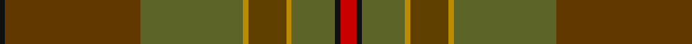

In pattern [KGGYGYGKR](/patterns/kggygygkr/).

This was sourced from tartans-authority.  It is a [9 stripes tartan](/stripes/stripes9/).

Original link http://www.tartansauthority.com/tartan-ferret/display/10357/

## Thread count
K/2 Ta50 G38 DY2 T14 DY2 G16 K2 R/6

## Palette
Each colour and its ΔE from the base-6 reference it is a variant of.

| Colour | Shade | Base | ΔE (OKLab) |
|---|---|---|---|
| DY | <code style="background-color:#BC8C00;">#BC8C00</code> `#BC8C00` | Y <code style="background-color:#F2BF00;">#F2BF00</code> | 0.16 |
| G | <code style="background-color:#5C6428;">#5C6428</code> `#5C6428` | G <code style="background-color:#006100;">#006100</code> | 0.10 |
| K | <code style="background-color:#101010;">#101010</code> `#101010` | K <code style="background-color:#000000;">#000000</code> | 0.17 |
| R | <code style="background-color:#C80000;">#C80000</code> `#C80000` | R <code style="background-color:#CC0000;">#CC0000</code> | 0.01 |
| T | <code style="background-color:#604000;">#604000</code> `#604000` | G <code style="background-color:#006100;">#006100</code> | 0.14 |
| Ta | <code style="background-color:#603800;">#603800</code> `#603800` | G <code style="background-color:#006100;">#006100</code> | 0.16 |

## Nearest tartans

The nearest existing variants by ΔTartan distance.

1. [Johansson (Personal)](/setts/s13/r16g2r2g2r2g50b2g2b2g2b50ra14y12-b5c5c5c-g5c6428-r880000-ra888888-ybc8c00/) — ΔT 1.72
1. [Tricor](/setts/s12/g16w4g16ga24gb24r16g92r16gb24ga24g16w4-g8c7038-ga00643c-gb604000-r98481c-wc0c0c0/) — ΔT 1.74
1. [Johansson (Aneby, Sweden), Christian (Personal)](/setts/s13/r16g2r2g2r2g50b2g2b2g2b50ga14y12-b3f4441-g70714d-ga75786c-r97342f-yc5831b/) — ΔT 1.96
1. [Broons, The (DC Thomson)](/setts/s9/r6k2g16y2ga14y2g38gb50k2-g556b2f-ga603311-gb8b6508-k101010-rff0000-yffd700/) — ΔT 1.97
1. [MacNaughton Htg](/setts/s9/g2r2ga44gb42g24r22ga44r2g2-g003820-ga145024-gb604000-ra40800/) — ΔT 2.12
1. [Hyland Day (Personal)](/setts/s14/y6b4g58b12g8r52g4r6g4r52g8b12g58b4-b441800-g604000-rb03000-ydc943c/) — ΔT 2.13
1. [Ensign of Ontario (Fashion)](/setts/s15/g42k2r8k2ga42g6ga6g6ga42g6y8g42ga6g6ga6-g006038-ga604000-k101010-rc80000-ybc8c00/) — ΔT 2.14
1. [The McAlbourne](/setts/s9/g4ga52b4gb8b6gc12g17ga7y4-b142127-g045324-ga335545-gb3d885f-gc132f20-ya78521/) — ΔT 2.17
1. [Roddy's Highland Spirit (Fashion)](/setts/s10/g60b6g6b6g6b20ga20gb40r4ga10-b80588c-g5c6428-ga3c6434-gb608064-rb07cc8/) — ΔT 2.18
1. [Hyland Day (Personal)](/setts/s8/r6g4r52g8b12g58b4y6-b441800-g604000-rb03000-ydc943c/) — ΔT 2.19

## Neighbour map

Every grey dot is one of 15726 variants placed by the first two principal components of the ΔTartan feature space (44% of its variance). Red is this tartan; blue dots are its nearest — click one to open its page.

<svg viewBox="0 0 640 380" role="img" style="max-width:100%;height:auto;border:1px solid #e0e0e0;border-radius:4px;display:block" xmlns="http://www.w3.org/2000/svg"><image href="/nn/cloud.v1.png" width="640" height="380"/><a href="/setts/s13/r16g2r2g2r2g50b2g2b2g2b50ra14y12-b5c5c5c-g5c6428-r880000-ra888888-ybc8c00/"><circle cx="342.9" cy="145.0" r="4" fill="#3465a4"><title>Johansson (Personal)</title></circle></a><a href="/setts/s12/g16w4g16ga24gb24r16g92r16gb24ga24g16w4-g8c7038-ga00643c-gb604000-r98481c-wc0c0c0/"><circle cx="381.3" cy="178.7" r="4" fill="#3465a4"><title>Tricor</title></circle></a><a href="/setts/s13/r16g2r2g2r2g50b2g2b2g2b50ga14y12-b3f4441-g70714d-ga75786c-r97342f-yc5831b/"><circle cx="334.6" cy="140.9" r="4" fill="#3465a4"><title>Johansson (Aneby, Sweden), Christian (Personal)</title></circle></a><a href="/setts/s9/r6k2g16y2ga14y2g38gb50k2-g556b2f-ga603311-gb8b6508-k101010-rff0000-yffd700/"><circle cx="317.0" cy="144.4" r="4" fill="#3465a4"><title>Broons, The (DC Thomson)</title></circle></a><a href="/setts/s9/g2r2ga44gb42g24r22ga44r2g2-g003820-ga145024-gb604000-ra40800/"><circle cx="397.8" cy="228.5" r="4" fill="#3465a4"><title>MacNaughton Htg</title></circle></a><a href="/setts/s14/y6b4g58b12g8r52g4r6g4r52g8b12g58b4-b441800-g604000-rb03000-ydc943c/"><circle cx="345.6" cy="176.5" r="4" fill="#3465a4"><title>Hyland Day (Personal)</title></circle></a><a href="/setts/s15/g42k2r8k2ga42g6ga6g6ga42g6y8g42ga6g6ga6-g006038-ga604000-k101010-rc80000-ybc8c00/"><circle cx="401.6" cy="177.1" r="4" fill="#3465a4"><title>Ensign of Ontario (Fashion)</title></circle></a><a href="/setts/s9/g4ga52b4gb8b6gc12g17ga7y4-b142127-g045324-ga335545-gb3d885f-gc132f20-ya78521/"><circle cx="369.7" cy="202.5" r="4" fill="#3465a4"><title>The McAlbourne</title></circle></a><a href="/setts/s10/g60b6g6b6g6b20ga20gb40r4ga10-b80588c-g5c6428-ga3c6434-gb608064-rb07cc8/"><circle cx="355.4" cy="222.5" r="4" fill="#3465a4"><title>Roddy's Highland Spirit (Fashion)</title></circle></a><a href="/setts/s8/r6g4r52g8b12g58b4y6-b441800-g604000-rb03000-ydc943c/"><circle cx="339.2" cy="189.2" r="4" fill="#3465a4"><title>Hyland Day (Personal)</title></circle></a><circle cx="370.6" cy="171.5" r="5" fill="#c00000"/></svg>

ID: /setts/s9/r6k2g16y2ga14y2g38gb50k2-g5c6428-ga604000-gb603800-k101010-rc80000-ybc8c00/
