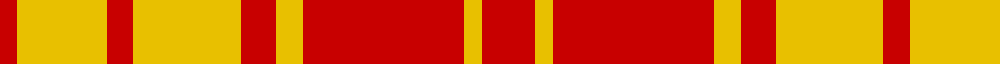

In pattern [RYRYRYRYR](/patterns/ryryryryr/).

This was sourced from house-of-tartan.  It is a [9 stripes tartan](/stripes/stripes9/).

Original link http://www.house-of-tartan.scotland.net/house/TartanViewjs.asp?colr=Def&tnam=1723

## Thread count
R/4 Y20 R6 Y24 R8 Y6 R36 Y4 R/12

## Palette
Each colour and its ΔE from the base-6 reference it is a variant of.

| Colour | Shade | Base | ΔE (OKLab) |
|---|---|---|---|
| R | <code style="background-color:#C80000;">#C80000</code> `#C80000` | R <code style="background-color:#CC0000;">#CC0000</code> | 0.01 |
| Y | <code style="background-color:#E8C000;">#E8C000</code> `#E8C000` | Y <code style="background-color:#F2BF00;">#F2BF00</code> | 0.02 |

## Nearest tartans

The nearest existing variants by ΔTartan distance.

1. [MacMillan](/setts/s9/r3y1r12y2r3y8r2y8r1x2~rc00000-yf0c000/) — ΔT 0.53
1. [MacMillan](/setts/s9/r3y1r12y2r3y8r2y8r1~rc80000-yc8c800/) — ΔT 0.82
1. [MacMillan](/setts/s9/r3y1r12y2r3y8r2y8r1x2~raa0000-yaaaa00/) — ΔT 1.19
1. [MacMillan](/setts/s9/r3y1r12y2r3y8r2y8r1~raa0000-yaaaa00/) — ΔT 1.19
1. [MacMillan - 1842 (Dress)](/setts/s9/r3y2r12y2r3y8r2y8r2x2~r901c38-ye8c000/) — ΔT 1.40
1. [Glassary #3](/setts/s8/b4y1r12y2r2y12r1y4x4~b2c2c80-rc80000-ye8c000/) — ΔT 1.72
1. [Maguire, Black](/setts/s6/r29g2r2g2r6y21x4~g008b00-rff0000-yffe600/) — ΔT 1.84
1. [Shire of Hornwood (Corporate)](/setts/s5/r18y3r18y30k4x2~k101010-rc80000-yfccc00/) — ΔT 1.86
1. [Queen Alexandra](/setts/s10/g4r2g2r16y2r3y2r3y8r3x2~g005030-rc80000-yb8b8b8/) — ΔT 1.95
1. [Queen Alexandra (Fashion)](/setts/s10/g4r2g2r16y2r3y2r3y8r3x4~g005030-rc80000-yb8b8b8/) — ΔT 1.95

## Neighbour map

Every grey dot is one of 15726 variants placed by the first two principal components of the ΔTartan feature space (44% of its variance). Red is this tartan; blue dots are its nearest — click one to open its page.

<svg viewBox="0 0 640 380" role="img" style="max-width:100%;height:auto;border:1px solid #e0e0e0;border-radius:4px;display:block" xmlns="http://www.w3.org/2000/svg"><image href="/nn/cloud.v1.png" width="640" height="380"/><a href="/setts/s9/r3y1r12y2r3y8r2y8r1x2~rc00000-yf0c000/"><circle cx="365.7" cy="201.1" r="4" fill="#3465a4"><title>MacMillan</title></circle></a><a href="/setts/s9/r3y1r12y2r3y8r2y8r1~rc80000-yc8c800/"><circle cx="360.1" cy="202.9" r="4" fill="#3465a4"><title>MacMillan</title></circle></a><a href="/setts/s9/r3y1r12y2r3y8r2y8r1x2~raa0000-yaaaa00/"><circle cx="376.7" cy="214.5" r="4" fill="#3465a4"><title>MacMillan</title></circle></a><a href="/setts/s9/r3y1r12y2r3y8r2y8r1~raa0000-yaaaa00/"><circle cx="376.7" cy="214.5" r="4" fill="#3465a4"><title>MacMillan</title></circle></a><a href="/setts/s9/r3y2r12y2r3y8r2y8r2x2~r901c38-ye8c000/"><circle cx="312.7" cy="231.7" r="4" fill="#3465a4"><title>MacMillan - 1842 (Dress)</title></circle></a><a href="/setts/s8/b4y1r12y2r2y12r1y4x4~b2c2c80-rc80000-ye8c000/"><circle cx="298.4" cy="177.8" r="4" fill="#3465a4"><title>Glassary #3</title></circle></a><a href="/setts/s6/r29g2r2g2r6y21x4~g008b00-rff0000-yffe600/"><circle cx="384.7" cy="170.7" r="4" fill="#3465a4"><title>Maguire, Black</title></circle></a><a href="/setts/s5/r18y3r18y30k4x2~k101010-rc80000-yfccc00/"><circle cx="291.5" cy="220.2" r="4" fill="#3465a4"><title>Shire of Hornwood (Corporate)</title></circle></a><a href="/setts/s10/g4r2g2r16y2r3y2r3y8r3x2~g005030-rc80000-yb8b8b8/"><circle cx="352.5" cy="193.5" r="4" fill="#3465a4"><title>Queen Alexandra</title></circle></a><a href="/setts/s10/g4r2g2r16y2r3y2r3y8r3x4~g005030-rc80000-yb8b8b8/"><circle cx="352.5" cy="193.5" r="4" fill="#3465a4"><title>Queen Alexandra (Fashion)</title></circle></a><circle cx="365.9" cy="217.0" r="5" fill="#c00000"/></svg>

ID: /setts/s9/r6y2r18y3r4y12r3y10r2x2~rc80000-ye8c000/
