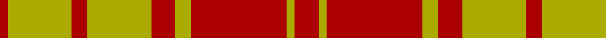

In pattern [RYRYRYRYR](/patterns/ryryryryr/).

This was sourced from weddslist.  It is a [9 stripes tartan](/stripes/stripes9/).

Original link http://www.weddslist.com/cgi-bin/tartans/pg.pl?source=tinsel

## Thread count
DR/2 LG16 DR4 LG16 DR6 LG4 DR24 LG2 DR/6

## Palette
Each colour and its ΔE from the base-6 reference it is a variant of.

| Colour | Shade | Base | ΔE (OKLab) |
|---|---|---|---|
| DR | <code style="background-color:#AA0000;">#AA0000</code> `#AA0000` | R <code style="background-color:#CC0000;">#CC0000</code> | 0.07 |
| LG | <code style="background-color:#AAAA00;">#AAAA00</code> `#AAAA00` | Y <code style="background-color:#F2BF00;">#F2BF00</code> | 0.13 |

## Nearest tartans

The nearest existing variants by ΔTartan distance.

1. [MacMillan](/setts/s9/r3y1r12y2r3y8r2y8r1-raa0000-yaaaa00/) — ΔT 0.00
1. [MacMillan](/setts/s9/r3y1r12y2r3y8r2y8r1-rc80000-yc8c800/) — ΔT 0.89
1. [MacMillan](/setts/s9/r6y2r24y4r6y16r4y16r2-rc00000-yf0c000/) — ΔT 1.10
1. [Livingstone](/setts/s10/g28r8g4r4g4r8g38r60g4r18-g008000-rc00000/) — ΔT 1.14
1. [MacMillan Dress Clan Tartan Tartan Number: 1723. Earliest known date: 1906 The modern Dress MacMillan incorporates red and yellow stripes from the ancient design but omits the greens and blues of the Vestiarium version. See products available Copyright © Blair Urquhart, Comrie, 2015](/setts/s9/r12y4r36y6r8y24r6y20r4-rc80000-ye8c000/) — ΔT 1.19
1. [Livingstone](/setts/s10/g28r8g4r4g4r8g38r60g4r18-g005020-rdc0000/) — ΔT 1.36
1. [Unidentified, NW Highlands](/setts/s6/g4r4g30r32g4r4-g008000-rc00000/) — ΔT 1.55
1. [Cameron](/setts/s6/r4g12r4g12r32y2-g008000-rc00000-yf0c000/) — ΔT 1.56
1. [Livingstone](/setts/s10/g24r8k2r4k2r8g32r40g4r16-g008000-k000000-rc00000/) — ΔT 1.56
1. [Livingston](/setts/s9/g40k4r6k4r12g40r58g6r20-g008000-k000000-rc00000/) — ΔT 1.56

## Neighbour map

Every grey dot is one of 15726 variants placed by the first two principal components of the ΔTartan feature space (44% of its variance). Red is this tartan; blue dots are its nearest — click one to open its page.

<svg viewBox="0 0 640 380" role="img" style="max-width:100%;height:auto;border:1px solid #e0e0e0;border-radius:4px;display:block" xmlns="http://www.w3.org/2000/svg"><image href="/nn/cloud.v1.png" width="640" height="380"/><a href="/setts/s9/r3y1r12y2r3y8r2y8r1-raa0000-yaaaa00/"><circle cx="378.2" cy="211.5" r="4" fill="#3465a4"><title>MacMillan</title></circle></a><a href="/setts/s9/r3y1r12y2r3y8r2y8r1-rc80000-yc8c800/"><circle cx="361.9" cy="199.4" r="4" fill="#3465a4"><title>MacMillan</title></circle></a><a href="/setts/s9/r6y2r24y4r6y16r4y16r2-rc00000-yf0c000/"><circle cx="367.5" cy="197.5" r="4" fill="#3465a4"><title>MacMillan</title></circle></a><a href="/setts/s10/g28r8g4r4g4r8g38r60g4r18-g008000-rc00000/"><circle cx="415.7" cy="194.3" r="4" fill="#3465a4"><title>Livingstone</title></circle></a><a href="/setts/s9/r12y4r36y6r8y24r6y20r4-rc80000-ye8c000/"><circle cx="368.1" cy="213.5" r="4" fill="#3465a4"><title>MacMillan Dress Clan Tartan Tartan Number: 1723. Earliest known date: 1906 The modern Dress MacMillan incorporates red and yellow stripes from the ancient design but omits the greens and blues of the Vestiarium version. See products available Copyright © Blair Urquhart, Comrie, 2015</title></circle></a><a href="/setts/s10/g28r8g4r4g4r8g38r60g4r18-g005020-rdc0000/"><circle cx="410.1" cy="188.3" r="4" fill="#3465a4"><title>Livingstone</title></circle></a><a href="/setts/s6/g4r4g30r32g4r4-g008000-rc00000/"><circle cx="381.7" cy="242.0" r="4" fill="#3465a4"><title>Unidentified, NW Highlands</title></circle></a><a href="/setts/s6/r4g12r4g12r32y2-g008000-rc00000-yf0c000/"><circle cx="418.4" cy="201.2" r="4" fill="#3465a4"><title>Cameron</title></circle></a><a href="/setts/s10/g24r8k2r4k2r8g32r40g4r16-g008000-k000000-rc00000/"><circle cx="372.7" cy="170.1" r="4" fill="#3465a4"><title>Livingstone</title></circle></a><a href="/setts/s9/g40k4r6k4r12g40r58g6r20-g008000-k000000-rc00000/"><circle cx="335.7" cy="186.6" r="4" fill="#3465a4"><title>Livingston</title></circle></a><circle cx="378.2" cy="211.5" r="5" fill="#c00000"/></svg>

ID: /setts/s9/r6y2r24y4r6y16r4y16r2-raa0000-yaaaa00/
