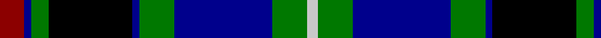

This page is one **sett** — a single exact thread-count. It belongs to the [tartan](/tartans/dr7db2g5k24db2g10db28g10n3/)
(the same proportion at any scale), whose colour order is pattern [RBGKBGBGW](/stripes/rbgkbgbgw/).

Sourced from register-of-tartans.  It is a [9 stripe tartan](/stripes/stripes9/).

Original link https://www.tartanregister.gov.uk/tartanDetails.aspx?ref=709

2 attestations — the source records this cloth was collapsed from (oldest owns this page)

<ul>
<li>01/06/1997 — Colgan (Personal) (register-of-tartans, <a href="https://www.tartanregister.gov.uk/tartanDetails.aspx?ref=709">record</a>)</li>
<li>pre 2002 — Colgan (Personal) (tartans-authority, <a href="http://www.tartansauthority.com/tartan-ferret/display/2403/">record</a>)</li>
</ul>

## Register references

External register numbers recorded for this tartan.

- Scottish Register of Tartans: [709](https://www.tartanregister.gov.uk/tartanDetails.aspx?ref=709)
- Scottish Tartans Authority (ITI): 2403
- Scottish Tartans World Register: 2403

## Thread count
DR/14 DB4 G10 K48 DB4 G20 DB56 G20 N/6

## Palette
Each colour and the base-6 reference it is a variant of.

| Colour | Shade | Base |
|---|---|---|
| DB | <code style="background-color:#00008C;">#00008C</code> `oklch(28.9% 0.200 264.1)` <small>#00008C</small> | B <code style="background-color:#2A418A;">#2A418A</code> |
| DR | <code style="background-color:#8C0000;">#8C0000</code> `oklch(40.2% 0.165 29.2)` <small>#8C0000</small> | R <code style="background-color:#CC0000;">#CC0000</code> |
| G | <code style="background-color:#007800;">#007800</code> `oklch(49.6% 0.169 142.5)` <small>#007800</small> | G <code style="background-color:#006100;">#006100</code> |
| K | <code style="background-color:#000000;">#000000</code> `oklch(0.0% 0.000 0.0)` <small>#000000</small> | K <code style="background-color:#000000;">#000000</code> |
| N | <code style="background-color:#C8C8C8;">#C8C8C8</code> `oklch(83.3% 0.000 89.9)` <small>#C8C8C8</small> | W <code style="background-color:#F7F7F7;">#F7F7F7</code> |

## Nearest tartans

The nearest existing variants by ΔTartan distance, with this tartan at the top so the swatches line up against it.

ΔTartan

Tartan

Sett

—

<a href="/ttd/edit/#slug=r7db2g5k24db2g10db28g10lb3~x2">Colgan (Personal)</a> <a class="nn-out" href="/setts/s9/r7db2g5k24db2g10db28g10lb3~x2/" title="open its dictionary page">↗</a>

0.71

<a href="/ttd/edit/#slug=lo6g28r4k20r3db45k5~x2">Nery</a> <a class="nn-out" href="/setts/s7/lo6g28r4k20r3db45k5~x2/" title="open its dictionary page">↗</a>

0.82

<a href="/ttd/edit/#slug=db3ly1db12k4ly2k4dg8r2dg8r1~x2">MacMillan Hunting</a> <a class="nn-out" href="/setts/s10/db3ly1db12k4ly2k4dg8r2dg8r1~x2/" title="open its dictionary page">↗</a>

0.82

<a href="/ttd/edit/#slug=g28k2db3k11db3k2db17db4w2~x2">West of Wells</a> <a class="nn-out" href="/setts/s9/g28k2db3k11db3k2db17db4w2~x2/" title="open its dictionary page">↗</a>

0.88

<a href="/ttd/edit/#slug=db12r4db18r2k19g18r4g3lo2g8~x2">Biskup (Personal)</a> <a class="nn-out" href="/setts/s10/db12r4db18r2k19g18r4g3lo2g8~x2/" title="open its dictionary page">↗</a>

0.91

<a href="/ttd/edit/#slug=t3g3k4g14k4g3k14db18r1db4r2~x2">Clerke of Ulva</a> <a class="nn-out" href="/setts/s11/t3g3k4g14k4g3k14db18r1db4r2~x2/" title="open its dictionary page">↗</a>

0.91

<a href="/ttd/edit/#slug=db4k2db16k12w1g13r2g2lo4~x2">Cusack</a> <a class="nn-out" href="/setts/s9/db4k2db16k12w1g13r2g2lo4~x2/" title="open its dictionary page">↗</a>

0.92

<a href="/ttd/edit/#slug=db20k3db3k3db3k16g2ly3g12r2~x2">Barnes</a> <a class="nn-out" href="/setts/s10/db20k3db3k3db3k16g2ly3g12r2~x2/" title="open its dictionary page">↗</a>

0.94

<a href="/ttd/edit/#slug=lt3dg3k4dg14k4dg3k14db18lo1db4lo2~x2">Clark of Ulva (Clan)</a> <a class="nn-out" href="/setts/s11/lt3dg3k4dg14k4dg3k14db18lo1db4lo2~x2/" title="open its dictionary page">↗</a>

0.97

<a href="/ttd/edit/#slug=t4dt16k2dt2k2dt2k13n20w4~x2">Royal College of Surgeons of Edinburgh</a> <a class="nn-out" href="/setts/s9/t4dt16k2dt2k2dt2k13n20w4~x2/" title="open its dictionary page">↗</a>

0.99

<a href="/ttd/edit/#slug=r6db3r2db2r2db16k12dg16r1dg1ly2~x2">Logan and MacLennan</a> <a class="nn-out" href="/setts/s11/r6db3r2db2r2db16k12dg16r1dg1ly2~x2/" title="open its dictionary page">↗</a>

## Neighbour map

Every grey dot is one of 14299 variants placed by the first two principal components of the ΔTartan feature space (44% of its variance). Red is this tartan; blue dots are its nearest — click one to open its page.

<svg viewBox="0 0 640 380" role="img" style="max-width:100%;height:auto;border:1px solid #e0e0e0;border-radius:4px;display:block" xmlns="http://www.w3.org/2000/svg"><image href="/nn/cloud.v1.png" width="640" height="380"/><a href="/setts/s7/lo6g28r4k20r3db45k5~x2/"><circle cx="183.2" cy="167.7" r="4" fill="#3465a4"><title>Nery</title></circle></a><a href="/setts/s10/db3ly1db12k4ly2k4dg8r2dg8r1~x2/"><circle cx="142.3" cy="176.0" r="4" fill="#3465a4"><title>MacMillan Hunting</title></circle></a><a href="/setts/s9/g28k2db3k11db3k2db17db4w2~x2/"><circle cx="187.0" cy="155.3" r="4" fill="#3465a4"><title>West of Wells</title></circle></a><a href="/setts/s10/db12r4db18r2k19g18r4g3lo2g8~x2/"><circle cx="117.8" cy="183.2" r="4" fill="#3465a4"><title>Biskup (Personal)</title></circle></a><a href="/setts/s11/t3g3k4g14k4g3k14db18r1db4r2~x2/"><circle cx="148.3" cy="145.0" r="4" fill="#3465a4"><title>Clerke of Ulva</title></circle></a><a href="/setts/s9/db4k2db16k12w1g13r2g2lo4~x2/"><circle cx="129.8" cy="140.1" r="4" fill="#3465a4"><title>Cusack</title></circle></a><a href="/setts/s10/db20k3db3k3db3k16g2ly3g12r2~x2/"><circle cx="161.0" cy="161.7" r="4" fill="#3465a4"><title>Barnes</title></circle></a><a href="/setts/s11/lt3dg3k4dg14k4dg3k14db18lo1db4lo2~x2/"><circle cx="151.0" cy="149.7" r="4" fill="#3465a4"><title>Clark of Ulva (Clan)</title></circle></a><a href="/setts/s9/t4dt16k2dt2k2dt2k13n20w4~x2/"><circle cx="133.8" cy="170.9" r="4" fill="#3465a4"><title>Royal College of Surgeons of Edinburgh</title></circle></a><a href="/setts/s11/r6db3r2db2r2db16k12dg16r1dg1ly2~x2/"><circle cx="147.9" cy="135.5" r="4" fill="#3465a4"><title>Logan and MacLennan</title></circle></a><circle cx="149.4" cy="161.9" r="5" fill="#c00000"/></svg>

ID: /setts/s9/r7db2g5k24db2g10db28g10lb3~x2/
