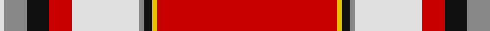

In pattern [RYKRWRKRW](/patterns/rykrwrkrw/).

This was sourced from house-of-tartan.  It is a [9 stripes tartan](/stripes/stripes9/).

Original link http://www.house-of-tartan.scotland.net/house/TartanViewjs.asp?colr=Def&tnam=1717

## Thread count
LN/2 N10 K10 R10 LN30 N2 K4 Y2 R/80

## Palette
Each colour and its ΔE from the base-6 reference it is a variant of.

| Colour | Shade | Base | ΔE (OKLab) |
|---|---|---|---|
| K | <code style="background-color:#101010;">#101010</code> `#101010` | K <code style="background-color:#000000;">#000000</code> | 0.17 |
| LN | <code style="background-color:#E0E0E0;">#E0E0E0</code> `#E0E0E0` | W <code style="background-color:#F4F4F0;">#F4F4F0</code> | 0.06 |
| N | <code style="background-color:#888888;">#888888</code> `#888888` | R <code style="background-color:#C80000;">#C80000</code> | 0.24 |
| R | <code style="background-color:#C80000;">#C80000</code> `#C80000` | R <code style="background-color:#C80000;">#C80000</code> | 0.00 |
| Y | <code style="background-color:#E8C000;">#E8C000</code> `#E8C000` | Y <code style="background-color:#E8C000;">#E8C000</code> | 0.00 |

## Nearest tartans

The nearest existing variants by ΔTartan distance.

1. [Drummond of Perth Dress](/setts/s9/r80y2k4g2w30r10k10g10w2-g808080-k101010-rdc0000-we0e0e0-ye8c000/) — ΔT 0.27
1. [Drummond of Perth, dress](/setts/s9/r80y2k4g2w30r10k10g10w2-g808080-k000000-rc00000-we0e0e0-yf0c000/) — ΔT 0.45
1. [Union Memorial Tartan (Military)](/setts/s10/y24y8w8y8b4r112w36b2r8r6-b1c0070-ra00000-wc0c0c0-ye8c000/) — ΔT 0.72
1. [Drummond of Perth, dress](/setts/s9/r134y6b12w6wa50r20b12w14wa6-b505050-rc00000-wc0c0c0-wae0e0e0-yf0c000/) — ΔT 1.00
1. [Drummond of Perth](/setts/s8/r72w2b6y2g32r16b6w10-b000064-g004c00-rc80000-wd0d0d0-yffc800/) — ΔT 1.08
1. [Leach, Leech, Leitch, dress](/setts/s9/r66w2k6w2g26r14k6b6w2-b800080-g008000-k000000-rc00000-we0e0e0/) — ΔT 1.11
1. [Spens (Lochcarron)](/setts/s9/r80w2b14w2g24r16b12ba4w2-b2c2c80-ba5c8ca8-g408060-rc80000-wf8f8f8/) — ΔT 1.15
1. [VeMMA Corporate Tartan Tartan Number: 10730. Earliest known date: 5 November 2012 Created for VeMMA International. VeMMA is a nutritional supplement company marketing fruit juice drinks that have been enhanced with vitamins and anti-oxidants (the name VeMMA is an acronym for Vitamins, essential Minerals, Mangosteen and Aloe vera). VeMMA offers an affiliate marketing program to those who wish to recommend its products. Colours: the orange represents enhanced health through supplementation; silver represents liquid and silver also purifies, soothes, inspires, and reflects back positive energy. See products available Copyright © Blair Urquhart, Comrie, 2015](/setts/s10/r48y4ya14y6k4ka8k4y2r8y2-k101010-ka000000-rff4000-yadadad-yaff9f80/) — ΔT 1.16
1. [Drummond of Perth Dress #3](/setts/s9/r134y6b12w6wa50r20b12w14wa6-b505050-rdc0000-wc0c0c0-wae0e0e0-ye8c000/) — ΔT 1.19
1. [Fueglistal](/setts/s9/k6y12w26r4w4r64w2r4w2-k101010-rc80000-wc0c0c0-ybc8c00/) — ΔT 1.19

## Neighbour map

Every grey dot is one of 15726 variants placed by the first two principal components of the ΔTartan feature space (44% of its variance). Red is this tartan; blue dots are its nearest — click one to open its page.

<svg viewBox="0 0 640 380" role="img" style="max-width:100%;height:auto;border:1px solid #e0e0e0;border-radius:4px;display:block" xmlns="http://www.w3.org/2000/svg"><image href="/nn/cloud.v1.png" width="640" height="380"/><a href="/setts/s9/r80y2k4g2w30r10k10g10w2-g808080-k101010-rdc0000-we0e0e0-ye8c000/"><circle cx="373.6" cy="62.1" r="4" fill="#3465a4"><title>Drummond of Perth Dress</title></circle></a><a href="/setts/s9/r80y2k4g2w30r10k10g10w2-g808080-k000000-rc00000-we0e0e0-yf0c000/"><circle cx="361.8" cy="61.5" r="4" fill="#3465a4"><title>Drummond of Perth, dress</title></circle></a><a href="/setts/s10/y24y8w8y8b4r112w36b2r8r6-b1c0070-ra00000-wc0c0c0-ye8c000/"><circle cx="376.6" cy="54.6" r="4" fill="#3465a4"><title>Union Memorial Tartan (Military)</title></circle></a><a href="/setts/s9/r134y6b12w6wa50r20b12w14wa6-b505050-rc00000-wc0c0c0-wae0e0e0-yf0c000/"><circle cx="350.5" cy="90.8" r="4" fill="#3465a4"><title>Drummond of Perth, dress</title></circle></a><a href="/setts/s8/r72w2b6y2g32r16b6w10-b000064-g004c00-rc80000-wd0d0d0-yffc800/"><circle cx="372.1" cy="94.9" r="4" fill="#3465a4"><title>Drummond of Perth</title></circle></a><a href="/setts/s9/r66w2k6w2g26r14k6b6w2-b800080-g008000-k000000-rc00000-we0e0e0/"><circle cx="374.0" cy="83.5" r="4" fill="#3465a4"><title>Leach, Leech, Leitch, dress</title></circle></a><a href="/setts/s9/r80w2b14w2g24r16b12ba4w2-b2c2c80-ba5c8ca8-g408060-rc80000-wf8f8f8/"><circle cx="403.5" cy="84.8" r="4" fill="#3465a4"><title>Spens (Lochcarron)</title></circle></a><a href="/setts/s10/r48y4ya14y6k4ka8k4y2r8y2-k101010-ka000000-rff4000-yadadad-yaff9f80/"><circle cx="306.9" cy="77.2" r="4" fill="#3465a4"><title>VeMMA Corporate Tartan Tartan Number: 10730. Earliest known date: 5 November 2012 Created for VeMMA International. VeMMA is a nutritional supplement company marketing fruit juice drinks that have been enhanced with vitamins and anti-oxidants (the name VeMMA is an acronym for Vitamins, essential Minerals, Mangosteen and Aloe vera). VeMMA offers an affiliate marketing program to those who wish to recommend its products. Colours: the orange represents enhanced health through supplementation; silver represents liquid and silver also purifies, soothes, inspires, and reflects back positive energy. See products available Copyright © Blair Urquhart, Comrie, 2015</title></circle></a><a href="/setts/s9/r134y6b12w6wa50r20b12w14wa6-b505050-rdc0000-wc0c0c0-wae0e0e0-ye8c000/"><circle cx="356.5" cy="89.8" r="4" fill="#3465a4"><title>Drummond of Perth Dress #3</title></circle></a><a href="/setts/s9/k6y12w26r4w4r64w2r4w2-k101010-rc80000-wc0c0c0-ybc8c00/"><circle cx="395.2" cy="97.7" r="4" fill="#3465a4"><title>Fueglistal</title></circle></a><circle cx="372.2" cy="64.0" r="5" fill="#c00000"/></svg>

ID: /setts/s9/r80y2k4ra2w30r10k10ra10w2-k101010-rc80000-ra888888-we0e0e0-ye8c000/
