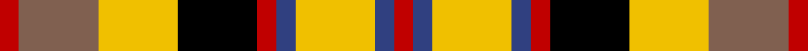

This page is one **sett** — a single exact thread-count. It belongs to the [tartan](/tartans/r8o33ly33k33r8db8ly33db8r8/)
(the same proportion at any scale), whose colour order is pattern [RBYBRKYRR](/stripes/rbybrkyrr/).

Sourced from weddslist.  It is a [9 stripe tartan](/stripes/stripes9/).

Original link http://www.weddslist.com/cgi-bin/tartans/pg.pl?source=sts

2 attestations — the source records this cloth was collapsed from (oldest owns this page)

<ul>
<li>undated — Jardine, of Castlemilk (weddslist, <a href="http://www.weddslist.com/cgi-bin/tartans/pg.pl?source=sts">record</a>)</li>
<li>undated — Jardine, of Castlemilk (weddslist, <a href="http://www.weddslist.com/cgi-bin/tartans/pg.pl?source=sts">record</a>)</li>
</ul>

## Thread count
R/8 LT33 Y33 K33 R8 B8 Y33 B8 R/8

## Palette

Palette: <strong>Ingles Buchan</strong> <small style="color:#888">(1 of 5 colours)</small>
<table><thead><tr><th>Colour</th><th>Threads</th><th>Shade</th><th>Base</th><th>OKLCh</th></tr></thead><tbody><tr><td>R/</td><td style="text-align:right;font-variant-numeric:tabular-nums">8</td><td><code style="background-color:#C00000;">#C00000</code> <small style="color:#888">#C00000</small></td><td>R <code style="background-color:#CC0000;">#CC0000</code></td><td><small style="color:#888">oklch(50.7% 0.208 29.2)</small></td></tr><tr><td>LT</td><td style="text-align:right;font-variant-numeric:tabular-nums">33</td><td><code style="background-color:#806050;">#806050</code> <small style="color:#888">#806050</small></td><td>R <code style="background-color:#CC0000;">#CC0000</code></td><td><small style="color:#888">oklch(51.7% 0.049 47.8)</small></td></tr><tr><td>Y</td><td style="text-align:right;font-variant-numeric:tabular-nums">33</td><td><code style="background-color:#F0C000;">#F0C000</code> <small style="color:#888">#F0C000</small></td><td>Y <code style="background-color:#F2BF00;">#F2BF00</code></td><td><small style="color:#888">oklch(82.7% 0.169 90.5)</small></td></tr><tr><td>K</td><td style="text-align:right;font-variant-numeric:tabular-nums">33</td><td><code style="background-color:#000000;">#000000</code> <small style="color:#888">#000000</small></td><td>K <code style="background-color:#000000;">#000000</code></td><td><small style="color:#888">oklch(0.0% 0.000 0.0)</small></td></tr><tr><td>R</td><td style="text-align:right;font-variant-numeric:tabular-nums">8</td><td><code style="background-color:#C00000;">#C00000</code> <small style="color:#888">#C00000</small></td><td>R <code style="background-color:#CC0000;">#CC0000</code></td><td><small style="color:#888">oklch(50.7% 0.208 29.2)</small></td></tr><tr><td>B</td><td style="text-align:right;font-variant-numeric:tabular-nums">8</td><td><code style="background-color:#304080;">#304080</code> <small style="color:#888">#304080</small></td><td>B <code style="background-color:#2A418A;">#2A418A</code></td><td><small style="color:#888">oklch(39.4% 0.109 270.2)</small></td></tr><tr><td>Y</td><td style="text-align:right;font-variant-numeric:tabular-nums">33</td><td><code style="background-color:#F0C000;">#F0C000</code> <small style="color:#888">#F0C000</small></td><td>Y <code style="background-color:#F2BF00;">#F2BF00</code></td><td><small style="color:#888">oklch(82.7% 0.169 90.5)</small></td></tr><tr><td>B</td><td style="text-align:right;font-variant-numeric:tabular-nums">8</td><td><code style="background-color:#304080;">#304080</code> <small style="color:#888">#304080</small></td><td>B <code style="background-color:#2A418A;">#2A418A</code></td><td><small style="color:#888">oklch(39.4% 0.109 270.2)</small></td></tr><tr><td>R/</td><td style="text-align:right;font-variant-numeric:tabular-nums">8</td><td><code style="background-color:#C00000;">#C00000</code> <small style="color:#888">#C00000</small></td><td>R <code style="background-color:#CC0000;">#CC0000</code></td><td><small style="color:#888">oklch(50.7% 0.208 29.2)</small></td></tr></tbody></table>

## Nearest tartans

The nearest existing variants by ΔTartan distance, with this tartan at the top so the swatches line up against it.

ΔTartan

Tartan

Sett

—

<a href="/ttd/edit/#slug=r8o33ly33k33r8db8ly33db8r8">Jardine, of Castlemilk</a> <a class="nn-out" href="/setts/s9/r8o33ly33k33r8db8ly33db8r8/" title="open its dictionary page">↗</a>

0.27

<a href="/ttd/edit/#slug=r8dy33ly33k33r8db8ly33db8r8">Jardine of Castlemilk</a> <a class="nn-out" href="/setts/s9/r8dy33ly33k33r8db8ly33db8r8/" title="open its dictionary page">↗</a>

0.79

<a href="/ttd/edit/#slug=g13ly16w4ly4r4ly4k20ly8r8~x2">Cawte of Middlebanknock (Personal)</a> <a class="nn-out" href="/setts/s9/g13ly16w4ly4r4ly4k20ly8r8~x2/" title="open its dictionary page">↗</a>

1.23

<a href="/ttd/edit/#slug=r2ly1r5k4g5w1~x4">Aboyne II (Fashion)</a> <a class="nn-out" href="/setts/s6/r2ly1r5k4g5w1~x4/" title="open its dictionary page">↗</a>

1.26

<a href="/ttd/edit/#slug=g9ly2g9w5r9t2r9t2~x2">Blackie</a> <a class="nn-out" href="/setts/s8/g9ly2g9w5r9t2r9t2~x2/" title="open its dictionary page">↗</a>

1.44

<a href="/ttd/edit/#slug=g6r4g5r13k13w5k13r13ly6~x2">Akins Red Dress</a> <a class="nn-out" href="/setts/s9/g6r4g5r13k13w5k13r13ly6~x2/" title="open its dictionary page">↗</a>

1.44

<a href="/ttd/edit/#slug=w8r2w2r6w13r2k13dg13r6dg2r2dg4ly3~x2">Carnegie Dress</a> <a class="nn-out" href="/setts/s13/w8r2w2r6w13r2k13dg13r6dg2r2dg4ly3~x2/" title="open its dictionary page">↗</a>

1.51

<a href="/ttd/edit/#slug=k16ly16r16g3db7w7k7~x2">Eusa</a> <a class="nn-out" href="/setts/s7/k16ly16r16g3db7w7k7~x2/" title="open its dictionary page">↗</a>

1.52

<a href="/ttd/edit/#slug=w8r2w2r6w13r2k13g13r6g2r2g4ly3~x2">Carnegie Dress #1 (Fashion)</a> <a class="nn-out" href="/setts/s13/w8r2w2r6w13r2k13g13r6g2r2g4ly3~x2/" title="open its dictionary page">↗</a>

1.52

<a href="/ttd/edit/#slug=lb23k4lb4k4lb4k22o23lo5~x2">Aberlour</a> <a class="nn-out" href="/setts/s8/lb23k4lb4k4lb4k22o23lo5~x2/" title="open its dictionary page">↗</a>

1.57

<a href="/ttd/edit/#slug=w9r2w2r6w14r2k14g14r6g2r2g8ly3~x2">Valley of the Green #2</a> <a class="nn-out" href="/setts/s13/w9r2w2r6w14r2k14g14r6g2r2g8ly3~x2/" title="open its dictionary page">↗</a>

## Neighbour map

Every grey dot is one of 14359 variants placed by the first two principal components of the ΔTartan feature space (44% of its variance). Red is this tartan; blue dots are its nearest — click one to open its page.

<svg viewBox="0 0 640 380" role="img" style="max-width:100%;height:auto;border:1px solid #e0e0e0;border-radius:4px;display:block" xmlns="http://www.w3.org/2000/svg"><image href="/nn/cloud.v1.png" width="640" height="380"/><a href="/setts/s9/r8dy33ly33k33r8db8ly33db8r8/"><circle cx="77.7" cy="196.8" r="4" fill="#3465a4"><title>Jardine of Castlemilk</title></circle></a><a href="/setts/s9/g13ly16w4ly4r4ly4k20ly8r8~x2/"><circle cx="86.4" cy="190.4" r="4" fill="#3465a4"><title>Cawte of Middlebanknock (Personal)</title></circle></a><a href="/setts/s6/r2ly1r5k4g5w1~x4/"><circle cx="112.9" cy="223.0" r="4" fill="#3465a4"><title>Aboyne II (Fashion)</title></circle></a><a href="/setts/s8/g9ly2g9w5r9t2r9t2~x2/"><circle cx="114.2" cy="219.5" r="4" fill="#3465a4"><title>Blackie</title></circle></a><a href="/setts/s9/g6r4g5r13k13w5k13r13ly6~x2/"><circle cx="68.3" cy="232.1" r="4" fill="#3465a4"><title>Akins Red Dress</title></circle></a><a href="/setts/s13/w8r2w2r6w13r2k13dg13r6dg2r2dg4ly3~x2/"><circle cx="61.1" cy="154.2" r="4" fill="#3465a4"><title>Carnegie Dress</title></circle></a><a href="/setts/s7/k16ly16r16g3db7w7k7~x2/"><circle cx="25.0" cy="199.7" r="4" fill="#3465a4"><title>Eusa</title></circle></a><a href="/setts/s13/w8r2w2r6w13r2k13g13r6g2r2g4ly3~x2/"><circle cx="54.0" cy="150.8" r="4" fill="#3465a4"><title>Carnegie Dress #1 (Fashion)</title></circle></a><a href="/setts/s8/lb23k4lb4k4lb4k22o23lo5~x2/"><circle cx="130.3" cy="193.1" r="4" fill="#3465a4"><title>Aberlour</title></circle></a><a href="/setts/s13/w9r2w2r6w14r2k14g14r6g2r2g8ly3~x2/"><circle cx="62.9" cy="155.4" r="4" fill="#3465a4"><title>Valley of the Green #2</title></circle></a><circle cx="70.8" cy="193.3" r="5" fill="#c00000"/></svg>

ID: /setts/s9/r8o33ly33k33r8db8ly33db8r8/
