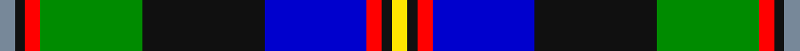

In pattern [BKRGKBRKY](/stripes/bkrgkbrky/).

This was sourced from register-of-tartans.  It is a [9 stripe tartan](/stripes/stripes9/).

Original link https://www.tartanregister.gov.uk/tartanDetails.aspx?ref=10586

## Register references

External register numbers recorded for this tartan.

- Scottish Register of Tartans: [10586](https://www.tartanregister.gov.uk/tartanDetails.aspx?ref=10586)

## Thread count
N/6 K4 R6 G40 K48 B40 R6 K4 Y/6

## Palette
Each colour and its ΔE from the base-6 reference it is a variant of.

| Colour | Shade | Base | ΔE (OKLab) |
|---|---|---|---|
| B | <code style="background-color:#0000CD;">#0000CD</code> `#0000CD` | B <code style="background-color:#2A418A;">#2A418A</code> | 0.14 |
| G | <code style="background-color:#008B00;">#008B00</code> `#008B00` | G <code style="background-color:#006100;">#006100</code> | 0.13 |
| K | <code style="background-color:#101010;">#101010</code> `#101010` | K <code style="background-color:#000000;">#000000</code> | 0.17 |
| N | <code style="background-color:#778899;">#778899</code> `#778899` | B <code style="background-color:#2A418A;">#2A418A</code> | 0.24 |
| R | <code style="background-color:#FF0000;">#FF0000</code> `#FF0000` | R <code style="background-color:#CC0000;">#CC0000</code> | 0.11 |
| Y | <code style="background-color:#FFE600;">#FFE600</code> `#FFE600` | Y <code style="background-color:#F2BF00;">#F2BF00</code> | 0.10 |

## Nearest tartans

The nearest existing variants by ΔTartan distance.

1. [McCuaig (Glenelg and the Western Isles)](/setts/s9/k10ly3k2db20k10g15k2r3w3~x2/) — ΔT 0.75
1. [Greene](/setts/s10/db6r4db24lb3k6g18lo4g2lo2g4~x2/) — ΔT 0.76
1. [Minnesota (District)](/setts/s8/k6w3k2db30r9k4g20ly3~x2/) — ΔT 0.84
1. [McCuaig (2010) (Name)](/setts/s9/k10ly3k2b20k10g15k2r3w3~x2/) — ΔT 0.84
1. [St Columba](/setts/s8/db60t5w4o12g42p12t5p12/) — ΔT 0.85
1. [Federated Women's Institutes of](/setts/s9/r2k1lo2g3lo4g3db12k1lb2~x4/) — ΔT 0.91
1. [Unnamed, No 20](/setts/s11/t3k2t2b8db20r4g16b4t2k2t3/) — ΔT 0.93
1. [Cusack](/setts/s9/db4k2db16k12w1g13r2g2lo4~x2/) — ΔT 0.94
1. [Leung (Personal)](/setts/s9/m4k7m2db25k19w2g13k2ly3~x2/) — ΔT 0.95
1. [Loch Awe](/setts/s9/ly3k2r3db20k24g20r3k2lb3~x2/) — ΔT 0.99

## Neighbour map

Every grey dot is one of 14299 variants placed by the first two principal components of the ΔTartan feature space (44% of its variance). Red is this tartan; blue dots are its nearest — click one to open its page.

<svg viewBox="0 0 640 380" role="img" style="max-width:100%;height:auto;border:1px solid #e0e0e0;border-radius:4px;display:block" xmlns="http://www.w3.org/2000/svg"><image href="/nn/cloud.v1.png" width="640" height="380"/><a href="/setts/s9/k10ly3k2db20k10g15k2r3w3~x2/"><circle cx="97.9" cy="152.6" r="4" fill="#3465a4"><title>McCuaig (Glenelg and the Western Isles)</title></circle></a><a href="/setts/s10/db6r4db24lb3k6g18lo4g2lo2g4~x2/"><circle cx="154.4" cy="138.3" r="4" fill="#3465a4"><title>Greene</title></circle></a><a href="/setts/s8/k6w3k2db30r9k4g20ly3~x2/"><circle cx="154.7" cy="132.9" r="4" fill="#3465a4"><title>Minnesota (District)</title></circle></a><a href="/setts/s9/k10ly3k2b20k10g15k2r3w3~x2/"><circle cx="115.4" cy="159.5" r="4" fill="#3465a4"><title>McCuaig (2010) (Name)</title></circle></a><a href="/setts/s8/db60t5w4o12g42p12t5p12/"><circle cx="166.6" cy="137.6" r="4" fill="#3465a4"><title>St Columba</title></circle></a><a href="/setts/s9/r2k1lo2g3lo4g3db12k1lb2~x4/"><circle cx="142.0" cy="137.0" r="4" fill="#3465a4"><title>Federated Women's Institutes of</title></circle></a><a href="/setts/s11/t3k2t2b8db20r4g16b4t2k2t3/"><circle cx="86.9" cy="135.6" r="4" fill="#3465a4"><title>Unnamed, No 20</title></circle></a><a href="/setts/s9/db4k2db16k12w1g13r2g2lo4~x2/"><circle cx="129.8" cy="140.1" r="4" fill="#3465a4"><title>Cusack</title></circle></a><a href="/setts/s9/m4k7m2db25k19w2g13k2ly3~x2/"><circle cx="152.4" cy="147.8" r="4" fill="#3465a4"><title>Leung (Personal)</title></circle></a><a href="/setts/s9/ly3k2r3db20k24g20r3k2lb3~x2/"><circle cx="145.2" cy="144.4" r="4" fill="#3465a4"><title>Loch Awe</title></circle></a><circle cx="120.5" cy="134.4" r="5" fill="#c00000"/></svg>

ID: /setts/s9/t3k2r3g20k24db20r3k2ly3~x2/
