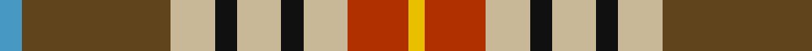

**Bands:** [YRYKYKYGB](/stripes/yrykykygb/) · **Stripes:** [LY R LR K LR K LR DY T](/stripes/stripes9/) LY R LR K LR K LR DY T

This was sourced from house-of-tartan.  It is a [9 band tartan](/bands/bands9/).

Original link http://www.house-of-tartan.scotland.net/house/TartanViewjs.asp?colr=Def&tnam=5977

## Thread count
B/8 T54 N16 K8 N16 K8 N16 R22 Y/6

## Palette
Each colour and its ΔE from the base-6 reference it is a variant of.

| Colour | Shade | Base | ΔE (OKLab) |
|---|---|---|---|
| B | <code style="background-color:#4898C4;">#4898C4</code> `#4898C4` | B <code style="background-color:#2A418A;">#2A418A</code> | 0.26 |
| K | <code style="background-color:#101010;">#101010</code> `#101010` | K <code style="background-color:#000000;">#000000</code> | 0.17 |
| N | <code style="background-color:#C8B898;">#C8B898</code> `#C8B898` | Y <code style="background-color:#F2BF00;">#F2BF00</code> | 0.13 |
| R | <code style="background-color:#B03000;">#B03000</code> `#B03000` | R <code style="background-color:#CC0000;">#CC0000</code> | 0.06 |
| T | <code style="background-color:#60441C;">#60441C</code> `#60441C` | G <code style="background-color:#006100;">#006100</code> | 0.14 |
| Y | <code style="background-color:#E8C000;">#E8C000</code> `#E8C000` | Y <code style="background-color:#F2BF00;">#F2BF00</code> | 0.02 |

## Nearest tartans

The nearest existing variants by ΔTartan distance.

1. [Unnamed No 14](/setts/s9/r22t6db10ly4r4w4g22db8ly3/) — ΔT 0.58
1. [Unidentified No 14](/setts/s9/r22t6db10ly4r4w4dg22db8ly3/) — ΔT 0.75
1. [Porcupine City of](/setts/s7/r10n3db1lb8db1lo2g5~x4/) — ΔT 0.76
1. [Jacobite Silk sash](/setts/s10/w2r8dy5ly6w5dg21w6r8r4w2/) — ΔT 0.86
1. [Nicolson of Taransay (Personal)](/setts/s7/w6g10r22db16g2g4g5~x2/) — ΔT 0.88
1. [Isle of Skye (District)](/setts/s11/lb24dg3lb3dg3lb3dg10o12dp12o12o2o3~x2/) — ΔT 0.89
1. [Hackett Hunting (Personal)](/setts/s8/k20lo4r4lo20y20lb5y2g2~x2/) — ΔT 0.90
1. [Unidentified (Woven sample)](/setts/s11/g18r4g4r6g28dp28r4lt3ly4lt13r6/) — ΔT 1.01
1. [Wilson's, No 121](/setts/s7/t4p3g1g9w1r8k1~x4/) — ΔT 1.07
1. [Wilson's, No 132](/setts/s8/k3r18w2g21g2p7t5w2~x2/) — ΔT 1.08

## Neighbour map

Every grey dot is one of 14299 variants placed by the first two principal components of the ΔTartan feature space (44% of its variance). Red is this tartan; blue dots are its nearest — click one to open its page.

<svg viewBox="0 0 640 380" role="img" style="max-width:100%;height:auto;border:1px solid #e0e0e0;border-radius:4px;display:block" xmlns="http://www.w3.org/2000/svg"><image href="/nn/cloud.v1.png" width="640" height="380"/><a href="/setts/s9/r22t6db10ly4r4w4g22db8ly3/"><circle cx="89.6" cy="163.7" r="4" fill="#3465a4"><title>Unnamed No 14</title></circle></a><a href="/setts/s9/r22t6db10ly4r4w4dg22db8ly3/"><circle cx="87.8" cy="161.3" r="4" fill="#3465a4"><title>Unidentified No 14</title></circle></a><a href="/setts/s7/r10n3db1lb8db1lo2g5~x4/"><circle cx="116.5" cy="163.3" r="4" fill="#3465a4"><title>Porcupine City of</title></circle></a><a href="/setts/s10/w2r8dy5ly6w5dg21w6r8r4w2/"><circle cx="81.2" cy="133.0" r="4" fill="#3465a4"><title>Jacobite Silk sash</title></circle></a><a href="/setts/s7/w6g10r22db16g2g4g5~x2/"><circle cx="105.7" cy="161.2" r="4" fill="#3465a4"><title>Nicolson of Taransay (Personal)</title></circle></a><a href="/setts/s11/lb24dg3lb3dg3lb3dg10o12dp12o12o2o3~x2/"><circle cx="105.6" cy="131.3" r="4" fill="#3465a4"><title>Isle of Skye (District)</title></circle></a><a href="/setts/s8/k20lo4r4lo20y20lb5y2g2~x2/"><circle cx="117.6" cy="159.1" r="4" fill="#3465a4"><title>Hackett Hunting (Personal)</title></circle></a><a href="/setts/s11/g18r4g4r6g28dp28r4lt3ly4lt13r6/"><circle cx="159.3" cy="146.2" r="4" fill="#3465a4"><title>Unidentified (Woven sample)</title></circle></a><a href="/setts/s7/t4p3g1g9w1r8k1~x4/"><circle cx="97.4" cy="150.0" r="4" fill="#3465a4"><title>Wilson's, No 121</title></circle></a><a href="/setts/s8/k3r18w2g21g2p7t5w2~x2/"><circle cx="110.3" cy="123.3" r="4" fill="#3465a4"><title>Wilson's, No 132</title></circle></a><circle cx="119.5" cy="150.5" r="5" fill="#c00000"/></svg>

ID: /setts/s9/t4dy27lr8k4lr8k4lr8r11ly3~x2/
