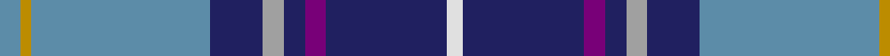

This page is one **sett** — a single exact thread-count. It belongs to the [tartan](/tartans/t4lo2t34db10lr4db4dp4db23w3/)
(the same proportion at any scale), whose colour order is pattern [BYBBYBBBW](/stripes/bybbybbbw/).

Sourced from tartans-authority.  It is a [9 stripe tartan](/stripes/stripes9/).

Original link http://www.tartansauthority.com/tartan-ferret/display/6406/

## Thread count
B/8 DY4 B68 DB20 N8 DB8 P8 DB46 LN/6

## Palette

Palette: <strong>Tartan Register</strong>
<table><thead><tr><th>Colour</th><th>Threads</th><th>Shade</th><th>Base</th><th>OKLCh</th></tr></thead><tbody><tr><td>B/</td><td style="text-align:right;font-variant-numeric:tabular-nums">8</td><td><code style="background-color:#5C8CA8;">#5C8CA8</code> <small style="color:#888">#5C8CA8</small></td><td>B <code style="background-color:#2A418A;">#2A418A</code></td><td><small style="color:#888">oklch(61.7% 0.067 235.0)</small></td></tr><tr><td>DY</td><td style="text-align:right;font-variant-numeric:tabular-nums">4</td><td><code style="background-color:#BC8C00;">#BC8C00</code> <small style="color:#888">#BC8C00</small></td><td>Y <code style="background-color:#F2BF00;">#F2BF00</code></td><td><small style="color:#888">oklch(66.8% 0.137 84.1)</small></td></tr><tr><td>B</td><td style="text-align:right;font-variant-numeric:tabular-nums">68</td><td><code style="background-color:#5C8CA8;">#5C8CA8</code> <small style="color:#888">#5C8CA8</small></td><td>B <code style="background-color:#2A418A;">#2A418A</code></td><td><small style="color:#888">oklch(61.7% 0.067 235.0)</small></td></tr><tr><td>DB</td><td style="text-align:right;font-variant-numeric:tabular-nums">20</td><td><code style="background-color:#202060;">#202060</code> <small style="color:#888">#202060</small></td><td>B <code style="background-color:#2A418A;">#2A418A</code></td><td><small style="color:#888">oklch(28.9% 0.111 276.9)</small></td></tr><tr><td>N</td><td style="text-align:right;font-variant-numeric:tabular-nums">8</td><td><code style="background-color:#A0A0A0;">#A0A0A0</code> <small style="color:#888">#A0A0A0</small></td><td>Y <code style="background-color:#F2BF00;">#F2BF00</code></td><td><small style="color:#888">oklch(70.6% 0.000 89.9)</small></td></tr><tr><td>DB</td><td style="text-align:right;font-variant-numeric:tabular-nums">8</td><td><code style="background-color:#202060;">#202060</code> <small style="color:#888">#202060</small></td><td>B <code style="background-color:#2A418A;">#2A418A</code></td><td><small style="color:#888">oklch(28.9% 0.111 276.9)</small></td></tr><tr><td>P</td><td style="text-align:right;font-variant-numeric:tabular-nums">8</td><td><code style="background-color:#780078;">#780078</code> <small style="color:#888">#780078</small></td><td>B <code style="background-color:#2A418A;">#2A418A</code></td><td><small style="color:#888">oklch(40.2% 0.185 328.4)</small></td></tr><tr><td>DB</td><td style="text-align:right;font-variant-numeric:tabular-nums">46</td><td><code style="background-color:#202060;">#202060</code> <small style="color:#888">#202060</small></td><td>B <code style="background-color:#2A418A;">#2A418A</code></td><td><small style="color:#888">oklch(28.9% 0.111 276.9)</small></td></tr><tr><td>LN/</td><td style="text-align:right;font-variant-numeric:tabular-nums">6</td><td><code style="background-color:#E0E0E0;">#E0E0E0</code> <small style="color:#888">#E0E0E0</small></td><td>W <code style="background-color:#F7F7F7;">#F7F7F7</code></td><td><small style="color:#888">oklch(90.7% 0.000 89.9)</small></td></tr></tbody></table>

## Nearest tartans

The nearest existing variants by ΔTartan distance, with this tartan at the top so the swatches line up against it.

ΔTartan

Tartan

Sett

—

<a href="/ttd/edit/#slug=t4lo2t34db10lr4db4dp4db23w3~x2">Heirloom Blue Alba (Fashion)</a> <a class="nn-out" href="/setts/s9/t4lo2t34db10lr4db4dp4db23w3~x2/" title="open its dictionary page">↗</a>

0.70

<a href="/ttd/edit/#slug=ly4db24t5g2db3k5t33r2~x2">Los Angeles</a> <a class="nn-out" href="/setts/s8/ly4db24t5g2db3k5t33r2~x2/" title="open its dictionary page">↗</a>

0.83

<a href="/ttd/edit/#slug=t27db9lb3g6db33lb3dr3ly2~x2">Blue Ridge Highlands Heritage</a> <a class="nn-out" href="/setts/s8/t27db9lb3g6db33lb3dr3ly2~x2/" title="open its dictionary page">↗</a>

0.93

<a href="/ttd/edit/#slug=t12db6t50db39p12dp6p6w4">Pride of the Nation (Fashion)</a> <a class="nn-out" href="/setts/s8/t12db6t50db39p12dp6p6w4/" title="open its dictionary page">↗</a>

0.96

<a href="/ttd/edit/#slug=b16db6k1ly1k1db6b4m4k1r1~x4">Kirk in the Hills</a> <a class="nn-out" href="/setts/s10/b16db6k1ly1k1db6b4m4k1r1~x4/" title="open its dictionary page">↗</a>

0.96

<a href="/ttd/edit/#slug=lr5lb3lb7lr5lb27b8dt43w3lb3">Queensferry High (School)</a> <a class="nn-out" href="/setts/s9/lr5lb3lb7lr5lb27b8dt43w3lb3/" title="open its dictionary page">↗</a>

0.98

<a href="/ttd/edit/#slug=db28r3w3r3w3r3db28k12b38w8">GYL family (Personal)</a> <a class="nn-out" href="/setts/s10/db28r3w3r3w3r3db28k12b38w8/" title="open its dictionary page">↗</a>

0.99

<a href="/ttd/edit/#slug=db4g2db24g8t2r2t2ly2t10db2w3~x2">McCartney (Evening/Night)</a> <a class="nn-out" href="/setts/s11/db4g2db24g8t2r2t2ly2t10db2w3~x2/" title="open its dictionary page">↗</a>

1.05

<a href="/ttd/edit/#slug=db4g2db24g8b2r2b2ly2b10db2w3~x2">McCartney (Night)</a> <a class="nn-out" href="/setts/s11/db4g2db24g8b2r2b2ly2b10db2w3~x2/" title="open its dictionary page">↗</a>

1.06

<a href="/ttd/edit/#slug=w1db15r1o10g2lp1~x4">Peterson, Oren (Name)</a> <a class="nn-out" href="/setts/s6/w1db15r1o10g2lp1~x4/" title="open its dictionary page">↗</a>

1.09

<a href="/ttd/edit/#slug=w4db8r3db25k13db4t29db3t8db2r3~x2">Royal Air Force Regimental Tartan Tartan Number: 2123. Earliest known date: 1988 The Royal Air Force initially declined to approve this tartan for members of the Air Services. However the tartan was worn by Scottish ex-servicemen and those who have served in Scotland and became quite popular. In 2002 it was officially adopted by the RAF. See products available Copyright © Blair Urquhart, Comrie, 2015</a> <a class="nn-out" href="/setts/s11/w4db8r3db25k13db4t29db3t8db2r3~x2/" title="open its dictionary page">↗</a>

## Neighbour map

Every grey dot is one of 14299 variants placed by the first two principal components of the ΔTartan feature space (44% of its variance). Red is this tartan; blue dots are its nearest — click one to open its page.

<svg viewBox="0 0 640 380" role="img" style="max-width:100%;height:auto;border:1px solid #e0e0e0;border-radius:4px;display:block" xmlns="http://www.w3.org/2000/svg"><image href="/nn/cloud.v1.png" width="640" height="380"/><a href="/setts/s8/ly4db24t5g2db3k5t33r2~x2/"><circle cx="251.2" cy="128.4" r="4" fill="#3465a4"><title>Los Angeles</title></circle></a><a href="/setts/s8/t27db9lb3g6db33lb3dr3ly2~x2/"><circle cx="263.6" cy="146.0" r="4" fill="#3465a4"><title>Blue Ridge Highlands Heritage</title></circle></a><a href="/setts/s8/t12db6t50db39p12dp6p6w4/"><circle cx="217.4" cy="153.1" r="4" fill="#3465a4"><title>Pride of the Nation (Fashion)</title></circle></a><a href="/setts/s10/b16db6k1ly1k1db6b4m4k1r1~x4/"><circle cx="241.2" cy="121.2" r="4" fill="#3465a4"><title>Kirk in the Hills</title></circle></a><a href="/setts/s9/lr5lb3lb7lr5lb27b8dt43w3lb3/"><circle cx="196.9" cy="122.1" r="4" fill="#3465a4"><title>Queensferry High (School)</title></circle></a><a href="/setts/s10/db28r3w3r3w3r3db28k12b38w8/"><circle cx="183.7" cy="138.4" r="4" fill="#3465a4"><title>GYL family (Personal)</title></circle></a><a href="/setts/s11/db4g2db24g8t2r2t2ly2t10db2w3~x2/"><circle cx="226.5" cy="130.5" r="4" fill="#3465a4"><title>McCartney (Evening/Night)</title></circle></a><a href="/setts/s11/db4g2db24g8b2r2b2ly2b10db2w3~x2/"><circle cx="231.3" cy="128.8" r="4" fill="#3465a4"><title>McCartney (Night)</title></circle></a><a href="/setts/s6/w1db15r1o10g2lp1~x4/"><circle cx="270.1" cy="149.8" r="4" fill="#3465a4"><title>Peterson, Oren (Name)</title></circle></a><a href="/setts/s11/w4db8r3db25k13db4t29db3t8db2r3~x2/"><circle cx="174.9" cy="135.1" r="4" fill="#3465a4"><title>Royal Air Force Regimental Tartan Tartan Number: 2123. Earliest known date: 1988 The Royal Air Force initially declined to approve this tartan for members of the Air Services. However the tartan was worn by Scottish ex-servicemen and those who have served in Scotland and became quite popular. In 2002 it was officially adopted by the RAF. See products available Copyright © Blair Urquhart, Comrie, 2015</title></circle></a><circle cx="238.0" cy="130.4" r="5" fill="#c00000"/></svg>

ID: /setts/s9/t4lo2t34db10lr4db4dp4db23w3~x2/
