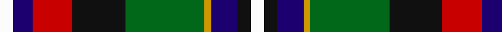

**Bands:** [WKBYGKRBW](/stripes/wkbygkrbw/) · **Stripes:** [W K DB LO G K R DB W](/stripes/stripes9/) W K DB LO G K R DB W

This was sourced from register-of-tartans.  It is a [9 band tartan](/bands/bands9/).

Original link https://www.tartanregister.gov.uk/tartanDetails.aspx?ref=5122

## Register references

External register numbers recorded for this tartan.

- Scottish Register of Tartans: [5122](https://www.tartanregister.gov.uk/tartanDetails.aspx?ref=5122)
- Scottish Tartans Authority (ITI): 3186

## Thread count
W/4 DB6 R12 K16 G24 DY2 DB8 K4 W/4

## Palette
Each colour and its ΔE from the base-6 reference it is a variant of.

| Colour | Shade | Base | ΔE (OKLab) |
|---|---|---|---|
| DB | <code style="background-color:#1C0070;">#1C0070</code> `#1C0070` | B <code style="background-color:#2A418A;">#2A418A</code> | 0.14 |
| DY | <code style="background-color:#D09800;">#D09800</code> `#D09800` | Y <code style="background-color:#F2BF00;">#F2BF00</code> | 0.12 |
| G | <code style="background-color:#006818;">#006818</code> `#006818` | G <code style="background-color:#006100;">#006100</code> | 0.02 |
| K | <code style="background-color:#101010;">#101010</code> `#101010` | K <code style="background-color:#000000;">#000000</code> | 0.17 |
| R | <code style="background-color:#C80000;">#C80000</code> `#C80000` | R <code style="background-color:#CC0000;">#CC0000</code> | 0.01 |
| W | <code style="background-color:#FCFCFC;">#FCFCFC</code> `#FCFCFC` | W <code style="background-color:#F7F7F7;">#F7F7F7</code> | 0.01 |

## Nearest tartans

The nearest existing variants by ΔTartan distance.

1. [National](/setts/s9/w2db3r6k8g12ly1db4k2w2~x2/) — ΔT 0.53
1. [Comyn, Cumming](/setts/s9/r4w1r4g10ly1k10t4k2t4~x4/) — ΔT 0.64
1. [Comyn/Cumming](/setts/s9/r4w1r4dg10ly1k10t4k2t4~x4/) — ΔT 0.65
1. [Stirling, and Bannockburn](/setts/s10/r3g18r4t3r4k13r3db18g2ly3~x2/) — ΔT 0.69
1. [George Brown](/setts/s9/ly3db29k15r4g25r8k4r3w2~x2/) — ΔT 0.74
1. [Birch (Personal) (Estimated threadcount)](/setts/s9/g2dp2g10k6r2k6t10k1lb2~x2/) — ΔT 0.83
1. [Leitrim Irish County Tartan Tartan Number: 2271. Earliest known date: 1996 One of a series of Irish District tartans designed by Polly Wittering of the House of Edgar, with colours reminiscent of the Country with soft warm colours dominating. See products available Copyright © Blair Urquhart, Comrie, 2015](/setts/s10/lr3k2lr18lg3o13lg4dy3lg4k18lg3~x2/) — ΔT 0.89
1. [Firth of Tay](/setts/s10/db2lb2db1lb9k5dg3r2dg5k1ly2~x4/) — ΔT 0.90
1. [Royal Dornoch Golf Club, The](/setts/s10/r12db22dg5db3ly3db3dg17b9dr7r2~x2/) — ΔT 0.92
1. [Scottish National - 1934 (Fashion)](/setts/s9/w2r3db6db8g12k1r4db2w2~x4/) — ΔT 1.00

## Neighbour map

Every grey dot is one of 14299 variants placed by the first two principal components of the ΔTartan feature space (44% of its variance). Red is this tartan; blue dots are its nearest — click one to open its page.

<svg viewBox="0 0 640 380" role="img" style="max-width:100%;height:auto;border:1px solid #e0e0e0;border-radius:4px;display:block" xmlns="http://www.w3.org/2000/svg"><image href="/nn/cloud.v1.png" width="640" height="380"/><a href="/setts/s9/w2db3r6k8g12ly1db4k2w2~x2/"><circle cx="65.6" cy="142.8" r="4" fill="#3465a4"><title>National</title></circle></a><a href="/setts/s9/r4w1r4g10ly1k10t4k2t4~x4/"><circle cx="65.0" cy="154.5" r="4" fill="#3465a4"><title>Comyn, Cumming</title></circle></a><a href="/setts/s9/r4w1r4dg10ly1k10t4k2t4~x4/"><circle cx="86.2" cy="162.6" r="4" fill="#3465a4"><title>Comyn/Cumming</title></circle></a><a href="/setts/s10/r3g18r4t3r4k13r3db18g2ly3~x2/"><circle cx="71.3" cy="145.1" r="4" fill="#3465a4"><title>Stirling, and Bannockburn</title></circle></a><a href="/setts/s9/ly3db29k15r4g25r8k4r3w2~x2/"><circle cx="110.4" cy="129.0" r="4" fill="#3465a4"><title>George Brown</title></circle></a><a href="/setts/s9/g2dp2g10k6r2k6t10k1lb2~x2/"><circle cx="76.7" cy="158.2" r="4" fill="#3465a4"><title>Birch (Personal) (Estimated threadcount)</title></circle></a><a href="/setts/s10/lr3k2lr18lg3o13lg4dy3lg4k18lg3~x2/"><circle cx="58.5" cy="133.2" r="4" fill="#3465a4"><title>Leitrim Irish County Tartan Tartan Number: 2271. Earliest known date: 1996 One of a series of Irish District tartans designed by Polly Wittering of the House of Edgar, with colours reminiscent of the Country with soft warm colours dominating. See products available Copyright © Blair Urquhart, Comrie, 2015</title></circle></a><a href="/setts/s10/db2lb2db1lb9k5dg3r2dg5k1ly2~x4/"><circle cx="64.2" cy="148.4" r="4" fill="#3465a4"><title>Firth of Tay</title></circle></a><a href="/setts/s10/r12db22dg5db3ly3db3dg17b9dr7r2~x2/"><circle cx="97.6" cy="150.1" r="4" fill="#3465a4"><title>Royal Dornoch Golf Club, The</title></circle></a><a href="/setts/s9/w2r3db6db8g12k1r4db2w2~x4/"><circle cx="93.6" cy="154.1" r="4" fill="#3465a4"><title>Scottish National - 1934 (Fashion)</title></circle></a><circle cx="74.9" cy="145.8" r="5" fill="#c00000"/></svg>

ID: /setts/s9/w2db3r6k8g12lo1db4k2w2~x2/
