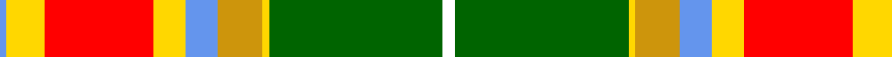

In pattern [BYRYBYYGW](/patterns/byrybyygw/).

This was sourced from register-of-tartans.  It is a [9 stripes tartan](/stripes/stripes9/).

Original link https://www.tartanregister.gov.uk/tartanDetails.aspx?ref=10677

## Register references

External register numbers recorded for this tartan.

- Scottish Register of Tartans: [10677](https://www.tartanregister.gov.uk/tartanDetails.aspx?ref=10677)

## Thread count
B/2 Y12 R34 Y10 B10 DY14 Y2 G54 W/4

## Palette
Each colour and its ΔE from the base-6 reference it is a variant of.

| Colour | Shade | Base | ΔE (OKLab) |
|---|---|---|---|
| B | <code style="background-color:#6495ED;">#6495ED</code> `#6495ED` | B <code style="background-color:#2A418A;">#2A418A</code> | 0.28 |
| DY | <code style="background-color:#CD950C;">#CD950C</code> `#CD950C` | Y <code style="background-color:#F2BF00;">#F2BF00</code> | 0.13 |
| G | <code style="background-color:#006400;">#006400</code> `#006400` | G <code style="background-color:#006100;">#006100</code> | 0.01 |
| R | <code style="background-color:#FF0000;">#FF0000</code> `#FF0000` | R <code style="background-color:#CC0000;">#CC0000</code> | 0.11 |
| W | <code style="background-color:#FFFFFF;">#FFFFFF</code> `#FFFFFF` | W <code style="background-color:#F7F7F7;">#F7F7F7</code> | 0.02 |
| Y | <code style="background-color:#FFD700;">#FFD700</code> `#FFD700` | Y <code style="background-color:#F2BF00;">#F2BF00</code> | 0.06 |

## Nearest tartans

The nearest existing variants by ΔTartan distance.

1. [Leaf Peeper](/setts/s9/k2w1g25ga11r12w1y12k1w2~g285800-ga603800-k101010-rc80000-wfcfcfc-ye8c000~x2/) — ΔT 0.87
1. [Elystan Glodrydd (Name)](/setts/s9/w2g27y1ya7b5y5r17y6b1~b5c8ca8-g003820-rc80000-wfcfcfc-ye8c000-yabc8c00~x2/) — ΔT 1.00
1. [Westwood (Fashion?)](/setts/s10/r15y30k1w6k1y2g16b4r6w1~b5c8ca8-g003820-k101010-rc80000-we0e0e0-ya08858~x2/) — ΔT 1.40
1. [Canadian Shield (Personal)](/setts/s7/r5g8b13ra21ga34w55g3~b441800-g285800-ga74846c-r880000-ra98481c-wf0e4cc/) — ΔT 1.40
1. [Red Rum Commemorative Tartan Tartan Number: 1217. Earliest known date: 1982 Red Remony See products available Copyright © Blair Urquhart, Comrie, 2015](/setts/s7/k2y30g4w2g14r13y2~g006818-k101010-r880000-we0e0e0-ye8c000~x2/) — ΔT 1.40
1. [Bouguet, Adrian Dress (Personal)](/setts/s11/w16g5y20r3g3r3y4ga14y2r2ra1~g003820-ga006818-r888888-rac80000-w98c8e8-yec8048~x2/) — ΔT 1.45
1. [North West Territories](/setts/s10/y4g2y2g2y2g24k2r16w9b3~b304080-g008000-k000000-rc00000-we0e0e0-yf0c000~x2/) — ΔT 1.46
1. [Dunblane](/setts/s12/g6y5w1g2w1g5w1g2w1r15b2w1~b304080-g008000-rc00000-we0e0e0-yf0c000~x2/) — ΔT 1.48
1. [Baxter of Balgavies](/setts/s11/w2r16k1b2k1y4k1b2k1g16b1~b5480b0-g008000-k000000-rc00000-we0e0e0-yf0c000~x2/) — ΔT 1.50
1. [North West Territories Canadian District Tartan Tartan Number: 662. Earliest known date: 1969 Designed at the request of an official of the Canadian Commission who decreed that the predominant colours should be "Green and White - White for the snow covering the Territories for six months of every year and the Green for the other six months." See products available Copyright © Blair Urquhart, Comrie, 2015](/setts/s10/y4g2y2g2y2g24k2r16w9b3~b2c2c80-g006818-k101010-rc80000-we0e0e0-ye8c000~x2/) — ΔT 1.51

## Neighbour map

Every grey dot is one of 15726 variants placed by the first two principal components of the ΔTartan feature space (44% of its variance). Red is this tartan; blue dots are its nearest — click one to open its page.

<svg viewBox="0 0 640 380" role="img" style="max-width:100%;height:auto;border:1px solid #e0e0e0;border-radius:4px;display:block" xmlns="http://www.w3.org/2000/svg"><image href="/nn/cloud.v1.png" width="640" height="380"/><a href="/setts/s9/k2w1g25ga11r12w1y12k1w2~g285800-ga603800-k101010-rc80000-wfcfcfc-ye8c000~x2/"><circle cx="165.5" cy="95.4" r="4" fill="#3465a4"><title>Leaf Peeper</title></circle></a><a href="/setts/s9/w2g27y1ya7b5y5r17y6b1~b5c8ca8-g003820-rc80000-wfcfcfc-ye8c000-yabc8c00~x2/"><circle cx="170.7" cy="91.4" r="4" fill="#3465a4"><title>Elystan Glodrydd (Name)</title></circle></a><a href="/setts/s10/r15y30k1w6k1y2g16b4r6w1~b5c8ca8-g003820-k101010-rc80000-we0e0e0-ya08858~x2/"><circle cx="207.5" cy="84.9" r="4" fill="#3465a4"><title>Westwood (Fashion?)</title></circle></a><a href="/setts/s7/r5g8b13ra21ga34w55g3~b441800-g285800-ga74846c-r880000-ra98481c-wf0e4cc/"><circle cx="151.7" cy="121.4" r="4" fill="#3465a4"><title>Canadian Shield (Personal)</title></circle></a><a href="/setts/s7/k2y30g4w2g14r13y2~g006818-k101010-r880000-we0e0e0-ye8c000~x2/"><circle cx="193.5" cy="123.8" r="4" fill="#3465a4"><title>Red Rum Commemorative Tartan Tartan Number: 1217. Earliest known date: 1982 Red Remony See products available Copyright © Blair Urquhart, Comrie, 2015</title></circle></a><a href="/setts/s11/w16g5y20r3g3r3y4ga14y2r2ra1~g003820-ga006818-r888888-rac80000-w98c8e8-yec8048~x2/"><circle cx="152.4" cy="102.9" r="4" fill="#3465a4"><title>Bouguet, Adrian Dress (Personal)</title></circle></a><a href="/setts/s10/y4g2y2g2y2g24k2r16w9b3~b304080-g008000-k000000-rc00000-we0e0e0-yf0c000~x2/"><circle cx="159.8" cy="111.6" r="4" fill="#3465a4"><title>North West Territories</title></circle></a><a href="/setts/s12/g6y5w1g2w1g5w1g2w1r15b2w1~b304080-g008000-rc00000-we0e0e0-yf0c000~x2/"><circle cx="178.2" cy="111.0" r="4" fill="#3465a4"><title>Dunblane</title></circle></a><a href="/setts/s11/w2r16k1b2k1y4k1b2k1g16b1~b5480b0-g008000-k000000-rc00000-we0e0e0-yf0c000~x2/"><circle cx="151.7" cy="84.4" r="4" fill="#3465a4"><title>Baxter of Balgavies</title></circle></a><a href="/setts/s10/y4g2y2g2y2g24k2r16w9b3~b2c2c80-g006818-k101010-rc80000-we0e0e0-ye8c000~x2/"><circle cx="163.3" cy="112.7" r="4" fill="#3465a4"><title>North West Territories Canadian District Tartan Tartan Number: 662. Earliest known date: 1969 Designed at the request of an official of the Canadian Commission who decreed that the predominant colours should be &quot;Green and White - White for the snow covering the Territories for six months of every year and the Green for the other six months.&quot; See products available Copyright © Blair Urquhart, Comrie, 2015</title></circle></a><circle cx="168.4" cy="86.7" r="5" fill="#c00000"/></svg>

ID: /setts/s9/w2g27y1ya7b5y5r17y6b1~b6495ed-g006400-rff0000-wffffff-yffd700-yacd950c~x2/
