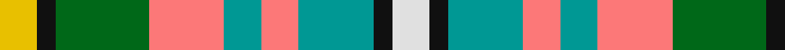

In pattern [WKGRGRGKY](/stripes/wkgrgrgky/).

This was sourced from tartans-authority.  It is a [9 stripe tartan](/stripes/stripes9/).

Original link http://www.tartansauthority.com/tartan-ferret/display/7946/

## Thread count
Y/12 K6 G30 LR24 B12 LR12 B24 K6 LN/12

## Palette
Each colour and the base-6 reference it is a variant of.

| Colour | Shade | Base |
|---|---|---|
| B | <code style="background-color:#009894;">#009894</code> `oklch(61.4% 0.106 191.5)` <small>#009894</small> | G <code style="background-color:#006100;">#006100</code> |
| G | <code style="background-color:#006818;">#006818</code> `oklch(45.0% 0.142 145.0)` <small>#006818</small> | G <code style="background-color:#006100;">#006100</code> |
| K | <code style="background-color:#101010;">#101010</code> `oklch(17.3% 0.000 89.9)` <small>#101010</small> | K <code style="background-color:#000000;">#000000</code> |
| LN | <code style="background-color:#E0E0E0;">#E0E0E0</code> `oklch(90.7% 0.000 89.9)` <small>#E0E0E0</small> | W <code style="background-color:#F7F7F7;">#F7F7F7</code> |
| LR | <code style="background-color:#FC7878;">#FC7878</code> `oklch(72.7% 0.162 21.9)` <small>#FC7878</small> | R <code style="background-color:#CC0000;">#CC0000</code> |
| Y | <code style="background-color:#E8C000;">#E8C000</code> `oklch(81.9% 0.168 93.7)` <small>#E8C000</small> | Y <code style="background-color:#F2BF00;">#F2BF00</code> |

## Nearest tartans

The nearest existing variants by ΔTartan distance, with this tartan at the top so the swatches line up against it.

ΔTartan

Tartan

Sett

—

<a href="/ttd/edit/#slug=w2k1g4r2g2r4g5k1ly2~x6">Ellis (Personal)</a> <a class="nn-out" href="/setts/s9/w2k1g4r2g2r4g5k1ly2~x6/" title="open its dictionary page">↗</a>

0.71

<a href="/ttd/edit/#slug=w5y4t1y4r4t1dg4ly1~x6">Devon Rural Skills Trust</a> <a class="nn-out" href="/setts/s8/w5y4t1y4r4t1dg4ly1~x6/" title="open its dictionary page">↗</a>

0.77

<a href="/ttd/edit/#slug=w5y4b1y4r4b1dg4ly1~x2">Devon Rural Skills Trust</a> <a class="nn-out" href="/setts/s8/w5y4b1y4r4b1dg4ly1~x2/" title="open its dictionary page">↗</a>

1.17

<a href="/ttd/edit/#slug=g5db3t3g5w4ly2t1ly2db1r1~x6">Northern College (Ontario)</a> <a class="nn-out" href="/setts/s10/g5db3t3g5w4ly2t1ly2db1r1~x6/" title="open its dictionary page">↗</a>

1.18

<a href="/ttd/edit/#slug=y8o8lg7lr5lb2k2lb2k2lb2~x4">Somerset (District)</a> <a class="nn-out" href="/setts/s9/y8o8lg7lr5lb2k2lb2k2lb2~x4/" title="open its dictionary page">↗</a>

1.21

<a href="/ttd/edit/#slug=dg2o13dg12w3lb10w3lb12g13r2~x2">Mounth The.. Corporate Tartan Tartan Number: 120. Earliest known date: 1988 Designed for Kincardine &amp; Deeside branch of the National Trust for Scotland. Blue is a muted sky blue. Green is a dark pine green. See products available Copyright © Blair Urquhart, Comrie, 2015</a> <a class="nn-out" href="/setts/s9/dg2o13dg12w3lb10w3lb12g13r2~x2/" title="open its dictionary page">↗</a>

1.24

<a href="/ttd/edit/#slug=db4g4db4w1db1w1m4lo4w1g4m4~x4">Belwade</a> <a class="nn-out" href="/setts/s11/db4g4db4w1db1w1m4lo4w1g4m4~x4/" title="open its dictionary page">↗</a>

1.25

<a href="/ttd/edit/#slug=lo6r8k4w6y16k13lr19k5~x2">Kilkenny County Crest (Fashion)</a> <a class="nn-out" href="/setts/s8/lo6r8k4w6y16k13lr19k5~x2/" title="open its dictionary page">↗</a>

1.34

<a href="/ttd/edit/#slug=r3db6g5db1g1db3ly6w6ly2w6r2~x2">Canice-Moodie (Personal)</a> <a class="nn-out" href="/setts/s11/r3db6g5db1g1db3ly6w6ly2w6r2~x2/" title="open its dictionary page">↗</a>

1.35

<a href="/ttd/edit/#slug=ly6k1ly3g3w3r3k2r3db3w3~x2">City of Williams Lake (District)</a> <a class="nn-out" href="/setts/s10/ly6k1ly3g3w3r3k2r3db3w3~x2/" title="open its dictionary page">↗</a>

1.36

<a href="/ttd/edit/#slug=do3o1lr1do1o3do3lr3ly6n1~x6">Toorak Chapler</a> <a class="nn-out" href="/setts/s9/do3o1lr1do1o3do3lr3ly6n1~x6/" title="open its dictionary page">↗</a>

## Neighbour map

Every grey dot is one of 14299 variants placed by the first two principal components of the ΔTartan feature space (44% of its variance). Red is this tartan; blue dots are its nearest — click one to open its page.

<svg viewBox="0 0 640 380" role="img" style="max-width:100%;height:auto;border:1px solid #e0e0e0;border-radius:4px;display:block" xmlns="http://www.w3.org/2000/svg"><image href="/nn/cloud.v1.png" width="640" height="380"/><a href="/setts/s8/w5y4t1y4r4t1dg4ly1~x6/"><circle cx="36.8" cy="199.0" r="4" fill="#3465a4"><title>Devon Rural Skills Trust</title></circle></a><a href="/setts/s8/w5y4b1y4r4b1dg4ly1~x2/"><circle cx="44.9" cy="202.9" r="4" fill="#3465a4"><title>Devon Rural Skills Trust</title></circle></a><a href="/setts/s10/g5db3t3g5w4ly2t1ly2db1r1~x6/"><circle cx="52.0" cy="194.1" r="4" fill="#3465a4"><title>Northern College (Ontario)</title></circle></a><a href="/setts/s9/y8o8lg7lr5lb2k2lb2k2lb2~x4/"><circle cx="14.0" cy="204.2" r="4" fill="#3465a4"><title>Somerset (District)</title></circle></a><a href="/setts/s9/dg2o13dg12w3lb10w3lb12g13r2~x2/"><circle cx="54.6" cy="186.1" r="4" fill="#3465a4"><title>Mounth The.. Corporate Tartan Tartan Number: 120. Earliest known date: 1988 Designed for Kincardine &amp; Deeside branch of the National Trust for Scotland. Blue is a muted sky blue. Green is a dark pine green. See products available Copyright © Blair Urquhart, Comrie, 2015</title></circle></a><a href="/setts/s11/db4g4db4w1db1w1m4lo4w1g4m4~x4/"><circle cx="14.0" cy="205.4" r="4" fill="#3465a4"><title>Belwade</title></circle></a><a href="/setts/s8/lo6r8k4w6y16k13lr19k5~x2/"><circle cx="20.9" cy="203.2" r="4" fill="#3465a4"><title>Kilkenny County Crest (Fashion)</title></circle></a><a href="/setts/s11/r3db6g5db1g1db3ly6w6ly2w6r2~x2/"><circle cx="27.4" cy="183.7" r="4" fill="#3465a4"><title>Canice-Moodie (Personal)</title></circle></a><a href="/setts/s10/ly6k1ly3g3w3r3k2r3db3w3~x2/"><circle cx="14.0" cy="187.1" r="4" fill="#3465a4"><title>City of Williams Lake (District)</title></circle></a><a href="/setts/s9/do3o1lr1do1o3do3lr3ly6n1~x6/"><circle cx="79.6" cy="189.8" r="4" fill="#3465a4"><title>Toorak Chapler</title></circle></a><circle cx="14.0" cy="197.6" r="5" fill="#c00000"/></svg>

ID: /setts/s9/w2k1g4r2g2r4g5k1ly2~x6/
