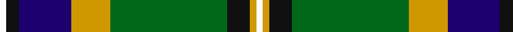

In pattern [WKBYGKKYW](/stripes/wkbygkkyw/).

This was sourced from tartans-authority.  It is a [9 stripe tartan](/stripes/stripes9/).

Original link http://www.tartansauthority.com/tartan-ferret/display/3186/

## Thread count
W/4 K8 DB32 DY24 G72 Ka2 K12 DY4 W/4

## Palette
Each colour and its ΔE from the base-6 reference it is a variant of.

| Colour | Shade | Base | ΔE (OKLab) |
|---|---|---|---|
| DB | <code style="background-color:#1C0070;">#1C0070</code> `#1C0070` | B <code style="background-color:#2A418A;">#2A418A</code> | 0.14 |
| DY | <code style="background-color:#D09800;">#D09800</code> `#D09800` | Y <code style="background-color:#F2BF00;">#F2BF00</code> | 0.12 |
| G | <code style="background-color:#006818;">#006818</code> `#006818` | G <code style="background-color:#006100;">#006100</code> | 0.02 |
| K | <code style="background-color:#101010;">#101010</code> `#101010` | K <code style="background-color:#000000;">#000000</code> | 0.17 |
| Ka | <code style="background-color:#101010;">#101010</code> `#101010` | K <code style="background-color:#000000;">#000000</code> | 0.17 |
| W | <code style="background-color:#FCFCFC;">#FCFCFC</code> `#FCFCFC` | W <code style="background-color:#F7F7F7;">#F7F7F7</code> | 0.01 |

## Nearest tartans

The nearest existing variants by ΔTartan distance.

1. [Birch (Name)](/setts/s9/g3dp2g25k6r2k6t20k1lb2~x2/) — ΔT 0.71
1. [Labrador (District)](/setts/s11/lb11k2lb2k2lo2k11dg30r2dg3k1w5~x2/) — ΔT 0.84
1. [National Millennium](/setts/s9/w2db4r16k12g36ly1db6k2w2~x2/) — ΔT 0.85
1. [Fermanagh County Crest (Fashion)](/setts/s10/r4w6k10db5k3lo16k3g33k1w4~x2/) — ΔT 0.91
1. [Gilhooley (Name)](/setts/s11/ly7g1k1ly2k9g22g7k27b4k3w4~x2/) — ΔT 0.95
1. [Fermanagh County, Crest Range](/setts/s10/r4w6k10db5k3o16k3dg33k1w4~x2/) — ΔT 0.96
1. [Labrador](/setts/s11/lt11k2lt2k2ly2k11g30r2g3k1w5~x2/) — ΔT 0.98
1. [Stirling, University of](/setts/s9/g90r1k10w6k4g6r10db62ly8/) — ΔT 1.03
1. [Tooth](/setts/s8/g5ly1r2g25k14db19w4g2~x2/) — ΔT 1.04
1. [St. Ninian (Commemorative)](/setts/s12/w4dg1g31ly1g4dg21dt4dg1dt36r2dt9w2~x2/) — ΔT 1.12

## Neighbour map

Every grey dot is one of 14299 variants placed by the first two principal components of the ΔTartan feature space (44% of its variance). Red is this tartan; blue dots are its nearest — click one to open its page.

<svg viewBox="0 0 640 380" role="img" style="max-width:100%;height:auto;border:1px solid #e0e0e0;border-radius:4px;display:block" xmlns="http://www.w3.org/2000/svg"><image href="/nn/cloud.v1.png" width="640" height="380"/><a href="/setts/s9/g3dp2g25k6r2k6t20k1lb2~x2/"><circle cx="193.6" cy="102.0" r="4" fill="#3465a4"><title>Birch (Name)</title></circle></a><a href="/setts/s11/lb11k2lb2k2lo2k11dg30r2dg3k1w5~x2/"><circle cx="223.5" cy="78.1" r="4" fill="#3465a4"><title>Labrador (District)</title></circle></a><a href="/setts/s9/w2db4r16k12g36ly1db6k2w2~x2/"><circle cx="236.7" cy="88.9" r="4" fill="#3465a4"><title>National Millennium</title></circle></a><a href="/setts/s10/r4w6k10db5k3lo16k3g33k1w4~x2/"><circle cx="176.0" cy="86.9" r="4" fill="#3465a4"><title>Fermanagh County Crest (Fashion)</title></circle></a><a href="/setts/s11/ly7g1k1ly2k9g22g7k27b4k3w4~x2/"><circle cx="194.7" cy="92.9" r="4" fill="#3465a4"><title>Gilhooley (Name)</title></circle></a><a href="/setts/s10/r4w6k10db5k3o16k3dg33k1w4~x2/"><circle cx="180.0" cy="87.6" r="4" fill="#3465a4"><title>Fermanagh County, Crest Range</title></circle></a><a href="/setts/s11/lt11k2lt2k2ly2k11g30r2g3k1w5~x2/"><circle cx="205.5" cy="71.5" r="4" fill="#3465a4"><title>Labrador</title></circle></a><a href="/setts/s9/g90r1k10w6k4g6r10db62ly8/"><circle cx="284.1" cy="72.3" r="4" fill="#3465a4"><title>Stirling, University of</title></circle></a><a href="/setts/s8/g5ly1r2g25k14db19w4g2~x2/"><circle cx="194.4" cy="120.7" r="4" fill="#3465a4"><title>Tooth</title></circle></a><a href="/setts/s12/w4dg1g31ly1g4dg21dt4dg1dt36r2dt9w2~x2/"><circle cx="231.3" cy="84.4" r="4" fill="#3465a4"><title>St. Ninian (Commemorative)</title></circle></a><circle cx="219.3" cy="86.0" r="5" fill="#c00000"/></svg>

ID: /setts/s9/w2k4db16lo12g36k1k6lo2w2~x2/
