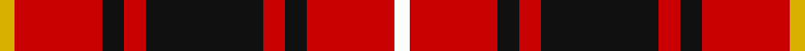

In pattern [WRKRKRKRY](/stripes/wrkrkrkry/).

This was sourced from tartans-authority.  It is a [9 stripe tartan](/stripes/stripes9/).

Original link http://www.tartansauthority.com/tartan-ferret/display/1855/

## Also known as

This cloth is also recorded under:

- MacIver #3

## Attestations

This cloth appears in 2 source records; the oldest owns this page.

- pre 2002 — MacIver (Clan) (tartans-authority, [record](http://www.tartansauthority.com/tartan-ferret/display/1855/))
- undated — MacIver #3 (register-of-tartans, [record](https://www.tartanregister.gov.uk/tartanDetails.aspx?ref=2491))

## Register references

External register numbers recorded for this tartan.

- Scottish Register of Tartans: [2491](https://www.tartanregister.gov.uk/tartanDetails.aspx?ref=2491)
- Scottish Tartans Authority (ITI): 1855
- Scottish Tartans World Register: 1855

## Thread count
Y/4 R24 K6 R6 K32 R6 K6 R24 W/4

## Palette
Each colour and its ΔE from the base-6 reference it is a variant of.

| Colour | Shade | Base | ΔE (OKLab) |
|---|---|---|---|
| K | <code style="background-color:#101010;">#101010</code> `#101010` | K <code style="background-color:#000000;">#000000</code> | 0.17 |
| R | <code style="background-color:#C80000;">#C80000</code> `#C80000` | R <code style="background-color:#CC0000;">#CC0000</code> | 0.01 |
| W | <code style="background-color:#FCFCFC;">#FCFCFC</code> `#FCFCFC` | W <code style="background-color:#F7F7F7;">#F7F7F7</code> | 0.01 |
| Y | <code style="background-color:#D8B000;">#D8B000</code> `#D8B000` | Y <code style="background-color:#F2BF00;">#F2BF00</code> | 0.06 |

## Nearest tartans

The nearest existing variants by ΔTartan distance.

1. [Cameron of Locheil #3](/setts/s9/r24db8r23k4w4k4r10k32r8/) — ΔT 0.45
1. [MacIver #2](/setts/s9/w3r27k5r5k32r5k5r27ly3~x2/) — ΔT 0.76
1. [Morrison LC](/setts/s9/dg9lb4dg15r17k5r7k5r32dg5/) — ΔT 0.80
1. [Nakayama (Personal)](/setts/s8/db1r1k2r7k7r1k2w1~x6/) — ΔT 0.85
1. [Alexander](/setts/s9/r12db2r4db4k15g4r4g2r12~x2/) — ΔT 0.92
1. [MacPherson Red Cluny](/setts/s7/r6k3r29k23w4k7ly3~x2/) — ΔT 0.94
1. [Cameron of Locheil #2](/setts/s9/r6g3r6db1w1db1r2db8r4~x4/) — ΔT 0.95
1. [Alexander - 1985 (Name)](/setts/s9/r12g2r4g4k15t4r4t2r12~x2/) — ΔT 1.00
1. [Nakayama (Fashion)](/setts/s8/b1r1k2r7k7r1k2w1~x6/) — ΔT 1.01
1. [MacKinnon Black (Personal)](/setts/s12/dp3r4k5r12k24r3k10r26k12dp3r6w3~x2/) — ΔT 1.06

## Neighbour map

Every grey dot is one of 14299 variants placed by the first two principal components of the ΔTartan feature space (44% of its variance). Red is this tartan; blue dots are its nearest — click one to open its page.

<svg viewBox="0 0 640 380" role="img" style="max-width:100%;height:auto;border:1px solid #e0e0e0;border-radius:4px;display:block" xmlns="http://www.w3.org/2000/svg"><image href="/nn/cloud.v1.png" width="640" height="380"/><a href="/setts/s9/r24db8r23k4w4k4r10k32r8/"><circle cx="281.0" cy="186.0" r="4" fill="#3465a4"><title>Cameron of Locheil #3</title></circle></a><a href="/setts/s9/w3r27k5r5k32r5k5r27ly3~x2/"><circle cx="322.3" cy="161.0" r="4" fill="#3465a4"><title>MacIver #2</title></circle></a><a href="/setts/s9/dg9lb4dg15r17k5r7k5r32dg5/"><circle cx="281.5" cy="188.7" r="4" fill="#3465a4"><title>Morrison LC</title></circle></a><a href="/setts/s8/db1r1k2r7k7r1k2w1~x6/"><circle cx="262.3" cy="188.8" r="4" fill="#3465a4"><title>Nakayama (Personal)</title></circle></a><a href="/setts/s9/r12db2r4db4k15g4r4g2r12~x2/"><circle cx="243.1" cy="195.0" r="4" fill="#3465a4"><title>Alexander</title></circle></a><a href="/setts/s7/r6k3r29k23w4k7ly3~x2/"><circle cx="261.4" cy="174.4" r="4" fill="#3465a4"><title>MacPherson Red Cluny</title></circle></a><a href="/setts/s9/r6g3r6db1w1db1r2db8r4~x4/"><circle cx="268.3" cy="195.5" r="4" fill="#3465a4"><title>Cameron of Locheil #2</title></circle></a><a href="/setts/s9/r12g2r4g4k15t4r4t2r12~x2/"><circle cx="259.1" cy="200.2" r="4" fill="#3465a4"><title>Alexander - 1985 (Name)</title></circle></a><a href="/setts/s8/b1r1k2r7k7r1k2w1~x6/"><circle cx="265.8" cy="192.3" r="4" fill="#3465a4"><title>Nakayama (Fashion)</title></circle></a><a href="/setts/s12/dp3r4k5r12k24r3k10r26k12dp3r6w3~x2/"><circle cx="258.6" cy="174.0" r="4" fill="#3465a4"><title>MacKinnon Black (Personal)</title></circle></a><circle cx="282.9" cy="182.1" r="5" fill="#c00000"/></svg>

ID: /setts/s9/w2r12k3r3k16r3k3r12ly2~x2/
