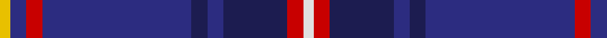

This page is one **sett** — a single exact thread-count. It belongs to the [tartan](/tartans/y2db3r3db28dbb3db3dbb12r3ln2/)
(the same proportion at any scale), whose colour order is pattern [WRBBBBRBY](/stripes/wrbbbbrby/).

Sourced from register-of-tartans.  It is a [9 stripe tartan](/stripes/stripes9/).

Original link https://www.tartanregister.gov.uk/tartanDetails.aspx?ref=3609

2 attestations — the source records this cloth was collapsed from (oldest owns this page)

<ul>
<li>01/06/2005 — Royal Scottish Corporation (register-of-tartans, <a href="https://www.tartanregister.gov.uk/tartanDetails.aspx?ref=3609">record</a>)</li>
<li>2005, June — Royal Scottish Corporation (Corp) (tartans-authority, <a href="http://www.tartansauthority.com/tartan-ferret/display/6907/">record</a>)</li>
</ul>

## Register references

External register numbers recorded for this tartan.

- Scottish Register of Tartans: [3609](https://www.tartanregister.gov.uk/tartanDetails.aspx?ref=3609)
- Scottish Tartans Authority (ITI): 6907

## Thread count
Y/4 DB6 R6 DB56 DBb6 DB6 DBb24 R6 LN/4

## Palette
Each colour and the base-6 reference it is a variant of.

| Colour | Shade | Base |
|---|---|---|
| DB | <code style="background-color:#2C2C80;">#2C2C80</code> `oklch(35.0% 0.138 276.6)` <small>#2C2C80</small> | B <code style="background-color:#2A418A;">#2A418A</code> |
| DBa | <code style="background-color:#003C64;">#003C64</code> `oklch(34.5% 0.089 246.0)` <small>#003C64</small> | B <code style="background-color:#2A418A;">#2A418A</code> |
| DBb | <code style="background-color:#1C1C50;">#1C1C50</code> `oklch(26.2% 0.093 277.9)` <small>#1C1C50</small> | B <code style="background-color:#2A418A;">#2A418A</code> |
| LN | <code style="background-color:#E0E0E0;">#E0E0E0</code> `oklch(90.7% 0.000 89.9)` <small>#E0E0E0</small> | W <code style="background-color:#F7F7F7;">#F7F7F7</code> |
| R | <code style="background-color:#C80000;">#C80000</code> `oklch(52.3% 0.215 29.2)` <small>#C80000</small> | R <code style="background-color:#CC0000;">#CC0000</code> |
| Y | <code style="background-color:#E8C000;">#E8C000</code> `oklch(81.9% 0.168 93.7)` <small>#E8C000</small> | Y <code style="background-color:#F2BF00;">#F2BF00</code> |

## Nearest tartans

The nearest existing variants by ΔTartan distance, with this tartan at the top so the swatches line up against it.

ΔTartan

Tartan

Sett

—

<a href="/ttd/edit/#slug=w2r3db12db3db3db28r3db3ly2~x2">Royal Scottish Corporation</a> <a class="nn-out" href="/setts/s9/w2r3db12db3db3db28r3db3ly2~x2/" title="open its dictionary page">↗</a>

1.07

<a href="/ttd/edit/#slug=db6ly3k2ly5db30g2k4g2db6db4~x2">St. Andrews University (Corporate)</a> <a class="nn-out" href="/setts/s10/db6ly3k2ly5db30g2k4g2db6db4~x2/" title="open its dictionary page">↗</a>

1.11

<a href="/ttd/edit/#slug=dp10ly3dp8db42g5o5~x2">Cheadle (Personal)</a> <a class="nn-out" href="/setts/s6/dp10ly3dp8db42g5o5~x2/" title="open its dictionary page">↗</a>

1.19

<a href="/ttd/edit/#slug=db6dp3db56k24g6r6g6">Wcwm 9275-1395</a> <a class="nn-out" href="/setts/s7/db6dp3db56k24g6r6g6/" title="open its dictionary page">↗</a>

1.20

<a href="/ttd/edit/#slug=k2db22g4k7lo2k2w2db2~x2">Glasgow, University of</a> <a class="nn-out" href="/setts/s8/k2db22g4k7lo2k2w2db2~x2/" title="open its dictionary page">↗</a>

1.20

<a href="/ttd/edit/#slug=r1db2n1dt3n19db3ly1db2ly1~x4">Pagus Wasia District Tartan Tartan Number: 10962. Earliest known date: 2012 Pagus (shire) Wasia (wetland) is a rural district in Belgium. The tartan was created by the founding members of the new Pagus Wasia Pipes &amp; Drums, based on the colours of the District Coat of Arms. The district is associated with the Belgian surname, Waas. Registration was authorised by Marc Van de Vijver, Mayor of the city of Beveren. See products available Copyright © Blair Urquhart, Comrie, 2015</a> <a class="nn-out" href="/setts/s9/r1db2n1dt3n19db3ly1db2ly1~x4/" title="open its dictionary page">↗</a>

1.23

<a href="/ttd/edit/#slug=r16db2o6r3k4t2db40t6~x2">St. Leonards (Corporate)</a> <a class="nn-out" href="/setts/s8/r16db2o6r3k4t2db40t6~x2/" title="open its dictionary page">↗</a>

1.25

<a href="/ttd/edit/#slug=db42k6lo2k3lo2g10r7k2~x2">MacBeth (Fashion)</a> <a class="nn-out" href="/setts/s8/db42k6lo2k3lo2g10r7k2~x2/" title="open its dictionary page">↗</a>

1.28

<a href="/ttd/edit/#slug=db40t2k4r3o6db2r16db2o6r3k4t2db40t6~x2">St. Leonards</a> <a class="nn-out" href="/setts/s14/db40t2k4r3o6db2r16db2o6r3k4t2db40t6~x2/" title="open its dictionary page">↗</a>

1.31

<a href="/ttd/edit/#slug=r2db34k2lb2k2n30db3n6r2~x2">Wcwm 1475-2</a> <a class="nn-out" href="/setts/s9/r2db34k2lb2k2n30db3n6r2~x2/" title="open its dictionary page">↗</a>

1.32

<a href="/ttd/edit/#slug=db8w2k8g12r2db3r2db24r2~x2">Burt #2 (Name)</a> <a class="nn-out" href="/setts/s9/db8w2k8g12r2db3r2db24r2~x2/" title="open its dictionary page">↗</a>

## Neighbour map

Every grey dot is one of 14299 variants placed by the first two principal components of the ΔTartan feature space (44% of its variance). Red is this tartan; blue dots are its nearest — click one to open its page.

<svg viewBox="0 0 640 380" role="img" style="max-width:100%;height:auto;border:1px solid #e0e0e0;border-radius:4px;display:block" xmlns="http://www.w3.org/2000/svg"><image href="/nn/cloud.v1.png" width="640" height="380"/><a href="/setts/s10/db6ly3k2ly5db30g2k4g2db6db4~x2/"><circle cx="301.0" cy="139.8" r="4" fill="#3465a4"><title>St. Andrews University (Corporate)</title></circle></a><a href="/setts/s6/dp10ly3dp8db42g5o5~x2/"><circle cx="356.7" cy="185.8" r="4" fill="#3465a4"><title>Cheadle (Personal)</title></circle></a><a href="/setts/s7/db6dp3db56k24g6r6g6/"><circle cx="358.5" cy="170.9" r="4" fill="#3465a4"><title>Wcwm 9275-1395</title></circle></a><a href="/setts/s8/k2db22g4k7lo2k2w2db2~x2/"><circle cx="303.2" cy="166.3" r="4" fill="#3465a4"><title>Glasgow, University of</title></circle></a><a href="/setts/s9/r1db2n1dt3n19db3ly1db2ly1~x4/"><circle cx="398.0" cy="145.7" r="4" fill="#3465a4"><title>Pagus Wasia District Tartan Tartan Number: 10962. Earliest known date: 2012 Pagus (shire) Wasia (wetland) is a rural district in Belgium. The tartan was created by the founding members of the new Pagus Wasia Pipes &amp; Drums, based on the colours of the District Coat of Arms. The district is associated with the Belgian surname, Waas. Registration was authorised by Marc Van de Vijver, Mayor of the city of Beveren. See products available Copyright © Blair Urquhart, Comrie, 2015</title></circle></a><a href="/setts/s8/r16db2o6r3k4t2db40t6~x2/"><circle cx="318.8" cy="136.5" r="4" fill="#3465a4"><title>St. Leonards (Corporate)</title></circle></a><a href="/setts/s8/db42k6lo2k3lo2g10r7k2~x2/"><circle cx="343.2" cy="139.7" r="4" fill="#3465a4"><title>MacBeth (Fashion)</title></circle></a><a href="/setts/s14/db40t2k4r3o6db2r16db2o6r3k4t2db40t6~x2/"><circle cx="370.7" cy="117.5" r="4" fill="#3465a4"><title>St. Leonards</title></circle></a><a href="/setts/s9/r2db34k2lb2k2n30db3n6r2~x2/"><circle cx="317.9" cy="151.2" r="4" fill="#3465a4"><title>Wcwm 1475-2</title></circle></a><a href="/setts/s9/db8w2k8g12r2db3r2db24r2~x2/"><circle cx="288.0" cy="171.6" r="4" fill="#3465a4"><title>Burt #2 (Name)</title></circle></a><circle cx="341.6" cy="156.1" r="5" fill="#c00000"/></svg>

ID: /setts/s9/w2r3db12db3db3db28r3db3ly2~x2/
