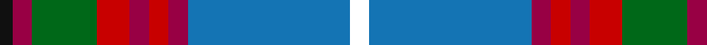

In pattern [KRGRRRRBW](/patterns/krgrrrrbw/).

This was sourced from register-of-tartans.  It is a [9 stripes tartan](/stripes/stripes9/).

Original link https://www.tartanregister.gov.uk/tartanDetails.aspx?ref=1074

## Register references

External register numbers recorded for this tartan.

- Scottish Register of Tartans: [1074](https://www.tartanregister.gov.uk/tartanDetails.aspx?ref=1074)
- Scottish Tartans Authority (ITI): 1163
- Scottish Tartans World Register: 1163

## Thread count
K/4 R6 G20 Ra10 R6 Ra6 R6 B50 W/6

## Palette
Each colour and its ΔE from the base-6 reference it is a variant of.

| Colour | Shade | Base | ΔE (OKLab) |
|---|---|---|---|
| B | <code style="background-color:#1474B4;">#1474B4</code> `#1474B4` | B <code style="background-color:#2A418A;">#2A418A</code> | 0.15 |
| G | <code style="background-color:#006818;">#006818</code> `#006818` | G <code style="background-color:#006100;">#006100</code> | 0.02 |
| K | <code style="background-color:#101010;">#101010</code> `#101010` | K <code style="background-color:#000000;">#000000</code> | 0.17 |
| R | <code style="background-color:#980044;">#980044</code> `#980044` | R <code style="background-color:#CC0000;">#CC0000</code> | 0.13 |
| Ra | <code style="background-color:#C80000;">#C80000</code> `#C80000` | R <code style="background-color:#CC0000;">#CC0000</code> | 0.01 |
| W | <code style="background-color:#FFFFFF;">#FFFFFF</code> `#FFFFFF` | W <code style="background-color:#F7F7F7;">#F7F7F7</code> | 0.02 |

## Nearest tartans

The nearest existing variants by ΔTartan distance.

1. [Edinburgh District (District)](/setts/s9/w3b25r3ra3r3ra5g10r3k2~b285074-g006818-k101010-r980044-rac80000-wfcfcfc~x2/) — ΔT 0.76
1. [Edinburgh District](/setts/s9/w3b25r3ra3r3ra5g10r3k2~b304080-g008000-k000000-r800000-rac00000-we0e0e0~x2/) — ΔT 0.77
1. [Scottish Association for N.S. (Corp)](/setts/s9/b46y4b4y4b6k16r66w11ra6~b2c2c80-k101010-r888888-rac80000-we0e0e0-ye8c000/) — ΔT 0.80
1. [Hek Family (Sunningdale, Berwick on Tweed)](/setts/s9/w1wa2g12k2w2k2b15w2y1~b816687-g1b6453-k101010-w00bfff-wafff8dc-yffb90f~x2/) — ΔT 0.80
1. [Traill Clan/Family Weavers Tartan Tartan Number: 3093. Earliest known date: 2002 The Traill tartan is for anyone tracing their ancestry to the Scottish 'Traills' - Traill of Blebo and descendants in Orkney and elsewhere. Blue is poor. See products available Copyright © Blair Urquhart, Comrie, 2015](/setts/s7/r16y2g7y2b24k2ga2~b1474b4-g604000-ga006818-k101010-r800000-ye8c000~x2/) — ΔT 0.81
1. [Ohio](/setts/s9/b16w6r8b3y1g1ba3b1g9~b304080-ba8080d0-g008000-rc00000-we0e0e0-yf0c000~x2/) — ΔT 0.89
1. [Traill (Personal)](/setts/s7/r16y2g7y2b24k2ga2~b2888c4-g604000-ga289c18-k101010-rc80000-ye8c000~x2/) — ΔT 0.96
1. [Edinburgh District Tartan Tartan Number: 1163. Earliest known date: 1970 Several attempts have been made to develop a special tartan for the residents of Edinburgh. None had success until the design by Councillor Hugh Macpherson in 1970 on the occassion of the Commonwealth Games. The colours have symbolic references to the City of Edinburgh. See products available Copyright © Blair Urquhart, Comrie, 2015](/setts/s9/w3b25r3ra3r3ra5g10r3k2~b2c2c80-g006818-k101010-r880000-rac80000-we0e0e0~x2/) — ΔT 0.97
1. [Ohio District Tartan Tartan Number: 651. Earliest known date: 1984 Design is based on the colours of Ohio's flag and state seal. The widths of the stripes in each colour are based on the date Ohio was admitted to the Union. The tartan first went on display at the Ohio Scottish Games in June 1983. See products available Copyright © Blair Urquhart, Comrie, 2015](/setts/s9/b16w6r8b3y1g1ba3b1g9~b2c2c80-ba2888c4-g006818-rc80000-we0e0e0-ye8c000~x2/) — ΔT 0.99
1. [Yorkshire, C.C.C.](/setts/s8/b5y5ba12g1ba1r1ba1w2~b5480b0-ba304080-g008000-rc00000-we0e0e0-yf0c000~x2/) — ΔT 1.00

## Neighbour map

Every grey dot is one of 15726 variants placed by the first two principal components of the ΔTartan feature space (44% of its variance). Red is this tartan; blue dots are its nearest — click one to open its page.

<svg viewBox="0 0 640 380" role="img" style="max-width:100%;height:auto;border:1px solid #e0e0e0;border-radius:4px;display:block" xmlns="http://www.w3.org/2000/svg"><image href="/nn/cloud.v1.png" width="640" height="380"/><a href="/setts/s9/w3b25r3ra3r3ra5g10r3k2~b285074-g006818-k101010-r980044-rac80000-wfcfcfc~x2/"><circle cx="203.7" cy="132.3" r="4" fill="#3465a4"><title>Edinburgh District (District)</title></circle></a><a href="/setts/s9/w3b25r3ra3r3ra5g10r3k2~b304080-g008000-k000000-r800000-rac00000-we0e0e0~x2/"><circle cx="193.2" cy="128.5" r="4" fill="#3465a4"><title>Edinburgh District</title></circle></a><a href="/setts/s9/b46y4b4y4b6k16r66w11ra6~b2c2c80-k101010-r888888-rac80000-we0e0e0-ye8c000/"><circle cx="191.8" cy="109.6" r="4" fill="#3465a4"><title>Scottish Association for N.S. (Corp)</title></circle></a><a href="/setts/s9/w1wa2g12k2w2k2b15w2y1~b816687-g1b6453-k101010-w00bfff-wafff8dc-yffb90f~x2/"><circle cx="179.3" cy="119.9" r="4" fill="#3465a4"><title>Hek Family (Sunningdale, Berwick on Tweed)</title></circle></a><a href="/setts/s7/r16y2g7y2b24k2ga2~b1474b4-g604000-ga006818-k101010-r800000-ye8c000~x2/"><circle cx="209.9" cy="149.2" r="4" fill="#3465a4"><title>Traill Clan/Family Weavers Tartan Tartan Number: 3093. Earliest known date: 2002 The Traill tartan is for anyone tracing their ancestry to the Scottish 'Traills' - Traill of Blebo and descendants in Orkney and elsewhere. Blue is poor. See products available Copyright © Blair Urquhart, Comrie, 2015</title></circle></a><a href="/setts/s9/b16w6r8b3y1g1ba3b1g9~b304080-ba8080d0-g008000-rc00000-we0e0e0-yf0c000~x2/"><circle cx="162.0" cy="127.8" r="4" fill="#3465a4"><title>Ohio</title></circle></a><a href="/setts/s7/r16y2g7y2b24k2ga2~b2888c4-g604000-ga289c18-k101010-rc80000-ye8c000~x2/"><circle cx="201.5" cy="140.0" r="4" fill="#3465a4"><title>Traill (Personal)</title></circle></a><a href="/setts/s9/w3b25r3ra3r3ra5g10r3k2~b2c2c80-g006818-k101010-r880000-rac80000-we0e0e0~x2/"><circle cx="199.0" cy="130.3" r="4" fill="#3465a4"><title>Edinburgh District Tartan Tartan Number: 1163. Earliest known date: 1970 Several attempts have been made to develop a special tartan for the residents of Edinburgh. None had success until the design by Councillor Hugh Macpherson in 1970 on the occassion of the Commonwealth Games. The colours have symbolic references to the City of Edinburgh. See products available Copyright © Blair Urquhart, Comrie, 2015</title></circle></a><a href="/setts/s9/b16w6r8b3y1g1ba3b1g9~b2c2c80-ba2888c4-g006818-rc80000-we0e0e0-ye8c000~x2/"><circle cx="158.1" cy="127.2" r="4" fill="#3465a4"><title>Ohio District Tartan Tartan Number: 651. Earliest known date: 1984 Design is based on the colours of Ohio's flag and state seal. The widths of the stripes in each colour are based on the date Ohio was admitted to the Union. The tartan first went on display at the Ohio Scottish Games in June 1983. See products available Copyright © Blair Urquhart, Comrie, 2015</title></circle></a><a href="/setts/s8/b5y5ba12g1ba1r1ba1w2~b5480b0-ba304080-g008000-rc00000-we0e0e0-yf0c000~x2/"><circle cx="208.0" cy="134.8" r="4" fill="#3465a4"><title>Yorkshire, C.C.C.</title></circle></a><circle cx="190.0" cy="126.8" r="5" fill="#c00000"/></svg>

ID: /setts/s9/w3b25r3ra3r3ra5g10r3k2~b1474b4-g006818-k101010-r980044-rac80000-wffffff~x2/
