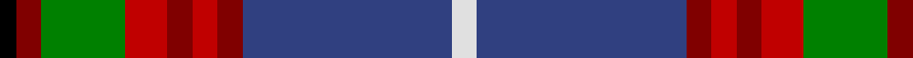

In pattern [KRGRRRRBW](/patterns/krgrrrrbw/).

This was sourced from weddslist.  It is a [9 stripes tartan](/stripes/stripes9/).

Original link http://www.weddslist.com/cgi-bin/tartans/pg.pl?source=sts

## Thread count
K/4 DR6 G20 R10 DR6 R6 DR6 B50 LN/6

## Palette
Each colour and its ΔE from the base-6 reference it is a variant of.

| Colour | Shade | Base | ΔE (OKLab) |
|---|---|---|---|
| B | <code style="background-color:#304080;">#304080</code> `#304080` | B <code style="background-color:#2A418A;">#2A418A</code> | 0.02 |
| DR | <code style="background-color:#800000;">#800000</code> `#800000` | R <code style="background-color:#CC0000;">#CC0000</code> | 0.17 |
| G | <code style="background-color:#008000;">#008000</code> `#008000` | G <code style="background-color:#006100;">#006100</code> | 0.10 |
| K | <code style="background-color:#000000;">#000000</code> `#000000` | K <code style="background-color:#000000;">#000000</code> | 0.00 |
| LN | <code style="background-color:#E0E0E0;">#E0E0E0</code> `#E0E0E0` | W <code style="background-color:#F7F7F7;">#F7F7F7</code> | 0.07 |
| R | <code style="background-color:#C00000;">#C00000</code> `#C00000` | R <code style="background-color:#CC0000;">#CC0000</code> | 0.03 |

## Nearest tartans

The nearest existing variants by ΔTartan distance.

1. [Edinburgh District Tartan Tartan Number: 1163. Earliest known date: 1970 Several attempts have been made to develop a special tartan for the residents of Edinburgh. None had success until the design by Councillor Hugh Macpherson in 1970 on the occassion of the Commonwealth Games. The colours have symbolic references to the City of Edinburgh. See products available Copyright © Blair Urquhart, Comrie, 2015](/setts/s9/w3b25r3ra3r3ra5g10r3k2~b2c2c80-g006818-k101010-r880000-rac80000-we0e0e0~x2/) — ΔT 0.48
1. [Edinburgh District (District)](/setts/s9/w3b25r3ra3r3ra5g10r3k2~b285074-g006818-k101010-r980044-rac80000-wfcfcfc~x2/) — ΔT 0.49
1. [Loch Lomond & the Trossachs (Fashion](/setts/s10/w2r5k2y3k4b28r4g14k4w2~b2c2c80-g285800-k101010-rc80000-we0e0e0-ybc8c00~x2/) — ΔT 0.65
1. [Edinburgh District](/setts/s9/w3b25r3ra3r3ra5g10r3k2~b1474b4-g006818-k101010-r980044-rac80000-wffffff~x2/) — ΔT 0.77
1. [Traill Clan/Family Weavers Tartan Tartan Number: 3093. Earliest known date: 2002 The Traill tartan is for anyone tracing their ancestry to the Scottish 'Traills' - Traill of Blebo and descendants in Orkney and elsewhere. Blue is poor. See products available Copyright © Blair Urquhart, Comrie, 2015](/setts/s7/r16y2g7y2b24k2ga2~b1474b4-g604000-ga006818-k101010-r800000-ye8c000~x2/) — ΔT 0.78
1. [Edinburgh](/setts/s9/w8b50k4r8k6r12g17ba7k4~b304080-ba800080-g008000-k000000-rc00000-we0e0e0/) — ΔT 0.79
1. [Edinburgh](/setts/s9/w3b22k2r3k2r5g7ra2k2~b304080-g008000-k000000-rc00000-rad03030-we0e0e0~x2/) — ΔT 0.80
1. [Scottish Association for Neurological Sciences](/setts/s9/b46y4b4y4b6k16ba66w11r6~b141e46-ba505050-k101010-rdc0000-wc0c0c0-ye8c000/) — ΔT 0.87
1. [State Seal of Utah (Fashion)](/setts/s8/b48y25g15r7w5b7k10w10~b003c64-g604000-k101010-r880000-we8ccb8-ya08858~x2/) — ΔT 1.03
1. [Turnbull, Dress Bruce (Personal)](/setts/s8/r11k66g32ga11g10b6g10ra4~b2c4084-g808080-ga002814-k101010-rc87814-rae13200/) — ΔT 1.04

## Neighbour map

Every grey dot is one of 15726 variants placed by the first two principal components of the ΔTartan feature space (44% of its variance). Red is this tartan; blue dots are its nearest — click one to open its page.

<svg viewBox="0 0 640 380" role="img" style="max-width:100%;height:auto;border:1px solid #e0e0e0;border-radius:4px;display:block" xmlns="http://www.w3.org/2000/svg"><image href="/nn/cloud.v1.png" width="640" height="380"/><a href="/setts/s9/w3b25r3ra3r3ra5g10r3k2~b2c2c80-g006818-k101010-r880000-rac80000-we0e0e0~x2/"><circle cx="199.0" cy="130.3" r="4" fill="#3465a4"><title>Edinburgh District Tartan Tartan Number: 1163. Earliest known date: 1970 Several attempts have been made to develop a special tartan for the residents of Edinburgh. None had success until the design by Councillor Hugh Macpherson in 1970 on the occassion of the Commonwealth Games. The colours have symbolic references to the City of Edinburgh. See products available Copyright © Blair Urquhart, Comrie, 2015</title></circle></a><a href="/setts/s9/w3b25r3ra3r3ra5g10r3k2~b285074-g006818-k101010-r980044-rac80000-wfcfcfc~x2/"><circle cx="203.7" cy="132.3" r="4" fill="#3465a4"><title>Edinburgh District (District)</title></circle></a><a href="/setts/s10/w2r5k2y3k4b28r4g14k4w2~b2c2c80-g285800-k101010-rc80000-we0e0e0-ybc8c00~x2/"><circle cx="177.8" cy="117.3" r="4" fill="#3465a4"><title>Loch Lomond &amp; the Trossachs (Fashion</title></circle></a><a href="/setts/s9/w3b25r3ra3r3ra5g10r3k2~b1474b4-g006818-k101010-r980044-rac80000-wffffff~x2/"><circle cx="190.0" cy="126.8" r="4" fill="#3465a4"><title>Edinburgh District</title></circle></a><a href="/setts/s7/r16y2g7y2b24k2ga2~b1474b4-g604000-ga006818-k101010-r800000-ye8c000~x2/"><circle cx="209.9" cy="149.2" r="4" fill="#3465a4"><title>Traill Clan/Family Weavers Tartan Tartan Number: 3093. Earliest known date: 2002 The Traill tartan is for anyone tracing their ancestry to the Scottish 'Traills' - Traill of Blebo and descendants in Orkney and elsewhere. Blue is poor. See products available Copyright © Blair Urquhart, Comrie, 2015</title></circle></a><a href="/setts/s9/w8b50k4r8k6r12g17ba7k4~b304080-ba800080-g008000-k000000-rc00000-we0e0e0/"><circle cx="164.6" cy="124.7" r="4" fill="#3465a4"><title>Edinburgh</title></circle></a><a href="/setts/s9/w3b22k2r3k2r5g7ra2k2~b304080-g008000-k000000-rc00000-rad03030-we0e0e0~x2/"><circle cx="181.0" cy="124.9" r="4" fill="#3465a4"><title>Edinburgh</title></circle></a><a href="/setts/s9/b46y4b4y4b6k16ba66w11r6~b141e46-ba505050-k101010-rdc0000-wc0c0c0-ye8c000/"><circle cx="213.3" cy="123.8" r="4" fill="#3465a4"><title>Scottish Association for Neurological Sciences</title></circle></a><a href="/setts/s8/b48y25g15r7w5b7k10w10~b003c64-g604000-k101010-r880000-we8ccb8-ya08858~x2/"><circle cx="155.2" cy="160.5" r="4" fill="#3465a4"><title>State Seal of Utah (Fashion)</title></circle></a><a href="/setts/s8/r11k66g32ga11g10b6g10ra4~b2c4084-g808080-ga002814-k101010-rc87814-rae13200/"><circle cx="216.3" cy="132.1" r="4" fill="#3465a4"><title>Turnbull, Dress Bruce (Personal)</title></circle></a><circle cx="193.2" cy="128.5" r="5" fill="#c00000"/></svg>

ID: /setts/s9/w3b25r3ra3r3ra5g10r3k2~b304080-g008000-k000000-r800000-rac00000-we0e0e0~x2/
