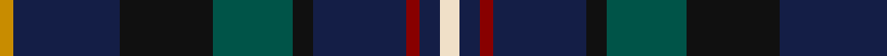

**Bands:** [WBRBKGKBY](/stripes/wbrbkgkby/) · **Stripes:** [W DB R DB K DG K DB LO](/stripes/stripes9/) W DB R DB K DG K DB LO

This was sourced from register-of-tartans.  It is a [9 band tartan](/bands/bands9/).

Original link https://www.tartanregister.gov.uk/tartanDetails.aspx?ref=11556

## Register references

External register numbers recorded for this tartan.

- Scottish Register of Tartans: [11556](https://www.tartanregister.gov.uk/tartanDetails.aspx?ref=11556)

## Thread count
DY/4 DB32 K28 G24 K6 DB28 DR4 DB6 W/6

## Palette
Each colour and its ΔE from the base-6 reference it is a variant of.

| Colour | Shade | Base | ΔE (OKLab) |
|---|---|---|---|
| DB | <code style="background-color:#141E46;">#141E46</code> `#141E46` | B <code style="background-color:#2A418A;">#2A418A</code> | 0.16 |
| DR | <code style="background-color:#880000;">#880000</code> `#880000` | R <code style="background-color:#CC0000;">#CC0000</code> | 0.15 |
| DY | <code style="background-color:#C88C00;">#C88C00</code> `#C88C00` | Y <code style="background-color:#F2BF00;">#F2BF00</code> | 0.15 |
| G | <code style="background-color:#005448;">#005448</code> `#005448` | G <code style="background-color:#006100;">#006100</code> | 0.10 |
| K | <code style="background-color:#101010;">#101010</code> `#101010` | K <code style="background-color:#000000;">#000000</code> | 0.17 |
| W | <code style="background-color:#F0E0C8;">#F0E0C8</code> `#F0E0C8` | W <code style="background-color:#F7F7F7;">#F7F7F7</code> | 0.07 |

## Nearest tartans

The nearest existing variants by ΔTartan distance.

1. [Unidentified #2](/setts/s10/k14t2db6dg7r2k14db6t2db2t4~x2/) — ΔT 1.07
1. [van der Watt Personal)](/setts/s12/lo1g6k1g1dp2k8g1k8db1k1db6r1~x4/) — ΔT 1.11
1. [Remember the Somme 1916](/setts/s8/dg5g2b2db15r2t2dg5r2~x4/) — ΔT 1.14
1. [Glen Erin Canadian Tartan Tartan Number: 1909. Earliest known date: pre 2003 Many new designs have been given district names to promote their Scottish connections. However, these names should not be confused with the District tartans which have earned their title through 'use and wont' and not a little history. See products available Copyright © Blair Urquhart, Comrie, 2015](/setts/s8/db16g8db8g8db16r3dy3g3~x2/) — ΔT 1.16
1. [Yates (Personal)](/setts/s8/k29r3dt24n6k8w4n8o6~x2/) — ΔT 1.18
1. [Côté-Haché (Personal)](/setts/s8/db3dg10db5ly1db10k1r4w1~x4/) — ΔT 1.21
1. [Game Fair](/setts/s7/r3db12k12dg12b2dg12w3~x2/) — ΔT 1.22
1. [Haus of RvR](/setts/s11/db13w2db13k3db13k21lo3k18db9k2db2~x2/) — ΔT 1.24
1. [Yates](/setts/s8/k37r4db30n7k10w5n10y7~x2/) — ΔT 1.26
1. [Fed. of Circles & Solitaries (Corp.)](/setts/s10/db9k30db9t3db5r3db5ly3db5g3~x2/) — ΔT 1.26

## Neighbour map

Every grey dot is one of 14313 variants placed by the first two principal components of the ΔTartan feature space (44% of its variance). Red is this tartan; blue dots are its nearest — click one to open its page.

<svg viewBox="0 0 640 380" role="img" style="max-width:100%;height:auto;border:1px solid #e0e0e0;border-radius:4px;display:block" xmlns="http://www.w3.org/2000/svg"><image href="/nn/cloud.v1.png" width="640" height="380"/><a href="/setts/s10/k14t2db6dg7r2k14db6t2db2t4~x2/"><circle cx="211.6" cy="214.3" r="4" fill="#3465a4"><title>Unidentified #2</title></circle></a><a href="/setts/s12/lo1g6k1g1dp2k8g1k8db1k1db6r1~x4/"><circle cx="226.1" cy="178.1" r="4" fill="#3465a4"><title>van der Watt Personal)</title></circle></a><a href="/setts/s8/dg5g2b2db15r2t2dg5r2~x4/"><circle cx="189.8" cy="188.0" r="4" fill="#3465a4"><title>Remember the Somme 1916</title></circle></a><a href="/setts/s8/db16g8db8g8db16r3dy3g3~x2/"><circle cx="200.4" cy="239.3" r="4" fill="#3465a4"><title>Glen Erin Canadian Tartan Tartan Number: 1909. Earliest known date: pre 2003 Many new designs have been given district names to promote their Scottish connections. However, these names should not be confused with the District tartans which have earned their title through 'use and wont' and not a little history. See products available Copyright © Blair Urquhart, Comrie, 2015</title></circle></a><a href="/setts/s8/k29r3dt24n6k8w4n8o6~x2/"><circle cx="174.5" cy="178.5" r="4" fill="#3465a4"><title>Yates (Personal)</title></circle></a><a href="/setts/s8/db3dg10db5ly1db10k1r4w1~x4/"><circle cx="235.2" cy="182.7" r="4" fill="#3465a4"><title>Côté-Haché (Personal)</title></circle></a><a href="/setts/s7/r3db12k12dg12b2dg12w3~x2/"><circle cx="149.6" cy="236.2" r="4" fill="#3465a4"><title>Game Fair</title></circle></a><a href="/setts/s11/db13w2db13k3db13k21lo3k18db9k2db2~x2/"><circle cx="243.9" cy="206.9" r="4" fill="#3465a4"><title>Haus of RvR</title></circle></a><a href="/setts/s8/k37r4db30n7k10w5n10y7~x2/"><circle cx="174.4" cy="178.6" r="4" fill="#3465a4"><title>Yates</title></circle></a><a href="/setts/s10/db9k30db9t3db5r3db5ly3db5g3~x2/"><circle cx="237.8" cy="165.3" r="4" fill="#3465a4"><title>Fed. of Circles &amp; Solitaries (Corp.)</title></circle></a><circle cx="211.2" cy="204.0" r="5" fill="#c00000"/></svg>

ID: /setts/s9/w3db3r2db14k3dg12k14db16lo2~x2/
