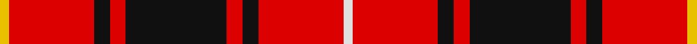

In pattern [WRKRKRKRY](/stripes/wrkrkrkry/).

This was sourced from register-of-tartans.  It is a [9 stripe tartan](/stripes/stripes9/).

Original link https://www.tartanregister.gov.uk/tartanDetails.aspx?ref=2490

## Also known as

This cloth is also recorded under:

- MacIver #2

## Attestations

This cloth appears in 2 source records; the oldest owns this page.

- undated — MacIver #2 (register-of-tartans, [record](https://www.tartanregister.gov.uk/tartanDetails.aspx?ref=2490))
- undated — MacIver (weddslist, [record](http://www.weddslist.com/cgi-bin/tartans/pg.pl?source=sts))

## Register references

External register numbers recorded for this tartan.

- Scottish Register of Tartans: [2490](https://www.tartanregister.gov.uk/tartanDetails.aspx?ref=2490)
- Scottish Tartans World Register: 1203

## Thread count
Y/6 R54 K10 R10 K64 R10 K10 R54 LN/6

## Palette
Each colour and the base-6 reference it is a variant of.

| Colour | Shade | Base |
|---|---|---|
| K | <code style="background-color:#101010;">#101010</code> `oklch(17.3% 0.000 89.9)` <small>#101010</small> | K <code style="background-color:#000000;">#000000</code> |
| LN | <code style="background-color:#E0E0E0;">#E0E0E0</code> `oklch(90.7% 0.000 89.9)` <small>#E0E0E0</small> | W <code style="background-color:#F7F7F7;">#F7F7F7</code> |
| R | <code style="background-color:#DC0000;">#DC0000</code> `oklch(56.2% 0.230 29.2)` <small>#DC0000</small> | R <code style="background-color:#CC0000;">#CC0000</code> |
| Y | <code style="background-color:#E8C000;">#E8C000</code> `oklch(81.9% 0.168 93.7)` <small>#E8C000</small> | Y <code style="background-color:#F2BF00;">#F2BF00</code> |

## Nearest tartans

The nearest existing variants by ΔTartan distance.

1. [MacIver (Clan)](/setts/s9/w2r12k3r3k16r3k3r12ly2~x2/) — ΔT 0.76
1. [Cameron of Locheil #3](/setts/s9/r24db8r23k4w4k4r10k32r8/) — ΔT 0.86
1. [Dobrain (Personal)](/setts/s10/r24o2r4n2k6o2r14k3o4n8~x2/) — ΔT 0.97
1. [Instakilt, Red (Fashion)](/setts/s7/r8w4r50k12r4k15g5~x2/) — ΔT 1.00
1. [Brad Majors](/setts/s13/ly3r2k7r2db7r18k2r2k2r18db7r2k2~x2/) — ΔT 1.11
1. [MacIver](/setts/s9/w1r9k2r2k12r2k2r9ly1~x4/) — ΔT 1.13
1. [MacNicol](/setts/s12/r6dg1r6k4r1lb1r1dg8r6k1r6dg1/) — ΔT 1.19
1. [Morrison LC](/setts/s9/dg9lb4dg15r17k5r7k5r32dg5/) — ΔT 1.20
1. [Morrison Ancient](/setts/s10/dg6w3dg12r12k4r6k4r24dg4r6/) — ΔT 1.22
1. [MacPherson Red Cluny](/setts/s7/r6k3r29k23w4k7ly3~x2/) — ΔT 1.22

## Neighbour map

Every grey dot is one of 14299 variants placed by the first two principal components of the ΔTartan feature space (44% of its variance). Red is this tartan; blue dots are its nearest — click one to open its page.

<svg viewBox="0 0 640 380" role="img" style="max-width:100%;height:auto;border:1px solid #e0e0e0;border-radius:4px;display:block" xmlns="http://www.w3.org/2000/svg"><image href="/nn/cloud.v1.png" width="640" height="380"/><a href="/setts/s9/w2r12k3r3k16r3k3r12ly2~x2/"><circle cx="282.9" cy="182.1" r="4" fill="#3465a4"><title>MacIver (Clan)</title></circle></a><a href="/setts/s9/r24db8r23k4w4k4r10k32r8/"><circle cx="281.0" cy="186.0" r="4" fill="#3465a4"><title>Cameron of Locheil #3</title></circle></a><a href="/setts/s10/r24o2r4n2k6o2r14k3o4n8~x2/"><circle cx="333.6" cy="155.2" r="4" fill="#3465a4"><title>Dobrain (Personal)</title></circle></a><a href="/setts/s7/r8w4r50k12r4k15g5~x2/"><circle cx="366.4" cy="150.1" r="4" fill="#3465a4"><title>Instakilt, Red (Fashion)</title></circle></a><a href="/setts/s13/ly3r2k7r2db7r18k2r2k2r18db7r2k2~x2/"><circle cx="305.9" cy="146.3" r="4" fill="#3465a4"><title>Brad Majors</title></circle></a><a href="/setts/s9/w1r9k2r2k12r2k2r9ly1~x4/"><circle cx="305.2" cy="161.3" r="4" fill="#3465a4"><title>MacIver</title></circle></a><a href="/setts/s12/r6dg1r6k4r1lb1r1dg8r6k1r6dg1/"><circle cx="306.2" cy="179.5" r="4" fill="#3465a4"><title>MacNicol</title></circle></a><a href="/setts/s9/dg9lb4dg15r17k5r7k5r32dg5/"><circle cx="281.5" cy="188.7" r="4" fill="#3465a4"><title>Morrison LC</title></circle></a><a href="/setts/s10/dg6w3dg12r12k4r6k4r24dg4r6/"><circle cx="301.3" cy="186.8" r="4" fill="#3465a4"><title>Morrison Ancient</title></circle></a><a href="/setts/s7/r6k3r29k23w4k7ly3~x2/"><circle cx="261.4" cy="174.4" r="4" fill="#3465a4"><title>MacPherson Red Cluny</title></circle></a><circle cx="322.3" cy="161.0" r="5" fill="#c00000"/></svg>

ID: /setts/s9/w3r27k5r5k32r5k5r27ly3~x2/
