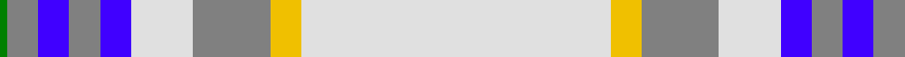

In pattern [GGBGBWGYW](/patterns/ggbgbwgyw/).

This was sourced from weddslist.  It is a [9 stripes tartan](/stripes/stripes9/).

Original link http://www.weddslist.com/cgi-bin/tartans/pg.pl?source=sts

## Thread count
G/1 N4 B4 N4 B4 LN8 N10 Y4 LN/40

## Palette
Each colour and its ΔE from the base-6 reference it is a variant of.

| Colour | Shade | Base | ΔE (OKLab) |
|---|---|---|---|
| B | <code style="background-color:#4000FF;">#4000FF</code> `#4000FF` | B <code style="background-color:#2C4084;">#2C4084</code> | 0.20 |
| G | <code style="background-color:#008000;">#008000</code> `#008000` | G <code style="background-color:#006400;">#006400</code> | 0.09 |
| LN | <code style="background-color:#E0E0E0;">#E0E0E0</code> `#E0E0E0` | W <code style="background-color:#F4F4F0;">#F4F4F0</code> | 0.06 |
| N | <code style="background-color:#808080;">#808080</code> `#808080` | G <code style="background-color:#006400;">#006400</code> | 0.22 |
| Y | <code style="background-color:#F0C000;">#F0C000</code> `#F0C000` | Y <code style="background-color:#E8C000;">#E8C000</code> | 0.01 |

## Nearest tartans

The nearest existing variants by ΔTartan distance.

1. [Boucherville Formal District Tartan Tartan Number: 2118. Earliest known date: 1990 Three designers from La Navette d'Art ENR, Jeanette Blanchette, Pauline Bastien and Jacqueline Provost, based their design on symbolic colours. Le bleu azur represente la loyaute, le gris argent la serenite, le jaune (l'or) la generosite, le vert represente l'esperance, et le blanc symbole de purete et d'innocence "nous rappelle notre appartenance au Quebec." "Les tisserands, c'est nous tous...!" See products available Copyright © Blair Urquhart, Comrie, 2015](/setts/s9/w40y4r10w8b4r4b4r4g1-b2c2c80-g006818-r888888-we0e0e0-ye8c000/) — ΔT 0.34
1. [Snowy Owl (Fashion)](/setts/s14/w80r2w12r6y2r14y6b2y16b6k2b18k4w16-b5c5c5c-k101010-r888888-we0e0e0-ya08858/) — ΔT 1.27
1. [Spirit of Dunkeld](/setts/s12/w76r2w4r4w4r12y8r20b16w22r6y2-b0000cd-rff0000-w82cffd-yffe600/) — ΔT 1.30
1. [Stewart Blue Dress Clan Tartan Tartan Number: 1794. Earliest known date: 1977 May have originated at Peter MacArthurs in the 1970s, but was very popular at Kinloch Andersons shop in Leith. Information from Colin Hutcheson. See products available Copyright © Blair Urquhart, Comrie, 2015](/setts/s11/w144g40y4b6w4g6r32ga12g4ga10w4-b202060-g60888c-ga604000-r888888-we0e0e0-ye8c000/) — ΔT 1.41
1. [Boucherville Dress (District)](/setts/s9/w40y4b10w8ba4b4ba4b4g2-b5c5c5c-ba1c0070-g003820-we0e0e0-yd09800/) — ΔT 1.48
1. [Australian, dress](/setts/s9/w100r8y4k4y4r8y20r30b4-b5480b0-k000000-r806050-we0e0e0-yd08010/) — ΔT 1.50
1. [Confederate Memorial Dress](/setts/s14/b36w8r12w8y8w72g8w8g8w72r24w2ba8w6-b2888c4-ba00008c-g7c7c7c-rc82800-wfcfcfc-yc88c00/) — ΔT 1.58
1. [Grant of Acharrow](/setts/s12/w18r8w80g18b2w6k6w40r36g8r12w6-b304080-g30a010-k000000-rd03030-we0e0e0/) — ΔT 1.58
1. [Kinloch of Loch Awe (Personal)](/setts/s5/w36r58b4ba6k2-b2888c4-ba780078-k101010-r888888-wf8f8f8/) — ΔT 1.61
1. [Boucherville Dress](/setts/s9/w40y4b10w8ba4b4ba4b4g2-b5c5c5c-ba1c0070-g003820-wffffff-yd09800/) — ΔT 1.63

## Neighbour map

Every grey dot is one of 15726 variants placed by the first two principal components of the ΔTartan feature space (44% of its variance). Red is this tartan; blue dots are its nearest — click one to open its page.

<svg viewBox="0 0 640 380" role="img" style="max-width:100%;height:auto;border:1px solid #e0e0e0;border-radius:4px;display:block" xmlns="http://www.w3.org/2000/svg"><image href="/nn/cloud.v1.png" width="640" height="380"/><a href="/setts/s9/w40y4r10w8b4r4b4r4g1-b2c2c80-g006818-r888888-we0e0e0-ye8c000/"><circle cx="361.8" cy="81.6" r="4" fill="#3465a4"><title>Boucherville Formal District Tartan Tartan Number: 2118. Earliest known date: 1990 Three designers from La Navette d'Art ENR, Jeanette Blanchette, Pauline Bastien and Jacqueline Provost, based their design on symbolic colours. Le bleu azur represente la loyaute, le gris argent la serenite, le jaune (l'or) la generosite, le vert represente l'esperance, et le blanc symbole de purete et d'innocence &quot;nous rappelle notre appartenance au Quebec.&quot; &quot;Les tisserands, c'est nous tous...!&quot; See products available Copyright © Blair Urquhart, Comrie, 2015</title></circle></a><a href="/setts/s14/w80r2w12r6y2r14y6b2y16b6k2b18k4w16-b5c5c5c-k101010-r888888-we0e0e0-ya08858/"><circle cx="336.3" cy="54.0" r="4" fill="#3465a4"><title>Snowy Owl (Fashion)</title></circle></a><a href="/setts/s12/w76r2w4r4w4r12y8r20b16w22r6y2-b0000cd-rff0000-w82cffd-yffe600/"><circle cx="360.9" cy="78.0" r="4" fill="#3465a4"><title>Spirit of Dunkeld</title></circle></a><a href="/setts/s11/w144g40y4b6w4g6r32ga12g4ga10w4-b202060-g60888c-ga604000-r888888-we0e0e0-ye8c000/"><circle cx="326.0" cy="46.8" r="4" fill="#3465a4"><title>Stewart Blue Dress Clan Tartan Tartan Number: 1794. Earliest known date: 1977 May have originated at Peter MacArthurs in the 1970s, but was very popular at Kinloch Andersons shop in Leith. Information from Colin Hutcheson. See products available Copyright © Blair Urquhart, Comrie, 2015</title></circle></a><a href="/setts/s9/w40y4b10w8ba4b4ba4b4g2-b5c5c5c-ba1c0070-g003820-we0e0e0-yd09800/"><circle cx="306.6" cy="99.3" r="4" fill="#3465a4"><title>Boucherville Dress (District)</title></circle></a><a href="/setts/s9/w100r8y4k4y4r8y20r30b4-b5480b0-k000000-r806050-we0e0e0-yd08010/"><circle cx="316.4" cy="84.6" r="4" fill="#3465a4"><title>Australian, dress</title></circle></a><a href="/setts/s14/b36w8r12w8y8w72g8w8g8w72r24w2ba8w6-b2888c4-ba00008c-g7c7c7c-rc82800-wfcfcfc-yc88c00/"><circle cx="310.6" cy="46.8" r="4" fill="#3465a4"><title>Confederate Memorial Dress</title></circle></a><a href="/setts/s12/w18r8w80g18b2w6k6w40r36g8r12w6-b304080-g30a010-k000000-rd03030-we0e0e0/"><circle cx="347.5" cy="72.9" r="4" fill="#3465a4"><title>Grant of Acharrow</title></circle></a><a href="/setts/s5/w36r58b4ba6k2-b2888c4-ba780078-k101010-r888888-wf8f8f8/"><circle cx="322.4" cy="132.0" r="4" fill="#3465a4"><title>Kinloch of Loch Awe (Personal)</title></circle></a><a href="/setts/s9/w40y4b10w8ba4b4ba4b4g2-b5c5c5c-ba1c0070-g003820-wffffff-yd09800/"><circle cx="293.7" cy="91.7" r="4" fill="#3465a4"><title>Boucherville Dress</title></circle></a><circle cx="361.3" cy="81.5" r="5" fill="#c00000"/></svg>

ID: /setts/s9/w40y4g10w8b4g4b4g4ga1-b4000ff-g808080-ga008000-we0e0e0-yf0c000/
