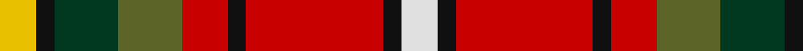

This page is one **sett** — a single exact thread-count. It belongs to the [tartan](/tartans/y4k2dg7g7r5k2r15k2ln4/)
(the same proportion at any scale), whose colour order is pattern [WKRKRGGKY](/stripes/wkrkrggky/).

Sourced from register-of-tartans.  It is a [9 stripe tartan](/stripes/stripes9/).

Original link https://www.tartanregister.gov.uk/tartanDetails.aspx?ref=4101

2 attestations — the source records this cloth was collapsed from (oldest owns this page)

<ul>
<li>01/01/2000 — Thirkill (register-of-tartans, <a href="https://www.tartanregister.gov.uk/tartanDetails.aspx?ref=4101">record</a>)</li>
<li>2000 — Thirkill (Name) (tartans-authority, <a href="http://www.tartansauthority.com/tartan-ferret/display/4015/">record</a>)</li>
</ul>

## Register references

External register numbers recorded for this tartan.

- Scottish Register of Tartans: [4101](https://www.tartanregister.gov.uk/tartanDetails.aspx?ref=4101)
- Scottish Tartans Authority (ITI): 4015

## Thread count
Y/8 K4 DG14 G14 R10 K4 R30 K4 LN/8

## Palette
Each colour and the base-6 reference it is a variant of.

| Colour | Shade | Base |
|---|---|---|
| DG | <code style="background-color:#003820;">#003820</code> `oklch(30.0% 0.070 158.3)` <small>#003820</small> | G <code style="background-color:#006100;">#006100</code> |
| G | <code style="background-color:#5C6428;">#5C6428</code> `oklch(48.3% 0.084 116.0)` <small>#5C6428</small> | G <code style="background-color:#006100;">#006100</code> |
| K | <code style="background-color:#101010;">#101010</code> `oklch(17.3% 0.000 89.9)` <small>#101010</small> | K <code style="background-color:#000000;">#000000</code> |
| LN | <code style="background-color:#E0E0E0;">#E0E0E0</code> `oklch(90.7% 0.000 89.9)` <small>#E0E0E0</small> | W <code style="background-color:#F7F7F7;">#F7F7F7</code> |
| R | <code style="background-color:#C80000;">#C80000</code> `oklch(52.3% 0.215 29.2)` <small>#C80000</small> | R <code style="background-color:#CC0000;">#CC0000</code> |
| Y | <code style="background-color:#E8C000;">#E8C000</code> `oklch(81.9% 0.168 93.7)` <small>#E8C000</small> | Y <code style="background-color:#F2BF00;">#F2BF00</code> |

## Nearest tartans

The nearest existing variants by ΔTartan distance, with this tartan at the top so the swatches line up against it.

ΔTartan

Tartan

Sett

—

<a href="/ttd/edit/#slug=w4k2r15k2r5y7dg7k2ly4~x2">Thirkill</a> <a class="nn-out" href="/setts/s9/w4k2r15k2r5y7dg7k2ly4~x2/" title="open its dictionary page">↗</a>

0.94

<a href="/ttd/edit/#slug=dp2r11t9dp11ly2g13r21w2~x2">Wilson's, No 2</a> <a class="nn-out" href="/setts/s8/dp2r11t9dp11ly2g13r21w2~x2/" title="open its dictionary page">↗</a>

0.97

<a href="/ttd/edit/#slug=ly9lo3k4lo4k8r17k3r17db8k4w4~x2">Laois County Crest (Fashion)</a> <a class="nn-out" href="/setts/s11/ly9lo3k4lo4k8r17k3r17db8k4w4~x2/" title="open its dictionary page">↗</a>

1.13

<a href="/ttd/edit/#slug=dp2o9g8o4ly1o4db10w2~x4">De Maynard (Personal)</a> <a class="nn-out" href="/setts/s8/dp2o9g8o4ly1o4db10w2~x4/" title="open its dictionary page">↗</a>

1.15

<a href="/ttd/edit/#slug=r6ly15do4db12g12dy4r25w5~x2">Young Presidents Organisation Dress</a> <a class="nn-out" href="/setts/s8/r6ly15do4db12g12dy4r25w5~x2/" title="open its dictionary page">↗</a>

1.16

<a href="/ttd/edit/#slug=g8r11k3ly2p8g15r5w2~x2">Wilson's, No 109</a> <a class="nn-out" href="/setts/s8/g8r11k3ly2p8g15r5w2~x2/" title="open its dictionary page">↗</a>

1.16

<a href="/ttd/edit/#slug=w3r22k18g10dy6ly3~x2">Tyrolean (Fashion?)</a> <a class="nn-out" href="/setts/s6/w3r22k18g10dy6ly3~x2/" title="open its dictionary page">↗</a>

1.22

<a href="/ttd/edit/#slug=r8db2k1db3k4ly1k1w1k1g8r6w1r6~x4">Christie</a> <a class="nn-out" href="/setts/s13/r8db2k1db3k4ly1k1w1k1g8r6w1r6~x4/" title="open its dictionary page">↗</a>

1.23

<a href="/ttd/edit/#slug=t4dy27lr8k4lr8k4lr8r11ly3~x2">Brittany Hunting French Fancy Tartan Tartan Number: 5977. Earliest known date: 2003 For Richard and Anne-Marie Duclos of Le Coudray-Montceaux, France. Based on the Breton National at 3902. The term Randonnée (Walking) is used in the sense of the Scottish category, Hunting. See products available Copyright © Blair Urquhart, Comrie, 2015</a> <a class="nn-out" href="/setts/s9/t4dy27lr8k4lr8k4lr8r11ly3~x2/" title="open its dictionary page">↗</a>

1.24

<a href="/ttd/edit/#slug=r18t5r18g24ly3k19t10k3t3k3t10r18w4k5r5~x2">MacPherson #5</a> <a class="nn-out" href="/setts/s15/r18t5r18g24ly3k19t10k3t3k3t10r18w4k5r5~x2/" title="open its dictionary page">↗</a>

1.27

<a href="/ttd/edit/#slug=r21t9k2t2k2t9k18ly3g21r13k3r13w2r13~x2">Caledonia</a> <a class="nn-out" href="/setts/s14/r21t9k2t2k2t9k18ly3g21r13k3r13w2r13~x2/" title="open its dictionary page">↗</a>

## Neighbour map

Every grey dot is one of 14299 variants placed by the first two principal components of the ΔTartan feature space (44% of its variance). Red is this tartan; blue dots are its nearest — click one to open its page.

<svg viewBox="0 0 640 380" role="img" style="max-width:100%;height:auto;border:1px solid #e0e0e0;border-radius:4px;display:block" xmlns="http://www.w3.org/2000/svg"><image href="/nn/cloud.v1.png" width="640" height="380"/><a href="/setts/s8/dp2r11t9dp11ly2g13r21w2~x2/"><circle cx="170.8" cy="159.6" r="4" fill="#3465a4"><title>Wilson's, No 2</title></circle></a><a href="/setts/s11/ly9lo3k4lo4k8r17k3r17db8k4w4~x2/"><circle cx="107.0" cy="167.6" r="4" fill="#3465a4"><title>Laois County Crest (Fashion)</title></circle></a><a href="/setts/s8/dp2o9g8o4ly1o4db10w2~x4/"><circle cx="141.3" cy="162.2" r="4" fill="#3465a4"><title>De Maynard (Personal)</title></circle></a><a href="/setts/s8/r6ly15do4db12g12dy4r25w5~x2/"><circle cx="65.3" cy="156.3" r="4" fill="#3465a4"><title>Young Presidents Organisation Dress</title></circle></a><a href="/setts/s8/g8r11k3ly2p8g15r5w2~x2/"><circle cx="132.8" cy="178.4" r="4" fill="#3465a4"><title>Wilson's, No 109</title></circle></a><a href="/setts/s6/w3r22k18g10dy6ly3~x2/"><circle cx="109.7" cy="183.4" r="4" fill="#3465a4"><title>Tyrolean (Fashion?)</title></circle></a><a href="/setts/s13/r8db2k1db3k4ly1k1w1k1g8r6w1r6~x4/"><circle cx="147.1" cy="133.4" r="4" fill="#3465a4"><title>Christie</title></circle></a><a href="/setts/s9/t4dy27lr8k4lr8k4lr8r11ly3~x2/"><circle cx="119.5" cy="150.5" r="4" fill="#3465a4"><title>Brittany Hunting French Fancy Tartan Tartan Number: 5977. Earliest known date: 2003 For Richard and Anne-Marie Duclos of Le Coudray-Montceaux, France. Based on the Breton National at 3902. The term Randonnée (Walking) is used in the sense of the Scottish category, Hunting. See products available Copyright © Blair Urquhart, Comrie, 2015</title></circle></a><a href="/setts/s15/r18t5r18g24ly3k19t10k3t3k3t10r18w4k5r5~x2/"><circle cx="117.9" cy="141.3" r="4" fill="#3465a4"><title>MacPherson #5</title></circle></a><a href="/setts/s14/r21t9k2t2k2t9k18ly3g21r13k3r13w2r13~x2/"><circle cx="165.8" cy="133.1" r="4" fill="#3465a4"><title>Caledonia</title></circle></a><circle cx="121.0" cy="157.4" r="5" fill="#c00000"/></svg>

ID: /setts/s9/w4k2r15k2r5y7dg7k2ly4~x2/
