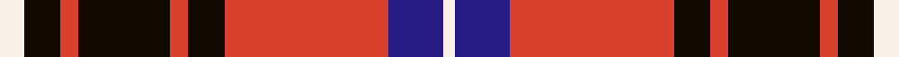

This page is one **sett** — a single exact thread-count. It belongs to the [tartan](/tartans/w4k6r3k15r3k6r27db9w2/)
(the same proportion at any scale), whose colour order is pattern [WBRKRKRKW](/stripes/wbrkrkrkw/).

Sourced from register-of-tartans.  It is a [9 stripe tartan](/stripes/stripes9/).

Original link https://www.tartanregister.gov.uk/tartanDetails.aspx?ref=10497

2 attestations — the source records this cloth was collapsed from (oldest owns this page)

<ul>
<li>18/01/2011 — Memery (Reston, USA) (register-of-tartans, <a href="https://www.tartanregister.gov.uk/tartanDetails.aspx?ref=10497">record</a>)</li>
<li>pre 2011 — Memery (Name) (tartans-authority, <a href="http://www.tartansauthority.com/tartan-ferret/display/10497/">record</a>)</li>
</ul>

## Register references

External register numbers recorded for this tartan.

- Scottish Register of Tartans: [10497](https://www.tartanregister.gov.uk/tartanDetails.aspx?ref=10497)

## Thread count
W/8 K12 R6 K30 R6 K12 R54 DB18 W/4

## Palette

Palette: <strong>custom</strong>
<table><thead><tr><th>Colour</th><th>Threads</th><th>Shade</th><th>Base</th><th>OKLCh</th></tr></thead><tbody><tr><td>W/</td><td style="text-align:right;font-variant-numeric:tabular-nums">8</td><td><code style="background-color:#F7F1E8;">#F7F1E8</code> <small style="color:#888">#F7F1E8</small></td><td>W <code style="background-color:#F7F7F7;">#F7F7F7</code></td><td><small style="color:#888">oklch(96.0% 0.014 78.3)</small></td></tr><tr><td>K</td><td style="text-align:right;font-variant-numeric:tabular-nums">12</td><td><code style="background-color:#120A01;">#120A01</code> <small style="color:#888">#120A01</small></td><td>K <code style="background-color:#000000;">#000000</code></td><td><small style="color:#888">oklch(15.2% 0.028 78.6)</small></td></tr><tr><td>R</td><td style="text-align:right;font-variant-numeric:tabular-nums">6</td><td><code style="background-color:#DA412D;">#DA412D</code> <small style="color:#888">#DA412D</small></td><td>R <code style="background-color:#CC0000;">#CC0000</code></td><td><small style="color:#888">oklch(59.6% 0.193 30.8)</small></td></tr><tr><td>K</td><td style="text-align:right;font-variant-numeric:tabular-nums">30</td><td><code style="background-color:#120A01;">#120A01</code> <small style="color:#888">#120A01</small></td><td>K <code style="background-color:#000000;">#000000</code></td><td><small style="color:#888">oklch(15.2% 0.028 78.6)</small></td></tr><tr><td>R</td><td style="text-align:right;font-variant-numeric:tabular-nums">6</td><td><code style="background-color:#DA412D;">#DA412D</code> <small style="color:#888">#DA412D</small></td><td>R <code style="background-color:#CC0000;">#CC0000</code></td><td><small style="color:#888">oklch(59.6% 0.193 30.8)</small></td></tr><tr><td>K</td><td style="text-align:right;font-variant-numeric:tabular-nums">12</td><td><code style="background-color:#120A01;">#120A01</code> <small style="color:#888">#120A01</small></td><td>K <code style="background-color:#000000;">#000000</code></td><td><small style="color:#888">oklch(15.2% 0.028 78.6)</small></td></tr><tr><td>R</td><td style="text-align:right;font-variant-numeric:tabular-nums">54</td><td><code style="background-color:#DA412D;">#DA412D</code> <small style="color:#888">#DA412D</small></td><td>R <code style="background-color:#CC0000;">#CC0000</code></td><td><small style="color:#888">oklch(59.6% 0.193 30.8)</small></td></tr><tr><td>DB</td><td style="text-align:right;font-variant-numeric:tabular-nums">18</td><td><code style="background-color:#271B86;">#271B86</code> <small style="color:#888">#271B86</small></td><td>B <code style="background-color:#2A418A;">#2A418A</code></td><td><small style="color:#888">oklch(32.6% 0.166 276.9)</small></td></tr><tr><td>W/</td><td style="text-align:right;font-variant-numeric:tabular-nums">4</td><td><code style="background-color:#F7F1E8;">#F7F1E8</code> <small style="color:#888">#F7F1E8</small></td><td>W <code style="background-color:#F7F7F7;">#F7F7F7</code></td><td><small style="color:#888">oklch(96.0% 0.014 78.3)</small></td></tr></tbody></table>

## Nearest tartans

The nearest existing variants by ΔTartan distance, with this tartan at the top so the swatches line up against it.

ΔTartan

Tartan

Sett

—

<a href="/ttd/edit/#slug=w4k6r3k15r3k6r27db9w2~x2">Memery (Reston, USA)</a> <a class="nn-out" href="/setts/s9/w4k6r3k15r3k6r27db9w2~x2/" title="open its dictionary page">↗</a>

0.86

<a href="/ttd/edit/#slug=k1lb1r16dg16k12lb8r16lb1k1~x2">MacNaughton</a> <a class="nn-out" href="/setts/s9/k1lb1r16dg16k12lb8r16lb1k1~x2/" title="open its dictionary page">↗</a>

0.90

<a href="/ttd/edit/#slug=k2db2r26dg25k13db13r26db2k2~x2">MacNaughton (Logan) #2</a> <a class="nn-out" href="/setts/s9/k2db2r26dg25k13db13r26db2k2~x2/" title="open its dictionary page">↗</a>

0.90

<a href="/ttd/edit/#slug=w2db3r24db15w6db3ly2~x2">Fazzolettone (Fashion?)</a> <a class="nn-out" href="/setts/s7/w2db3r24db15w6db3ly2~x2/" title="open its dictionary page">↗</a>

0.95

<a href="/ttd/edit/#slug=lr1k1r10g10k5lr5r10k1lr1~x4">Graham Red</a> <a class="nn-out" href="/setts/s9/lr1k1r10g10k5lr5r10k1lr1~x4/" title="open its dictionary page">↗</a>

0.95

<a href="/ttd/edit/#slug=db1k1r12g12k6db5r12k1db1~x2">Montrose</a> <a class="nn-out" href="/setts/s9/db1k1r12g12k6db5r12k1db1~x2/" title="open its dictionary page">↗</a>

0.99

<a href="/ttd/edit/#slug=r12k2w8k4n16r2k31n2">Distripress Annual Congress 2012</a> <a class="nn-out" href="/setts/s8/r12k2w8k4n16r2k31n2/" title="open its dictionary page">↗</a>

0.99

<a href="/ttd/edit/#slug=k1db1r16g16k12db8r16db1k1~x2">MacNaughton</a> <a class="nn-out" href="/setts/s9/k1db1r16g16k12db8r16db1k1~x2/" title="open its dictionary page">↗</a>

1.07

<a href="/ttd/edit/#slug=lo4r2k9r25k3r2k3r4db15w3~x2">Golfers</a> <a class="nn-out" href="/setts/s10/lo4r2k9r25k3r2k3r4db15w3~x2/" title="open its dictionary page">↗</a>

1.08

<a href="/ttd/edit/#slug=r3t19k4r3k3r7k3r5k3r5k2w2~x2">Duchess of Kent</a> <a class="nn-out" href="/setts/s12/r3t19k4r3k3r7k3r5k3r5k2w2~x2/" title="open its dictionary page">↗</a>

1.08

<a href="/ttd/edit/#slug=k10t1k1r10t1k1t1r10g6r2~x2">Scoepaig, fragment</a> <a class="nn-out" href="/setts/s10/k10t1k1r10t1k1t1r10g6r2~x2/" title="open its dictionary page">↗</a>

## Neighbour map

Every grey dot is one of 14299 variants placed by the first two principal components of the ΔTartan feature space (44% of its variance). Red is this tartan; blue dots are its nearest — click one to open its page.

<svg viewBox="0 0 640 380" role="img" style="max-width:100%;height:auto;border:1px solid #e0e0e0;border-radius:4px;display:block" xmlns="http://www.w3.org/2000/svg"><image href="/nn/cloud.v1.png" width="640" height="380"/><a href="/setts/s9/k1lb1r16dg16k12lb8r16lb1k1~x2/"><circle cx="208.7" cy="149.7" r="4" fill="#3465a4"><title>MacNaughton</title></circle></a><a href="/setts/s9/k2db2r26dg25k13db13r26db2k2~x2/"><circle cx="230.2" cy="161.4" r="4" fill="#3465a4"><title>MacNaughton (Logan) #2</title></circle></a><a href="/setts/s7/w2db3r24db15w6db3ly2~x2/"><circle cx="240.4" cy="158.3" r="4" fill="#3465a4"><title>Fazzolettone (Fashion?)</title></circle></a><a href="/setts/s9/lr1k1r10g10k5lr5r10k1lr1~x4/"><circle cx="201.2" cy="171.6" r="4" fill="#3465a4"><title>Graham Red</title></circle></a><a href="/setts/s9/db1k1r12g12k6db5r12k1db1~x2/"><circle cx="227.0" cy="168.9" r="4" fill="#3465a4"><title>Montrose</title></circle></a><a href="/setts/s8/r12k2w8k4n16r2k31n2/"><circle cx="237.8" cy="150.1" r="4" fill="#3465a4"><title>Distripress Annual Congress 2012</title></circle></a><a href="/setts/s9/k1db1r16g16k12db8r16db1k1~x2/"><circle cx="219.0" cy="159.2" r="4" fill="#3465a4"><title>MacNaughton</title></circle></a><a href="/setts/s10/lo4r2k9r25k3r2k3r4db15w3~x2/"><circle cx="218.3" cy="128.2" r="4" fill="#3465a4"><title>Golfers</title></circle></a><a href="/setts/s12/r3t19k4r3k3r7k3r5k3r5k2w2~x2/"><circle cx="178.5" cy="154.1" r="4" fill="#3465a4"><title>Duchess of Kent</title></circle></a><a href="/setts/s10/k10t1k1r10t1k1t1r10g6r2~x2/"><circle cx="248.1" cy="160.9" r="4" fill="#3465a4"><title>Scoepaig, fragment</title></circle></a><circle cx="225.6" cy="151.2" r="5" fill="#c00000"/></svg>

ID: /setts/s9/w4k6r3k15r3k6r27db9w2~x2/
