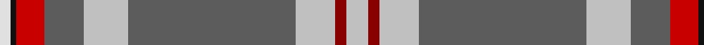

In pattern [WKRBWBWRW](/patterns/wkrbwbwrw/).

This was sourced from tartans-authority.  It is a [9 stripes tartan](/stripes/stripes9/).

Original link http://www.tartansauthority.com/tartan-ferret/display/8560/

## Thread count
LN/4 K2 R10 N14 Na16 N60 Na14 DR4 Na/8

## Palette
Each colour and its ΔE from the base-6 reference it is a variant of.

| Colour | Shade | Base | ΔE (OKLab) |
|---|---|---|---|
| DR | <code style="background-color:#880000;">#880000</code> `#880000` | R <code style="background-color:#CC0000;">#CC0000</code> | 0.15 |
| K | <code style="background-color:#101010;">#101010</code> `#101010` | K <code style="background-color:#000000;">#000000</code> | 0.17 |
| LN | <code style="background-color:#E0E0E0;">#E0E0E0</code> `#E0E0E0` | W <code style="background-color:#F7F7F7;">#F7F7F7</code> | 0.07 |
| N | <code style="background-color:#5C5C5C;">#5C5C5C</code> `#5C5C5C` | B <code style="background-color:#2A418A;">#2A418A</code> | 0.15 |
| Na | <code style="background-color:#C0C0C0;">#C0C0C0</code> `#C0C0C0` | W <code style="background-color:#F7F7F7;">#F7F7F7</code> | 0.17 |
| R | <code style="background-color:#C80000;">#C80000</code> `#C80000` | R <code style="background-color:#CC0000;">#CC0000</code> | 0.01 |

## Nearest tartans

The nearest existing variants by ΔTartan distance.

1. [Ascension Island Heritage Society](/setts/s7/r8b45w1g4k11ga6r4~b5f749c-g808080-ga289c18-k101010-rdc0000-wf8f4d0~x2/) — ΔT 1.14
1. [Confederate Memorial Commemmorative Tartan Tartan Number: 2501. Earliest known date: 1995 Designed by Dr. Philip Smith in 1995. Grey is the colour of the Confederate States of America. The fields represent the Confederate Army in line of battle-- light blue for infantry, flanked by red for artilllery and yellow for outriding cavalry. The red field represents the Confederate flag in true proportions. See products available Copyright © Blair Urquhart, Comrie, 2015](/setts/s10/y8ya2r3ya2yb2ya28r10w1b3w2~b1c0070-ra00024-wc0c0c0-y48a4c0-yab8b8b8-ybe8c000~x2/) — ΔT 1.15
1. [Carbon (Corporate)](/setts/s9/b68k4b18r20k3w3k10wa8y4~b5c5c5c-k101010-r888888-we0e0e0-wac0c0c0-yfcb464/) — ΔT 1.16
1. [Ascension Island Heritage Trust](/setts/s7/r8b45w1ra4k11g6r4~b5c8ca8-g006818-k101010-rc80000-ra888888-wfcfcfc~x2/) — ΔT 1.17
1. [Nickel Lodge Centennial (Corporate)](/setts/s9/r36y2r1y2r4b12w8g2ga12~b003c64-g604000-ga005834-r888888-we0e0e0-ye8c000~x2/) — ΔT 1.20
1. [State Seal of Georgia (Fashion)](/setts/s11/k10b13k3w7k1y20ya3w13r5y47k3~b2c2c80-k101010-rc80000-w98c8e8-ya08858-yabc8c00~x2/) — ΔT 1.24
1. [Nickel Lodge Centennial Corporate Tartan Tartan Number: 920. Earliest known date: 1988 1989 See products available Copyright © Blair Urquhart, Comrie, 2015](/setts/s9/r18y1r2y1r2b6w4g1ga6~b2c2c80-g604000-ga006818-r888888-we0e0e0-ye8c000~x2/) — ΔT 1.24
1. [Kuehle (Personal)](/setts/s7/w6wa2w1b6r30wb1ra3~b1c1c50-r888888-rae87878-wc49cd8-wae0e0e0-wbdcecf4~x2/) — ΔT 1.26
1. [Inchforth (Personal)](/setts/s9/r4g2r7b30r8b7y5g1w2~b383f44-g608c36-r8b8d8e-wffffff-yb6df1a~x2/) — ΔT 1.30
1. [(4) Traill](/setts/s7/r8y2ra7y2b24k2g1~b005f8c-g008000-k000000-rc10000-ra82644b-yefcc09~x2/) — ΔT 1.32

## Neighbour map

Every grey dot is one of 15726 variants placed by the first two principal components of the ΔTartan feature space (44% of its variance). Red is this tartan; blue dots are its nearest — click one to open its page.

<svg viewBox="0 0 640 380" role="img" style="max-width:100%;height:auto;border:1px solid #e0e0e0;border-radius:4px;display:block" xmlns="http://www.w3.org/2000/svg"><image href="/nn/cloud.v1.png" width="640" height="380"/><a href="/setts/s7/r8b45w1g4k11ga6r4~b5f749c-g808080-ga289c18-k101010-rdc0000-wf8f4d0~x2/"><circle cx="341.0" cy="91.8" r="4" fill="#3465a4"><title>Ascension Island Heritage Society</title></circle></a><a href="/setts/s10/y8ya2r3ya2yb2ya28r10w1b3w2~b1c0070-ra00024-wc0c0c0-y48a4c0-yab8b8b8-ybe8c000~x2/"><circle cx="286.1" cy="78.3" r="4" fill="#3465a4"><title>Confederate Memorial Commemmorative Tartan Tartan Number: 2501. Earliest known date: 1995 Designed by Dr. Philip Smith in 1995. Grey is the colour of the Confederate States of America. The fields represent the Confederate Army in line of battle-- light blue for infantry, flanked by red for artilllery and yellow for outriding cavalry. The red field represents the Confederate flag in true proportions. See products available Copyright © Blair Urquhart, Comrie, 2015</title></circle></a><a href="/setts/s9/b68k4b18r20k3w3k10wa8y4~b5c5c5c-k101010-r888888-we0e0e0-wac0c0c0-yfcb464/"><circle cx="362.0" cy="113.4" r="4" fill="#3465a4"><title>Carbon (Corporate)</title></circle></a><a href="/setts/s7/r8b45w1ra4k11g6r4~b5c8ca8-g006818-k101010-rc80000-ra888888-wfcfcfc~x2/"><circle cx="333.7" cy="90.7" r="4" fill="#3465a4"><title>Ascension Island Heritage Trust</title></circle></a><a href="/setts/s9/r36y2r1y2r4b12w8g2ga12~b003c64-g604000-ga005834-r888888-we0e0e0-ye8c000~x2/"><circle cx="288.7" cy="90.9" r="4" fill="#3465a4"><title>Nickel Lodge Centennial (Corporate)</title></circle></a><a href="/setts/s11/k10b13k3w7k1y20ya3w13r5y47k3~b2c2c80-k101010-rc80000-w98c8e8-ya08858-yabc8c00~x2/"><circle cx="284.1" cy="68.0" r="4" fill="#3465a4"><title>State Seal of Georgia (Fashion)</title></circle></a><a href="/setts/s9/r18y1r2y1r2b6w4g1ga6~b2c2c80-g604000-ga006818-r888888-we0e0e0-ye8c000~x2/"><circle cx="269.9" cy="118.6" r="4" fill="#3465a4"><title>Nickel Lodge Centennial Corporate Tartan Tartan Number: 920. Earliest known date: 1988 1989 See products available Copyright © Blair Urquhart, Comrie, 2015</title></circle></a><a href="/setts/s7/w6wa2w1b6r30wb1ra3~b1c1c50-r888888-rae87878-wc49cd8-wae0e0e0-wbdcecf4~x2/"><circle cx="376.7" cy="103.0" r="4" fill="#3465a4"><title>Kuehle (Personal)</title></circle></a><a href="/setts/s9/r4g2r7b30r8b7y5g1w2~b383f44-g608c36-r8b8d8e-wffffff-yb6df1a~x2/"><circle cx="331.8" cy="119.4" r="4" fill="#3465a4"><title>Inchforth (Personal)</title></circle></a><a href="/setts/s7/r8y2ra7y2b24k2g1~b005f8c-g008000-k000000-rc10000-ra82644b-yefcc09~x2/"><circle cx="274.2" cy="117.0" r="4" fill="#3465a4"><title>(4) Traill</title></circle></a><circle cx="324.8" cy="98.9" r="5" fill="#c00000"/></svg>

ID: /setts/s9/w4r2w7b30w8b7ra5k1wa2~b5c5c5c-k101010-r880000-rac80000-wc0c0c0-wae0e0e0~x2/
