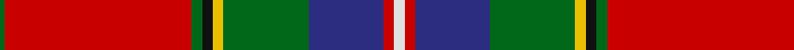

In pattern [GRGKYGBRW](/patterns/grgkygbrw/).

This was sourced from register-of-tartans.  It is a [9 stripes tartan](/stripes/stripes9/).

Original link https://www.tartanregister.gov.uk/tartanDetails.aspx?ref=1980

## Attestations

This cloth appears in 2 source records; the oldest owns this page.

- 01/05/2006 — King (Austria) (Personal) (register-of-tartans, [record](https://www.tartanregister.gov.uk/tartanDetails.aspx?ref=1980))
- 2006 May — King (Austria) (Personal) (tartans-authority, [record](http://www.tartansauthority.com/tartan-ferret/display/6939/))

## Thread count
G/2 R70 G4 K4 Y4 G32 DB28 R4 LN/4

## Palette
Each colour and its ΔE from the base-6 reference it is a variant of.

| Colour | Shade | Base | ΔE (OKLab) |
|---|---|---|---|
| DB | <code style="background-color:#2C2C80;">#2C2C80</code> `#2C2C80` | B <code style="background-color:#2C4084;">#2C4084</code> | 0.05 |
| G | <code style="background-color:#006818;">#006818</code> `#006818` | G <code style="background-color:#006400;">#006400</code> | 0.02 |
| K | <code style="background-color:#101010;">#101010</code> `#101010` | K <code style="background-color:#000000;">#000000</code> | 0.17 |
| LN | <code style="background-color:#E0E0E0;">#E0E0E0</code> `#E0E0E0` | W <code style="background-color:#F4F4F0;">#F4F4F0</code> | 0.06 |
| R | <code style="background-color:#C80000;">#C80000</code> `#C80000` | R <code style="background-color:#C80000;">#C80000</code> | 0.00 |
| Y | <code style="background-color:#E8C000;">#E8C000</code> `#E8C000` | Y <code style="background-color:#E8C000;">#E8C000</code> | 0.00 |

## Nearest tartans

The nearest existing variants by ΔTartan distance.

1. [MacNiven Family Tartan Tartan Number: 752. Earliest known date: 1986 Based in part on the MacNaughton of which the MacNivens are a Sept. The name in Mr Cannonito's family was spelt, MacKniffen. Other members of the family have dropped the 'Mac' since arriving in America in 1650. This clan tartan was accredited by the Scottish Tartans Society in 1988. See products available Copyright © Blair Urquhart, Comrie, 2015](/setts/s9/g18ga2b5r45ba3b18ba3r5w2-b202060-ba2c2c80-g006818-ga289c18-rc80000-we0e0e0/) — ΔT 0.82
1. [Celtic Nations (Fashion)](/setts/s12/b6r4b4r70y4b6k4b10k8g26k2w6-b2c2c80-g006818-k101010-rc80000-wfcfcfc-ybc8c00/) — ΔT 0.82
1. [Banause-Zunft zu Olte](/setts/s11/y4g8b2r6b6g6ga2r64b28w6y4-b003c64-g285800-ga289c18-r880000-we0e0e0-ye8c000/) — ΔT 0.84
1. [Follower's Plaid Artifact Tartan Tartan Number: 1376. Earliest known date: 1745 Red pivot = 192 threads in original. W & Y are silk. Sindex title See products available Copyright © Blair Urquhart, Comrie, 2015](/setts/s11/r96b16k20y4k6w4g50r20k6r6w4-b5c8ca8-g006818-k101010-rc80000-we0e0e0-ye8c000/) — ΔT 0.91
1. [MacLean of Duart #5](/setts/s11/b28k16y4k6w8k6g42r96b8r10k6-b3c82af-g005020-k101010-rdc0000-we0e0e0-ye8c000/) — ΔT 0.93
1. [Followers' Plaid](/setts/s11/r96b16k20y4k6w4g50r20k6r6w4-b5c8ca8-g006818-k101010-rc80000-wfcfcfc-ye8c000/) — ΔT 0.94
1. [MacNiven](/setts/s9/g18ga2b5r45ba3b18ba3r5w2-b000050-ba304080-g008000-ga30a010-rc00000-we0e0e0/) — ΔT 0.96
1. [Holyrood, Chair](/setts/s13/r68w2b20g20w2y2g4ba4w2b4ba20r12w2-b304080-ba5480b0-g008000-rc00000-we0e0e0-yf0c000/) — ΔT 0.98
1. [Caledonian Society Ancient Artifact Tartan Tartan Number: 1554. Earliest known date: 1847 Coat at Banff museum. The MacPherson of MacPherson's Rant was hanged at Banff market cross. See products available Copyright © Blair Urquhart, Comrie, 2015](/setts/s8/r80g32y4k16b8w2ba10w4-b5c8ca8-ba2c2c80-g006818-k101010-rc80000-we0e0e0-ye8c000/) — ΔT 0.99
1. [Ancient Caledonian Society](/setts/s8/r80g32y4k16ga8w2b10w4-b2c2c80-g006818-ga789484-k101010-rc80000-wf8f8f8-ye8c000/) — ΔT 1.03

## Neighbour map

Every grey dot is one of 15726 variants placed by the first two principal components of the ΔTartan feature space (44% of its variance). Red is this tartan; blue dots are its nearest — click one to open its page.

<svg viewBox="0 0 640 380" role="img" style="max-width:100%;height:auto;border:1px solid #e0e0e0;border-radius:4px;display:block" xmlns="http://www.w3.org/2000/svg"><image href="/nn/cloud.v1.png" width="640" height="380"/><a href="/setts/s9/g18ga2b5r45ba3b18ba3r5w2-b202060-ba2c2c80-g006818-ga289c18-rc80000-we0e0e0/"><circle cx="271.1" cy="98.7" r="4" fill="#3465a4"><title>MacNiven Family Tartan Tartan Number: 752. Earliest known date: 1986 Based in part on the MacNaughton of which the MacNivens are a Sept. The name in Mr Cannonito's family was spelt, MacKniffen. Other members of the family have dropped the 'Mac' since arriving in America in 1650. This clan tartan was accredited by the Scottish Tartans Society in 1988. See products available Copyright © Blair Urquhart, Comrie, 2015</title></circle></a><a href="/setts/s12/b6r4b4r70y4b6k4b10k8g26k2w6-b2c2c80-g006818-k101010-rc80000-wfcfcfc-ybc8c00/"><circle cx="276.3" cy="50.0" r="4" fill="#3465a4"><title>Celtic Nations (Fashion)</title></circle></a><a href="/setts/s11/y4g8b2r6b6g6ga2r64b28w6y4-b003c64-g285800-ga289c18-r880000-we0e0e0-ye8c000/"><circle cx="305.8" cy="71.2" r="4" fill="#3465a4"><title>Banause-Zunft zu Olte</title></circle></a><a href="/setts/s11/r96b16k20y4k6w4g50r20k6r6w4-b5c8ca8-g006818-k101010-rc80000-we0e0e0-ye8c000/"><circle cx="282.1" cy="78.0" r="4" fill="#3465a4"><title>Follower's Plaid Artifact Tartan Tartan Number: 1376. Earliest known date: 1745 Red pivot = 192 threads in original. W &amp; Y are silk. Sindex title See products available Copyright © Blair Urquhart, Comrie, 2015</title></circle></a><a href="/setts/s11/b28k16y4k6w8k6g42r96b8r10k6-b3c82af-g005020-k101010-rdc0000-we0e0e0-ye8c000/"><circle cx="230.1" cy="74.7" r="4" fill="#3465a4"><title>MacLean of Duart #5</title></circle></a><a href="/setts/s11/r96b16k20y4k6w4g50r20k6r6w4-b5c8ca8-g006818-k101010-rc80000-wfcfcfc-ye8c000/"><circle cx="278.8" cy="76.5" r="4" fill="#3465a4"><title>Followers' Plaid</title></circle></a><a href="/setts/s9/g18ga2b5r45ba3b18ba3r5w2-b000050-ba304080-g008000-ga30a010-rc00000-we0e0e0/"><circle cx="253.9" cy="94.2" r="4" fill="#3465a4"><title>MacNiven</title></circle></a><a href="/setts/s13/r68w2b20g20w2y2g4ba4w2b4ba20r12w2-b304080-ba5480b0-g008000-rc00000-we0e0e0-yf0c000/"><circle cx="282.3" cy="55.3" r="4" fill="#3465a4"><title>Holyrood, Chair</title></circle></a><a href="/setts/s8/r80g32y4k16b8w2ba10w4-b5c8ca8-ba2c2c80-g006818-k101010-rc80000-we0e0e0-ye8c000/"><circle cx="274.8" cy="58.1" r="4" fill="#3465a4"><title>Caledonian Society Ancient Artifact Tartan Tartan Number: 1554. Earliest known date: 1847 Coat at Banff museum. The MacPherson of MacPherson's Rant was hanged at Banff market cross. See products available Copyright © Blair Urquhart, Comrie, 2015</title></circle></a><a href="/setts/s8/r80g32y4k16ga8w2b10w4-b2c2c80-g006818-ga789484-k101010-rc80000-wf8f8f8-ye8c000/"><circle cx="272.3" cy="56.7" r="4" fill="#3465a4"><title>Ancient Caledonian Society</title></circle></a><circle cx="286.1" cy="76.1" r="5" fill="#c00000"/></svg>

ID: /setts/s9/w4r4b28g32y4k4g4r70g2-b2c2c80-g006818-k101010-rc80000-we0e0e0-ye8c000/
