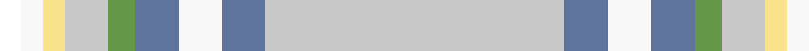

In pattern [KWYWGBWBW](/patterns/kwywgbwbw/).

This was sourced from register-of-tartans.  It is a [9 stripes tartan](/stripes/stripes9/).

Original link https://www.tartanregister.gov.uk/tartanDetails.aspx?ref=11209

## Register references

External register numbers recorded for this tartan.

- Scottish Register of Tartans: [11209](https://www.tartanregister.gov.uk/tartanDetails.aspx?ref=11209)

## Thread count
K/8 W8 LY8 N16 LG10 B16 W16 B16 N/110

## Palette
Each colour and its ΔE from the base-6 reference it is a variant of.

| Colour | Shade | Base | ΔE (OKLab) |
|---|---|---|---|
| B | <code style="background-color:#5F749C;">#5F749C</code> `#5F749C` | B <code style="background-color:#2A418A;">#2A418A</code> | 0.17 |
| LG | <code style="background-color:#649848;">#649848</code> `#649848` | G <code style="background-color:#006100;">#006100</code> | 0.20 |
| LY | <code style="background-color:#F8E38C;">#F8E38C</code> `#F8E38C` | Y <code style="background-color:#F2BF00;">#F2BF00</code> | 0.11 |
| N | <code style="background-color:#C8C8C8;">#C8C8C8</code> `#C8C8C8` | W <code style="background-color:#F7F7F7;">#F7F7F7</code> | 0.14 |
| W | <code style="background-color:#F8F8F8;">#F8F8F8</code> `#F8F8F8` | W <code style="background-color:#F7F7F7;">#F7F7F7</code> | 0.00 |

## Nearest tartans

The nearest existing variants by ΔTartan distance.

1. [Gray, Thomas (Personal)](/setts/s10/b1y1ba1r6w16bb1w1r2w1bb1~b2888c4-ba2c2c80-bb5c5c5c-r888888-we0e0e0-ye8c000~x4/) — ΔT 0.70
1. [Miller Hargreaves (Personal)](/setts/s8/w40b4w4ba5g5w3y6r3~b2c2c80-ba9058d8-g006818-rb03000-wc0c0c0-yfccc00~x2/) — ΔT 1.05
1. [Nicolson of the Isles (Personal)](/setts/s7/w2r12y5wa35b4r4ya2~b6080d0-rc80000-we0e0e0-wa98c8e8-y80c86c-yae8c000~x2/) — ΔT 1.14
1. [Ofsharick, Matthew (Personal)](/setts/s9/r55b8w8b8g5r8y4w4k4~b1474b4-g006818-k101010-r888888-wfcfcfc-yfccc00~x2/) — ΔT 1.19
1. [Glenmore Green Fashion Tartan Tartan Number: 5041. Earliest known date: pre 1988 A Royal Stewart colour variation produced by many weaving mills See products available Copyright © Blair Urquhart, Comrie, 2015](/setts/s11/w38g10r2g3w2g3ga8y3g2y3w2~g506c6c-ga407c40-ra00048-wf0f0d8-yc0a490~x2/) — ΔT 1.40
1. [Boucherville Dress (District)](/setts/s9/w20y2b5w4ba2b2ba2b2g1~b5c5c5c-ba1c0070-g003820-we0e0e0-yd09800~x2/) — ΔT 1.52
1. [Grant of Auchnarrow](/setts/s13/w6r2w38g8b6w2b2w2y14r7g2r3w2~b2c2c80-g289c18-re87878-we0e0e0-ya08858~x2/) — ΔT 1.58
1. [Australian, dress](/setts/s9/w50r4y2k2y2r4y10r15b2~b5480b0-k000000-r806050-we0e0e0-yd08010~x2/) — ΔT 1.61
1. [Unidentified #54](/setts/s12/w24r2w3g1y1g1w1g6ra6b1ra2w1~b3474fc-g502814-r8c0000-ra8c6428-wc8c8c8-yc89800~x4/) — ΔT 1.61
1. [Strathyre Dress (Dance)](/setts/s11/w36g6r2g3w2g3ga6b4g2b2w2~b9058d8-g006818-ga604000-r880000-wf8f8f8~x2/) — ΔT 1.66

## Neighbour map

Every grey dot is one of 15726 variants placed by the first two principal components of the ΔTartan feature space (44% of its variance). Red is this tartan; blue dots are its nearest — click one to open its page.

<svg viewBox="0 0 640 380" role="img" style="max-width:100%;height:auto;border:1px solid #e0e0e0;border-radius:4px;display:block" xmlns="http://www.w3.org/2000/svg"><image href="/nn/cloud.v1.png" width="640" height="380"/><a href="/setts/s10/b1y1ba1r6w16bb1w1r2w1bb1~b2888c4-ba2c2c80-bb5c5c5c-r888888-we0e0e0-ye8c000~x4/"><circle cx="317.9" cy="91.7" r="4" fill="#3465a4"><title>Gray, Thomas (Personal)</title></circle></a><a href="/setts/s8/w40b4w4ba5g5w3y6r3~b2c2c80-ba9058d8-g006818-rb03000-wc0c0c0-yfccc00~x2/"><circle cx="360.3" cy="115.5" r="4" fill="#3465a4"><title>Miller Hargreaves (Personal)</title></circle></a><a href="/setts/s7/w2r12y5wa35b4r4ya2~b6080d0-rc80000-we0e0e0-wa98c8e8-y80c86c-yae8c000~x2/"><circle cx="289.3" cy="114.3" r="4" fill="#3465a4"><title>Nicolson of the Isles (Personal)</title></circle></a><a href="/setts/s9/r55b8w8b8g5r8y4w4k4~b1474b4-g006818-k101010-r888888-wfcfcfc-yfccc00~x2/"><circle cx="316.6" cy="116.7" r="4" fill="#3465a4"><title>Ofsharick, Matthew (Personal)</title></circle></a><a href="/setts/s11/w38g10r2g3w2g3ga8y3g2y3w2~g506c6c-ga407c40-ra00048-wf0f0d8-yc0a490~x2/"><circle cx="293.7" cy="87.2" r="4" fill="#3465a4"><title>Glenmore Green Fashion Tartan Tartan Number: 5041. Earliest known date: pre 1988 A Royal Stewart colour variation produced by many weaving mills See products available Copyright © Blair Urquhart, Comrie, 2015</title></circle></a><a href="/setts/s9/w20y2b5w4ba2b2ba2b2g1~b5c5c5c-ba1c0070-g003820-we0e0e0-yd09800~x2/"><circle cx="307.4" cy="101.9" r="4" fill="#3465a4"><title>Boucherville Dress (District)</title></circle></a><a href="/setts/s13/w6r2w38g8b6w2b2w2y14r7g2r3w2~b2c2c80-g289c18-re87878-we0e0e0-ya08858~x2/"><circle cx="273.1" cy="88.2" r="4" fill="#3465a4"><title>Grant of Auchnarrow</title></circle></a><a href="/setts/s9/w50r4y2k2y2r4y10r15b2~b5480b0-k000000-r806050-we0e0e0-yd08010~x2/"><circle cx="317.9" cy="86.2" r="4" fill="#3465a4"><title>Australian, dress</title></circle></a><a href="/setts/s12/w24r2w3g1y1g1w1g6ra6b1ra2w1~b3474fc-g502814-r8c0000-ra8c6428-wc8c8c8-yc89800~x4/"><circle cx="317.2" cy="60.0" r="4" fill="#3465a4"><title>Unidentified #54</title></circle></a><a href="/setts/s11/w36g6r2g3w2g3ga6b4g2b2w2~b9058d8-g006818-ga604000-r880000-wf8f8f8~x2/"><circle cx="292.7" cy="77.8" r="4" fill="#3465a4"><title>Strathyre Dress (Dance)</title></circle></a><circle cx="301.2" cy="103.9" r="5" fill="#c00000"/></svg>

ID: /setts/s9/w55b8wa8b8g5w8y4wa4k4~b5f749c-g649848-k000000-wc8c8c8-waf8f8f8-yf8e38c~x2/
