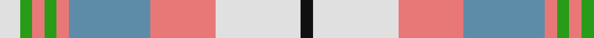

This page is one **sett** — a single exact thread-count. It belongs to the [tartan](/tartans/ln5g3lr3g3lr3b20lr16ln21k3/)
(the same proportion at any scale), whose colour order is pattern [KWRBRGRGW](/stripes/kwrbrgrgw/).

Sourced from tartans-authority.  It is a [9 stripe tartan](/stripes/stripes9/).

Original link http://www.tartansauthority.com/tartan-ferret/display/1259/

## Thread count
LN/10 G6 LR6 G6 LR6 B40 LR32 LN42 K/6

## Palette
Each colour and the base-6 reference it is a variant of.

| Colour | Shade | Base |
|---|---|---|
| B | <code style="background-color:#5C8CA8;">#5C8CA8</code> `oklch(61.7% 0.067 235.0)` <small>#5C8CA8</small> | B <code style="background-color:#2A418A;">#2A418A</code> |
| G | <code style="background-color:#289C18;">#289C18</code> `oklch(60.6% 0.191 141.6)` <small>#289C18</small> | G <code style="background-color:#006100;">#006100</code> |
| K | <code style="background-color:#101010;">#101010</code> `oklch(17.3% 0.000 89.9)` <small>#101010</small> | K <code style="background-color:#000000;">#000000</code> |
| LN | <code style="background-color:#E0E0E0;">#E0E0E0</code> `oklch(90.7% 0.000 89.9)` <small>#E0E0E0</small> | W <code style="background-color:#F7F7F7;">#F7F7F7</code> |
| LR | <code style="background-color:#E87878;">#E87878</code> `oklch(70.0% 0.139 21.2)` <small>#E87878</small> | R <code style="background-color:#CC0000;">#CC0000</code> |

## Nearest tartans

The nearest existing variants by ΔTartan distance, with this tartan at the top so the swatches line up against it.

ΔTartan

Tartan

Sett

—

<a href="/ttd/edit/#slug=w5g3r3g3r3t20r16w21k3~x2">Oliver Dress, Pink (Dance?)</a> <a class="nn-out" href="/setts/s9/w5g3r3g3r3t20r16w21k3~x2/" title="open its dictionary page">↗</a>

1.35

<a href="/ttd/edit/#slug=w4t32w12k5r9lo8r4w4~x2">Brunnbauer (2015)</a> <a class="nn-out" href="/setts/s8/w4t32w12k5r9lo8r4w4~x2/" title="open its dictionary page">↗</a>

1.40

<a href="/ttd/edit/#slug=t8ly2g4ly2dp4ly2t8w15lo2~x4">Edmonton, City of</a> <a class="nn-out" href="/setts/s9/t8ly2g4ly2dp4ly2t8w15lo2~x4/" title="open its dictionary page">↗</a>

1.44

<a href="/ttd/edit/#slug=r1g1ly1t9ly3w3lr9t1~x4">Curd (2013)</a> <a class="nn-out" href="/setts/s8/r1g1ly1t9ly3w3lr9t1~x4/" title="open its dictionary page">↗</a>

1.44

<a href="/ttd/edit/#slug=g4lo7r9lo9b20w2b2~x2">Tombow 140th Anniversary, The</a> <a class="nn-out" href="/setts/s7/g4lo7r9lo9b20w2b2~x2/" title="open its dictionary page">↗</a>

1.51

<a href="/ttd/edit/#slug=g3r10lb2g3lb13g2lb2g3~x2">Manitoba Dress (Dance)</a> <a class="nn-out" href="/setts/s8/g3r10lb2g3lb13g2lb2g3~x2/" title="open its dictionary page">↗</a>

1.56

<a href="/ttd/edit/#slug=r2o9lb4w2n22w2lb4w22n2w8r2~x2">MacRae Grey (Fashion)</a> <a class="nn-out" href="/setts/s11/r2o9lb4w2n22w2lb4w22n2w8r2~x2/" title="open its dictionary page">↗</a>

1.59

<a href="/ttd/edit/#slug=o17y5db2w12db2ly4g7~x2">Ontario, Northern</a> <a class="nn-out" href="/setts/s7/o17y5db2w12db2ly4g7~x2/" title="open its dictionary page">↗</a>

1.59

<a href="/ttd/edit/#slug=do3o1lr1do1o3do3lr3ly6n1~x6">Toorak Chapler</a> <a class="nn-out" href="/setts/s9/do3o1lr1do1o3do3lr3ly6n1~x6/" title="open its dictionary page">↗</a>

1.61

<a href="/ttd/edit/#slug=r6o2r2o23k2r4k2t21r2t2w6~x2">IRPA (Corporate)</a> <a class="nn-out" href="/setts/s11/r6o2r2o23k2r4k2t21r2t2w6~x2/" title="open its dictionary page">↗</a>

1.61

<a href="/ttd/edit/#slug=o30r3dg14w10r3b30~x2">Cercle de Fermières Varennes</a> <a class="nn-out" href="/setts/s6/o30r3dg14w10r3b30~x2/" title="open its dictionary page">↗</a>

## Neighbour map

Every grey dot is one of 14299 variants placed by the first two principal components of the ΔTartan feature space (44% of its variance). Red is this tartan; blue dots are its nearest — click one to open its page.

<svg viewBox="0 0 640 380" role="img" style="max-width:100%;height:auto;border:1px solid #e0e0e0;border-radius:4px;display:block" xmlns="http://www.w3.org/2000/svg"><image href="/nn/cloud.v1.png" width="640" height="380"/><a href="/setts/s8/w4t32w12k5r9lo8r4w4~x2/"><circle cx="152.0" cy="155.6" r="4" fill="#3465a4"><title>Brunnbauer (2015)</title></circle></a><a href="/setts/s9/t8ly2g4ly2dp4ly2t8w15lo2~x4/"><circle cx="88.5" cy="153.5" r="4" fill="#3465a4"><title>Edmonton, City of</title></circle></a><a href="/setts/s8/r1g1ly1t9ly3w3lr9t1~x4/"><circle cx="164.8" cy="162.6" r="4" fill="#3465a4"><title>Curd (2013)</title></circle></a><a href="/setts/s7/g4lo7r9lo9b20w2b2~x2/"><circle cx="182.4" cy="181.8" r="4" fill="#3465a4"><title>Tombow 140th Anniversary, The</title></circle></a><a href="/setts/s8/g3r10lb2g3lb13g2lb2g3~x2/"><circle cx="173.6" cy="181.0" r="4" fill="#3465a4"><title>Manitoba Dress (Dance)</title></circle></a><a href="/setts/s11/r2o9lb4w2n22w2lb4w22n2w8r2~x2/"><circle cx="175.6" cy="121.3" r="4" fill="#3465a4"><title>MacRae Grey (Fashion)</title></circle></a><a href="/setts/s7/o17y5db2w12db2ly4g7~x2/"><circle cx="105.1" cy="173.8" r="4" fill="#3465a4"><title>Ontario, Northern</title></circle></a><a href="/setts/s9/do3o1lr1do1o3do3lr3ly6n1~x6/"><circle cx="79.6" cy="189.8" r="4" fill="#3465a4"><title>Toorak Chapler</title></circle></a><a href="/setts/s11/r6o2r2o23k2r4k2t21r2t2w6~x2/"><circle cx="186.6" cy="139.8" r="4" fill="#3465a4"><title>IRPA (Corporate)</title></circle></a><a href="/setts/s6/o30r3dg14w10r3b30~x2/"><circle cx="147.0" cy="194.3" r="4" fill="#3465a4"><title>Cercle de Fermières Varennes</title></circle></a><circle cx="139.7" cy="169.8" r="5" fill="#c00000"/></svg>

ID: /setts/s9/w5g3r3g3r3t20r16w21k3~x2/
