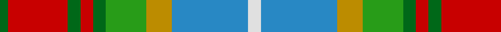

In pattern [GRGRGGYBW](/patterns/grgrggybw/).

This was sourced from tartans-authority.  It is a [9 stripes tartan](/stripes/stripes9/).

Original link http://www.tartansauthority.com/tartan-ferret/display/10377/

## Thread count
Ga/4 R28 Ga6 R6 Ga6 G19 DY12 B36 LN/6

## Palette
Each colour and its ΔE from the base-6 reference it is a variant of.

| Colour | Shade | Base | ΔE (OKLab) |
|---|---|---|---|
| B | <code style="background-color:#2888C4;">#2888C4</code> `#2888C4` | B <code style="background-color:#2C4084;">#2C4084</code> | 0.21 |
| DY | <code style="background-color:#BC8C00;">#BC8C00</code> `#BC8C00` | Y <code style="background-color:#E8C000;">#E8C000</code> | 0.16 |
| G | <code style="background-color:#289C18;">#289C18</code> `#289C18` | G <code style="background-color:#006400;">#006400</code> | 0.18 |
| Ga | <code style="background-color:#006818;">#006818</code> `#006818` | G <code style="background-color:#006400;">#006400</code> | 0.02 |
| LN | <code style="background-color:#E0E0E0;">#E0E0E0</code> `#E0E0E0` | W <code style="background-color:#F4F4F0;">#F4F4F0</code> | 0.06 |
| R | <code style="background-color:#C80000;">#C80000</code> `#C80000` | R <code style="background-color:#C80000;">#C80000</code> | 0.00 |

## Nearest tartans

The nearest existing variants by ΔTartan distance.

1. [Unnamed No 14](/setts/s9/r22b6ba10y4r4w4g22ba8y3-b5480b0-ba304080-g008000-rc00000-we0e0e0-yf0c000/) — ΔT 0.87
1. [Ontario, Northern](/setts/s7/r34g10b4w24b4y8ga14-b304080-g808080-ga008000-r806050-we0e0e0-yf0c000/) — ΔT 0.89
1. [Porcupine City of](/setts/s7/r40b12ba4w32ba4y8g20-b5c5c5c-ba1c0070-g006818-rb03000-wc0c0c0-yd09800/) — ΔT 1.01
1. [Royal Pharmaceutical Society](/setts/s9/g6r4ga38r12ga4r12y28ra8w4-g604000-ga003820-r888888-ra901c38-we0e0e0-ya08858/) — ΔT 1.09
1. [Falardeau-Murphy (Canada) (Personal)](/setts/s7/g42b42y6r42ba6bb10ba6-b5c8ca8-ba5c5c5c-bb780078-g006818-ra00000-yfccc00/) — ΔT 1.10
1. [Isle of Skye (District)](/setts/s11/w48g6w6g6w6g20r24b24r24r4r6-b440044-g003820-r8c5c00-wc0c0c0/) — ΔT 1.13
1. [Brittany Hunting French Fancy Tartan Tartan Number: 5977. Earliest known date: 2003 For Richard and Anne-Marie Duclos of Le Coudray-Montceaux, France. Based on the Breton National at 3902. The term Randonnée (Walking) is used in the sense of the Scottish category, Hunting. See products available Copyright © Blair Urquhart, Comrie, 2015](/setts/s9/b8g54y16k8y16k8y16r22ya6-b4898c4-g60441c-k101010-rb03000-yc8b898-yae8c000/) — ΔT 1.13
1. [Royal Pharmaceutical Society (Corp)](/setts/s9/g4r4ga38r12ga4r12y28ra8w4-g604000-ga003820-r888888-ra901c38-we0e0e0-ya08858/) — ΔT 1.15
1. [Unnamed No 14 Tartan Tartan Number: 1326. Earliest known date: 1870 This sett is taken from the records of Messrs Bolingbroke and Jones of Norwich, who were weavers around 1870. Some of the tartans have been adopted or modified in recent times as the copyright of the designs is now in the public domain. See products available Copyright © Blair Urquhart, Comrie, 2015](/setts/s9/r22b6ba10y4r4w4g22ba8y3-b5c8ca8-ba2c2c80-g006818-rc80000-we0e0e0-ye8c000/) — ΔT 1.15
1. [Ontario Northern Canadian District Tartan Tartan Number: 956. Earliest known date: 1967 The six colours represent the nickel bearing rocks (grey), the snow (white), the sky and the lakes (blue), gold, the forests and fields (green), and the Indian Nation (red brown). See products available Copyright © Blair Urquhart, Comrie, 2015](/setts/s7/g34r10b4w24b4y8ga14-b2c2c80-g604000-ga006818-r888888-we0e0e0-ye8c000/) — ΔT 1.16

## Neighbour map

Every grey dot is one of 15726 variants placed by the first two principal components of the ΔTartan feature space (44% of its variance). Red is this tartan; blue dots are its nearest — click one to open its page.

<svg viewBox="0 0 640 380" role="img" style="max-width:100%;height:auto;border:1px solid #e0e0e0;border-radius:4px;display:block" xmlns="http://www.w3.org/2000/svg"><image href="/nn/cloud.v1.png" width="640" height="380"/><a href="/setts/s9/r22b6ba10y4r4w4g22ba8y3-b5480b0-ba304080-g008000-rc00000-we0e0e0-yf0c000/"><circle cx="86.3" cy="163.0" r="4" fill="#3465a4"><title>Unnamed No 14</title></circle></a><a href="/setts/s7/r34g10b4w24b4y8ga14-b304080-g808080-ga008000-r806050-we0e0e0-yf0c000/"><circle cx="101.8" cy="172.6" r="4" fill="#3465a4"><title>Ontario, Northern</title></circle></a><a href="/setts/s7/r40b12ba4w32ba4y8g20-b5c5c5c-ba1c0070-g006818-rb03000-wc0c0c0-yd09800/"><circle cx="113.6" cy="162.7" r="4" fill="#3465a4"><title>Porcupine City of</title></circle></a><a href="/setts/s9/g6r4ga38r12ga4r12y28ra8w4-g604000-ga003820-r888888-ra901c38-we0e0e0-ya08858/"><circle cx="147.5" cy="161.2" r="4" fill="#3465a4"><title>Royal Pharmaceutical Society</title></circle></a><a href="/setts/s7/g42b42y6r42ba6bb10ba6-b5c8ca8-ba5c5c5c-bb780078-g006818-ra00000-yfccc00/"><circle cx="108.5" cy="190.2" r="4" fill="#3465a4"><title>Falardeau-Murphy (Canada) (Personal)</title></circle></a><a href="/setts/s11/w48g6w6g6w6g20r24b24r24r4r6-b440044-g003820-r8c5c00-wc0c0c0/"><circle cx="101.4" cy="130.5" r="4" fill="#3465a4"><title>Isle of Skye (District)</title></circle></a><a href="/setts/s9/b8g54y16k8y16k8y16r22ya6-b4898c4-g60441c-k101010-rb03000-yc8b898-yae8c000/"><circle cx="116.4" cy="150.4" r="4" fill="#3465a4"><title>Brittany Hunting French Fancy Tartan Tartan Number: 5977. Earliest known date: 2003 For Richard and Anne-Marie Duclos of Le Coudray-Montceaux, France. Based on the Breton National at 3902. The term Randonnée (Walking) is used in the sense of the Scottish category, Hunting. See products available Copyright © Blair Urquhart, Comrie, 2015</title></circle></a><a href="/setts/s9/g4r4ga38r12ga4r12y28ra8w4-g604000-ga003820-r888888-ra901c38-we0e0e0-ya08858/"><circle cx="153.3" cy="158.8" r="4" fill="#3465a4"><title>Royal Pharmaceutical Society (Corp)</title></circle></a><a href="/setts/s9/r22b6ba10y4r4w4g22ba8y3-b5c8ca8-ba2c2c80-g006818-rc80000-we0e0e0-ye8c000/"><circle cx="83.6" cy="161.5" r="4" fill="#3465a4"><title>Unnamed No 14 Tartan Tartan Number: 1326. Earliest known date: 1870 This sett is taken from the records of Messrs Bolingbroke and Jones of Norwich, who were weavers around 1870. Some of the tartans have been adopted or modified in recent times as the copyright of the designs is now in the public domain. See products available Copyright © Blair Urquhart, Comrie, 2015</title></circle></a><a href="/setts/s7/g34r10b4w24b4y8ga14-b2c2c80-g604000-ga006818-r888888-we0e0e0-ye8c000/"><circle cx="84.5" cy="166.5" r="4" fill="#3465a4"><title>Ontario Northern Canadian District Tartan Tartan Number: 956. Earliest known date: 1967 The six colours represent the nickel bearing rocks (grey), the snow (white), the sky and the lakes (blue), gold, the forests and fields (green), and the Indian Nation (red brown). See products available Copyright © Blair Urquhart, Comrie, 2015</title></circle></a><circle cx="92.3" cy="159.7" r="5" fill="#c00000"/></svg>

ID: /setts/s9/w6b36y12g19ga6r6ga6r28ga4-b2888c4-g289c18-ga006818-rc80000-we0e0e0-ybc8c00/
