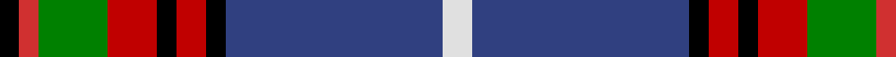

In pattern [KRGRKRKBW](/patterns/krgrkrkbw/).

This was sourced from weddslist.  It is a [9 stripes tartan](/stripes/stripes9/).

Original link http://www.weddslist.com/cgi-bin/tartans/pg.pl?source=sts

## Thread count
K/4 R4 G14 Ra10 K4 Ra6 K4 B44 LN/6

## Palette
Each colour and its ΔE from the base-6 reference it is a variant of.

| Colour | Shade | Base | ΔE (OKLab) |
|---|---|---|---|
| B | <code style="background-color:#304080;">#304080</code> `#304080` | B <code style="background-color:#2A418A;">#2A418A</code> | 0.02 |
| G | <code style="background-color:#008000;">#008000</code> `#008000` | G <code style="background-color:#006100;">#006100</code> | 0.10 |
| K | <code style="background-color:#000000;">#000000</code> `#000000` | K <code style="background-color:#000000;">#000000</code> | 0.00 |
| LN | <code style="background-color:#E0E0E0;">#E0E0E0</code> `#E0E0E0` | W <code style="background-color:#F7F7F7;">#F7F7F7</code> | 0.07 |
| R | <code style="background-color:#D03030;">#D03030</code> `#D03030` | R <code style="background-color:#CC0000;">#CC0000</code> | 0.04 |
| Ra | <code style="background-color:#C00000;">#C00000</code> `#C00000` | R <code style="background-color:#CC0000;">#CC0000</code> | 0.03 |

## Nearest tartans

The nearest existing variants by ΔTartan distance.

1. [Edinburgh](/setts/s9/w8b50k4r8k6r12g17ba7k4-b304080-ba800080-g008000-k000000-rc00000-we0e0e0/) — ΔT 0.43
1. [Edinburgh District](/setts/s9/w6b50r6ra6r6ra10g20r6k4-b304080-g008000-k000000-r800000-rac00000-we0e0e0/) — ΔT 0.78
1. [Loch Lomond & the Trossachs (Fashion](/setts/s10/w4r10k4y6k8b56r8g28k8w4-b2c2c80-g285800-k101010-rc80000-we0e0e0-ybc8c00/) — ΔT 0.79
1. [Edinburgh District Tartan Tartan Number: 1163. Earliest known date: 1970 Several attempts have been made to develop a special tartan for the residents of Edinburgh. None had success until the design by Councillor Hugh Macpherson in 1970 on the occassion of the Commonwealth Games. The colours have symbolic references to the City of Edinburgh. See products available Copyright © Blair Urquhart, Comrie, 2015](/setts/s9/w6b50r6ra6r6ra10g20r6k4-b2c2c80-g006818-k101010-r880000-rac80000-we0e0e0/) — ΔT 0.93
1. [Legion of Frontiersmen (Corporate)](/setts/s8/k90y20g14r6w8b26w18r12-b202060-g006818-k101010-rc80000-we0e0e0-ybc8c00/) — ΔT 0.94
1. [Bird Family (Personal)](/setts/s10/y8k56y4b14w6r18g4w8g4k4-b2c2c80-g289c18-k101010-r901c38-wfcfcfc-yfccc00/) — ΔT 0.96
1. [Dublin County Crest (Fashion)](/setts/s11/y9k8y30k4w8k4b24k54r14k4ya8-b2c2c80-k101010-r880000-wa8ace8-ybc8c00-yaa0a0a0/) — ΔT 0.97
1. [Wee Course, Blairgowrie Golf Club, The](/setts/s11/w6b60g6ba6r6y6ba16b6y6ba6w6-b5c5c5c-ba000048-g003c14-r960028-wffffff-yd09800/) — ΔT 0.98
1. [Dean/Dundas (Personal)](/setts/s9/r34k10w8k12y10b62k10g12w6-b2c2c80-g289c18-k101010-rc80000-we0e0e0-yfccc00/) — ΔT 1.03
1. [Asman, Dress (Name)](/setts/s11/b8y6b44r12w4ra12w4k12k40ra6k8-b2c2c80-k101010-r888888-rac80000-wfcfcfc-ye8c000/) — ΔT 1.03

## Neighbour map

Every grey dot is one of 15726 variants placed by the first two principal components of the ΔTartan feature space (44% of its variance). Red is this tartan; blue dots are its nearest — click one to open its page.

<svg viewBox="0 0 640 380" role="img" style="max-width:100%;height:auto;border:1px solid #e0e0e0;border-radius:4px;display:block" xmlns="http://www.w3.org/2000/svg"><image href="/nn/cloud.v1.png" width="640" height="380"/><a href="/setts/s9/w8b50k4r8k6r12g17ba7k4-b304080-ba800080-g008000-k000000-rc00000-we0e0e0/"><circle cx="162.7" cy="124.5" r="4" fill="#3465a4"><title>Edinburgh</title></circle></a><a href="/setts/s9/w6b50r6ra6r6ra10g20r6k4-b304080-g008000-k000000-r800000-rac00000-we0e0e0/"><circle cx="191.1" cy="128.9" r="4" fill="#3465a4"><title>Edinburgh District</title></circle></a><a href="/setts/s10/w4r10k4y6k8b56r8g28k8w4-b2c2c80-g285800-k101010-rc80000-we0e0e0-ybc8c00/"><circle cx="175.3" cy="117.8" r="4" fill="#3465a4"><title>Loch Lomond &amp; the Trossachs (Fashion</title></circle></a><a href="/setts/s9/w6b50r6ra6r6ra10g20r6k4-b2c2c80-g006818-k101010-r880000-rac80000-we0e0e0/"><circle cx="196.8" cy="130.7" r="4" fill="#3465a4"><title>Edinburgh District Tartan Tartan Number: 1163. Earliest known date: 1970 Several attempts have been made to develop a special tartan for the residents of Edinburgh. None had success until the design by Councillor Hugh Macpherson in 1970 on the occassion of the Commonwealth Games. The colours have symbolic references to the City of Edinburgh. See products available Copyright © Blair Urquhart, Comrie, 2015</title></circle></a><a href="/setts/s8/k90y20g14r6w8b26w18r12-b202060-g006818-k101010-rc80000-we0e0e0-ybc8c00/"><circle cx="178.5" cy="121.3" r="4" fill="#3465a4"><title>Legion of Frontiersmen (Corporate)</title></circle></a><a href="/setts/s10/y8k56y4b14w6r18g4w8g4k4-b2c2c80-g289c18-k101010-r901c38-wfcfcfc-yfccc00/"><circle cx="179.5" cy="101.0" r="4" fill="#3465a4"><title>Bird Family (Personal)</title></circle></a><a href="/setts/s11/y9k8y30k4w8k4b24k54r14k4ya8-b2c2c80-k101010-r880000-wa8ace8-ybc8c00-yaa0a0a0/"><circle cx="169.5" cy="121.9" r="4" fill="#3465a4"><title>Dublin County Crest (Fashion)</title></circle></a><a href="/setts/s11/w6b60g6ba6r6y6ba16b6y6ba6w6-b5c5c5c-ba000048-g003c14-r960028-wffffff-yd09800/"><circle cx="211.1" cy="110.8" r="4" fill="#3465a4"><title>Wee Course, Blairgowrie Golf Club, The</title></circle></a><a href="/setts/s9/r34k10w8k12y10b62k10g12w6-b2c2c80-g289c18-k101010-rc80000-we0e0e0-yfccc00/"><circle cx="118.2" cy="132.1" r="4" fill="#3465a4"><title>Dean/Dundas (Personal)</title></circle></a><a href="/setts/s11/b8y6b44r12w4ra12w4k12k40ra6k8-b2c2c80-k101010-r888888-rac80000-wfcfcfc-ye8c000/"><circle cx="141.3" cy="131.5" r="4" fill="#3465a4"><title>Asman, Dress (Name)</title></circle></a><circle cx="179.3" cy="124.4" r="5" fill="#c00000"/></svg>

ID: /setts/s9/w6b44k4r6k4r10g14ra4k4-b304080-g008000-k000000-rc00000-rad03030-we0e0e0/
