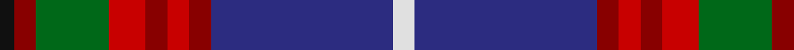

In pattern [KRGRRRRBW](/patterns/krgrrrrbw/).

This was sourced from house-of-tartan.  It is a [9 stripes tartan](/stripes/stripes9/).

Original link http://www.house-of-tartan.scotland.net/house/TartanViewjs.asp?colr=Def&tnam=1163

## Thread count
K/4 DR6 G20 R10 DR6 R6 DR6 DB50 LN/6

## Palette
Each colour and its ΔE from the base-6 reference it is a variant of.

| Colour | Shade | Base | ΔE (OKLab) |
|---|---|---|---|
| DB | <code style="background-color:#2C2C80;">#2C2C80</code> `#2C2C80` | B <code style="background-color:#2C4084;">#2C4084</code> | 0.05 |
| DR | <code style="background-color:#880000;">#880000</code> `#880000` | R <code style="background-color:#C80000;">#C80000</code> | 0.14 |
| G | <code style="background-color:#006818;">#006818</code> `#006818` | G <code style="background-color:#006400;">#006400</code> | 0.02 |
| K | <code style="background-color:#101010;">#101010</code> `#101010` | K <code style="background-color:#000000;">#000000</code> | 0.17 |
| LN | <code style="background-color:#E0E0E0;">#E0E0E0</code> `#E0E0E0` | W <code style="background-color:#F4F4F0;">#F4F4F0</code> | 0.06 |
| R | <code style="background-color:#C80000;">#C80000</code> `#C80000` | R <code style="background-color:#C80000;">#C80000</code> | 0.00 |

## Nearest tartans

The nearest existing variants by ΔTartan distance.

1. [Edinburgh District](/setts/s9/w6b50r6ra6r6ra10g20r6k4-b304080-g008000-k000000-r800000-rac00000-we0e0e0/) — ΔT 0.48
1. [Loch Lomond & the Trossachs (Fashion](/setts/s10/w4r10k4y6k8b56r8g28k8w4-b2c2c80-g285800-k101010-rc80000-we0e0e0-ybc8c00/) — ΔT 0.69
1. [Edinburgh District (District)](/setts/s9/w6b50r6ra6r6ra10g20r6k4-b285074-g006818-k101010-r980044-rac80000-wfcfcfc/) — ΔT 0.69
1. [Edinburgh](/setts/s9/w8b50k4r8k6r12g17ba7k4-b304080-ba800080-g008000-k000000-rc00000-we0e0e0/) — ΔT 0.85
1. [Scottish Association for Neurological Sciences](/setts/s9/b46y4b4y4b6k16ba66w11r6-b141e46-ba505050-k101010-rdc0000-wc0c0c0-ye8c000/) — ΔT 0.90
1. [Edinburgh](/setts/s9/w6b44k4r6k4r10g14ra4k4-b304080-g008000-k000000-rc00000-rad03030-we0e0e0/) — ΔT 0.93
1. [Glenn](/setts/s8/g16b8ba72r8k16r24b4w4-b2888c4-ba2c2c80-g003820-k101010-rc80000-wfcfcfc/) — ΔT 0.96
1. [Edinburgh District](/setts/s9/w6b50r6ra6r6ra10g20r6k4-b1474b4-g006818-k101010-r980044-rac80000-wffffff/) — ΔT 0.97
1. [Traill Clan/Family Weavers Tartan Tartan Number: 3093. Earliest known date: 2002 The Traill tartan is for anyone tracing their ancestry to the Scottish 'Traills' - Traill of Blebo and descendants in Orkney and elsewhere. Blue is poor. See products available Copyright © Blair Urquhart, Comrie, 2015](/setts/s7/r32y4g14y4b48k4ga4-b1474b4-g604000-ga006818-k101010-r800000-ye8c000/) — ΔT 0.98
1. [Crieff Primary School](/setts/s10/k12g4r4b24ba8b4ba4b4r40w4-b081434-ba646064-g3c6838-k000000-r742434-wd8d4d4/) — ΔT 1.01

## Neighbour map

Every grey dot is one of 15726 variants placed by the first two principal components of the ΔTartan feature space (44% of its variance). Red is this tartan; blue dots are its nearest — click one to open its page.

<svg viewBox="0 0 640 380" role="img" style="max-width:100%;height:auto;border:1px solid #e0e0e0;border-radius:4px;display:block" xmlns="http://www.w3.org/2000/svg"><image href="/nn/cloud.v1.png" width="640" height="380"/><a href="/setts/s9/w6b50r6ra6r6ra10g20r6k4-b304080-g008000-k000000-r800000-rac00000-we0e0e0/"><circle cx="191.1" cy="128.9" r="4" fill="#3465a4"><title>Edinburgh District</title></circle></a><a href="/setts/s10/w4r10k4y6k8b56r8g28k8w4-b2c2c80-g285800-k101010-rc80000-we0e0e0-ybc8c00/"><circle cx="175.3" cy="117.8" r="4" fill="#3465a4"><title>Loch Lomond &amp; the Trossachs (Fashion</title></circle></a><a href="/setts/s9/w6b50r6ra6r6ra10g20r6k4-b285074-g006818-k101010-r980044-rac80000-wfcfcfc/"><circle cx="201.5" cy="133.2" r="4" fill="#3465a4"><title>Edinburgh District (District)</title></circle></a><a href="/setts/s9/w8b50k4r8k6r12g17ba7k4-b304080-ba800080-g008000-k000000-rc00000-we0e0e0/"><circle cx="162.7" cy="124.5" r="4" fill="#3465a4"><title>Edinburgh</title></circle></a><a href="/setts/s9/b46y4b4y4b6k16ba66w11r6-b141e46-ba505050-k101010-rdc0000-wc0c0c0-ye8c000/"><circle cx="210.6" cy="124.4" r="4" fill="#3465a4"><title>Scottish Association for Neurological Sciences</title></circle></a><a href="/setts/s9/w6b44k4r6k4r10g14ra4k4-b304080-g008000-k000000-rc00000-rad03030-we0e0e0/"><circle cx="179.3" cy="124.4" r="4" fill="#3465a4"><title>Edinburgh</title></circle></a><a href="/setts/s8/g16b8ba72r8k16r24b4w4-b2888c4-ba2c2c80-g003820-k101010-rc80000-wfcfcfc/"><circle cx="232.6" cy="124.9" r="4" fill="#3465a4"><title>Glenn</title></circle></a><a href="/setts/s9/w6b50r6ra6r6ra10g20r6k4-b1474b4-g006818-k101010-r980044-rac80000-wffffff/"><circle cx="187.9" cy="127.4" r="4" fill="#3465a4"><title>Edinburgh District</title></circle></a><a href="/setts/s7/r32y4g14y4b48k4ga4-b1474b4-g604000-ga006818-k101010-r800000-ye8c000/"><circle cx="208.2" cy="149.7" r="4" fill="#3465a4"><title>Traill Clan/Family Weavers Tartan Tartan Number: 3093. Earliest known date: 2002 The Traill tartan is for anyone tracing their ancestry to the Scottish 'Traills' - Traill of Blebo and descendants in Orkney and elsewhere. Blue is poor. See products available Copyright © Blair Urquhart, Comrie, 2015</title></circle></a><a href="/setts/s10/k12g4r4b24ba8b4ba4b4r40w4-b081434-ba646064-g3c6838-k000000-r742434-wd8d4d4/"><circle cx="187.1" cy="144.3" r="4" fill="#3465a4"><title>Crieff Primary School</title></circle></a><circle cx="196.8" cy="130.7" r="5" fill="#c00000"/></svg>

ID: /setts/s9/w6b50r6ra6r6ra10g20r6k4-b2c2c80-g006818-k101010-r880000-rac80000-we0e0e0/
