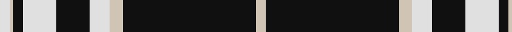

In pattern [WKWWKWKWW](/patterns/wkwwkwkww/).

This was sourced from tartans-authority.  It is a [9 stripes tartan](/stripes/stripes9/).

Original link http://www.tartansauthority.com/tartan-ferret/display/7611/

## Attestations

This cloth appears in 2 source records; the oldest owns this page.

- March 2008 — Moonlight Glen (Fashion) (tartans-authority, [record](http://www.tartansauthority.com/tartan-ferret/display/7611/))
- undated — Moonlight Glen (register-of-tartans, [record](https://www.tartanregister.gov.uk/tartanDetails.aspx?ref=5633))

## Thread count
LN/6 N2 K6 LN20 K20 LN12 N8 K80 N/6

## Palette
Each colour and its ΔE from the base-6 reference it is a variant of.

| Colour | Shade | Base | ΔE (OKLab) |
|---|---|---|---|
| K | <code style="background-color:#101010;">#101010</code> `#101010` | K <code style="background-color:#000000;">#000000</code> | 0.17 |
| LN | <code style="background-color:#E0E0E0;">#E0E0E0</code> `#E0E0E0` | W <code style="background-color:#F4F4F0;">#F4F4F0</code> | 0.06 |
| N | <code style="background-color:#D0C4B4;">#D0C4B4</code> `#D0C4B4` | W <code style="background-color:#F4F4F0;">#F4F4F0</code> | 0.14 |

ID: /setts/s9/w6k80w8wa12k20wa20k6w2wa6-k101010-wd0c4b4-wae0e0e0/
