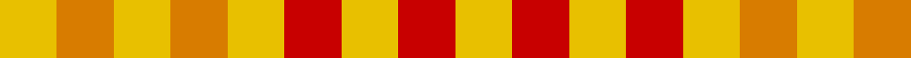

In pattern [YRYRYYYYY](/patterns/yryryyyyy/).

This was sourced from tartans-authority.  It is a [9 stripes tartan](/stripes/stripes9/).

Original link http://www.tartansauthority.com/tartan-ferret/display/1888/

## Attestations

This cloth appears in 2 source records; the oldest owns this page.

- pre 2002 — Compaq Check (Corporate) (tartans-authority, [record](http://www.tartansauthority.com/tartan-ferret/display/1888/))
- undated — Compaq Corporate Tartan Tartan Number: 1888. Earliest known date: 1987 Used in the uniforms of Games Officials. See products available Copyright © Blair Urquhart, Comrie, 2015 (house-of-tartan, [record](http://www.house-of-tartan.scotland.net/house/TartanViewjs.asp?colr=Def&tnam=1888))

## Thread count
Y/6 O6 Y6 O6 Y6 R6 Y6 R6 Y/6

## Palette
Each colour and its ΔE from the base-6 reference it is a variant of.

| Colour | Shade | Base | ΔE (OKLab) |
|---|---|---|---|
| O | <code style="background-color:#D87C00;">#D87C00</code> `#D87C00` | Y <code style="background-color:#F2BF00;">#F2BF00</code> | 0.17 |
| R | <code style="background-color:#C80000;">#C80000</code> `#C80000` | R <code style="background-color:#CC0000;">#CC0000</code> | 0.01 |
| Y | <code style="background-color:#E8C000;">#E8C000</code> `#E8C000` | Y <code style="background-color:#F2BF00;">#F2BF00</code> | 0.02 |

## Nearest tartans

The nearest existing variants by ΔTartan distance.

1. [Compaq](/setts/s9/y1r1y1r1y1ya1y1ya1y1~rc00000-yf0c000-yaff8500~x6/) — ΔT 0.30
1. [Compaq](/setts/s16/y1ya1y1ya1r1ya1r1ya1r1ya1r1ya1y1ya1y1ya1~rc80000-yd87c00-yae8c000~x6/) — ΔT 1.30
1. [Lochwood (Estate Check)](/setts/s7/g1y1r1y1g1y1r1~g006818-rc80000-yc4bc68~x8/) — ΔT 2.69
1. [Lochwood Estate Check](/setts/s7/g4y4b4y4g4y3r4~b1474b4-g006818-rc80000-yc4bc68~x2/) — ΔT 3.58
1. [Ballindalloch Check](/setts/s5/b1r1b1r1g1~b4c0c28-g004c00-ra0783c~x8/) — ΔT 3.76
1. [Menzies](/setts/s4/r5g5w3r5~g004c00-rc80000-wd0d0d0/) — ΔT 3.85
1. [Shepherd (Brown & White)](/setts/s4/g1w1g1w1~g604000-wc0c0c0~x6/) — ΔT 3.85
1. [Seaforth (Estate Check)](/setts/s9/g1r1k1r1g1r1k1r1ra1~g886000-k000000-ra0783c-ra8c0000~x12/) — ΔT 3.92
1. [Seaforth Estate Check Estate Check Weavers Tartan Tartan Number: 5344. Earliest known date: pre 1990 No details. See products available Copyright © Blair Urquhart, Comrie, 2015](/setts/s9/g1r1k1r1g1r1k1r1ra1~g886000-k000000-ra0783c-ra8c0000~x6/) — ΔT 3.92
1. [Rainbow](/setts/s14/b1w1r1w1ra1w1ra1w1r1w1y1w1g1w1~b2c4084-g309c18-rfa4b00-radc0000-we0e0e0-ye8c000~x6/) — ΔT 3.96

## Neighbour map

Every grey dot is one of 15726 variants placed by the first two principal components of the ΔTartan feature space (44% of its variance). Red is this tartan; blue dots are its nearest — click one to open its page.

<svg viewBox="0 0 640 380" role="img" style="max-width:100%;height:auto;border:1px solid #e0e0e0;border-radius:4px;display:block" xmlns="http://www.w3.org/2000/svg"><image href="/nn/cloud.v1.png" width="640" height="380"/><a href="/setts/s9/y1r1y1r1y1ya1y1ya1y1~rc00000-yf0c000-yaff8500~x6/"><circle cx="137.0" cy="366.0" r="4" fill="#3465a4"><title>Compaq</title></circle></a><a href="/setts/s16/y1ya1y1ya1r1ya1r1ya1r1ya1r1ya1y1ya1y1ya1~rc80000-yd87c00-yae8c000~x6/"><circle cx="97.6" cy="366.0" r="4" fill="#3465a4"><title>Compaq</title></circle></a><a href="/setts/s7/g1y1r1y1g1y1r1~g006818-rc80000-yc4bc68~x8/"><circle cx="14.0" cy="366.0" r="4" fill="#3465a4"><title>Lochwood (Estate Check)</title></circle></a><a href="/setts/s7/g4y4b4y4g4y3r4~b1474b4-g006818-rc80000-yc4bc68~x2/"><circle cx="22.2" cy="366.0" r="4" fill="#3465a4"><title>Lochwood Estate Check</title></circle></a><a href="/setts/s5/b1r1b1r1g1~b4c0c28-g004c00-ra0783c~x8/"><circle cx="66.5" cy="366.0" r="4" fill="#3465a4"><title>Ballindalloch Check</title></circle></a><a href="/setts/s4/r5g5w3r5~g004c00-rc80000-wd0d0d0/"><circle cx="178.5" cy="366.0" r="4" fill="#3465a4"><title>Menzies</title></circle></a><a href="/setts/s4/g1w1g1w1~g604000-wc0c0c0~x6/"><circle cx="131.1" cy="366.0" r="4" fill="#3465a4"><title>Shepherd (Brown &amp; White)</title></circle></a><a href="/setts/s9/g1r1k1r1g1r1k1r1ra1~g886000-k000000-ra0783c-ra8c0000~x12/"><circle cx="14.0" cy="366.0" r="4" fill="#3465a4"><title>Seaforth (Estate Check)</title></circle></a><a href="/setts/s9/g1r1k1r1g1r1k1r1ra1~g886000-k000000-ra0783c-ra8c0000~x6/"><circle cx="14.0" cy="366.0" r="4" fill="#3465a4"><title>Seaforth Estate Check Estate Check Weavers Tartan Tartan Number: 5344. Earliest known date: pre 1990 No details. See products available Copyright © Blair Urquhart, Comrie, 2015</title></circle></a><a href="/setts/s14/b1w1r1w1ra1w1ra1w1r1w1y1w1g1w1~b2c4084-g309c18-rfa4b00-radc0000-we0e0e0-ye8c000~x6/"><circle cx="14.0" cy="322.7" r="4" fill="#3465a4"><title>Rainbow</title></circle></a><circle cx="139.1" cy="366.0" r="5" fill="#c00000"/></svg>

ID: /setts/s9/y1r1y1r1y1ya1y1ya1y1~rc80000-ye8c000-yad87c00~x6/
