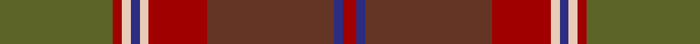

In pattern [GRWBWRGBR](/stripes/grwbwrgbr/).

This was sourced from tartans-authority.  It is a [9 stripe tartan](/stripes/stripes9/).

Original link http://www.tartansauthority.com/tartan-ferret/display/8907/

## Thread count
G/50 DR4 LR4 DB4 LR4 DR26 T56 DB4 DR/6

## Palette
Each colour and the base-6 reference it is a variant of.

| Colour | Shade | Base |
|---|---|---|
| DB | <code style="background-color:#2C2C80;">#2C2C80</code> `oklch(35.0% 0.138 276.6)` <small>#2C2C80</small> | B <code style="background-color:#2A418A;">#2A418A</code> |
| DR | <code style="background-color:#A00000;">#A00000</code> `oklch(44.3% 0.182 29.2)` <small>#A00000</small> | R <code style="background-color:#CC0000;">#CC0000</code> |
| G | <code style="background-color:#5C6428;">#5C6428</code> `oklch(48.3% 0.084 116.0)` <small>#5C6428</small> | G <code style="background-color:#006100;">#006100</code> |
| LR | <code style="background-color:#E8CCB8;">#E8CCB8</code> `oklch(86.3% 0.042 57.7)` <small>#E8CCB8</small> | W <code style="background-color:#F7F7F7;">#F7F7F7</code> |
| T | <code style="background-color:#643424;">#643424</code> `oklch(38.3% 0.074 39.1)` <small>#643424</small> | G <code style="background-color:#006100;">#006100</code> |

## Nearest tartans

The nearest existing variants by ΔTartan distance.

1. [Methven](/setts/s11/r2dg3dy18r2dy2r21y6dg2y2dg24lo2~x2/) — ΔT 0.93
1. [Henry, W. A.](/setts/s9/dy16r16lr3dg16o2r1o2dy6r2~x4/) — ΔT 1.14
1. [Clarks No.1](/setts/s10/dt5t2dt11y2dt2y6o17o9dt1o1~x2/) — ΔT 1.15
1. [Harmony 5](/setts/s12/g9r3g4o3g3o4g3dp11o30r3o4g3~x2/) — ΔT 1.28
1. [Scottish Crofting Foundation](/setts/s9/do6lg3do18dy2do2dy10y28r2y4~x2/) — ΔT 1.28
1. [Methven](/setts/s11/o2dg3dy18o2dy2o21g2dg2g2dg24lo2~x2/) — ΔT 1.35
1. [John Muir Way](/setts/s8/dy35dg19r3g8r3dg8r3db3~x2/) — ΔT 1.36
1. [PSD: Operation Iraqi Freedom](/setts/s7/k2y1dg12y12r12k1r2~x4/) — ΔT 1.39
1. [John Muir Way](/setts/s8/dy35dg19r3y8r3dg8r3t3~x2/) — ΔT 1.41
1. [Pubcrawlers (Corporate)](/setts/s7/g3dy4g2dy22n5r16ly3~x2/) — ΔT 1.42

## Neighbour map

Every grey dot is one of 14299 variants placed by the first two principal components of the ΔTartan feature space (44% of its variance). Red is this tartan; blue dots are its nearest — click one to open its page.

<svg viewBox="0 0 640 380" role="img" style="max-width:100%;height:auto;border:1px solid #e0e0e0;border-radius:4px;display:block" xmlns="http://www.w3.org/2000/svg"><image href="/nn/cloud.v1.png" width="640" height="380"/><a href="/setts/s11/r2dg3dy18r2dy2r21y6dg2y2dg24lo2~x2/"><circle cx="251.5" cy="179.7" r="4" fill="#3465a4"><title>Methven</title></circle></a><a href="/setts/s9/dy16r16lr3dg16o2r1o2dy6r2~x4/"><circle cx="238.0" cy="182.9" r="4" fill="#3465a4"><title>Henry, W. A.</title></circle></a><a href="/setts/s10/dt5t2dt11y2dt2y6o17o9dt1o1~x2/"><circle cx="259.7" cy="186.8" r="4" fill="#3465a4"><title>Clarks No.1</title></circle></a><a href="/setts/s12/g9r3g4o3g3o4g3dp11o30r3o4g3~x2/"><circle cx="271.4" cy="174.8" r="4" fill="#3465a4"><title>Harmony 5</title></circle></a><a href="/setts/s9/do6lg3do18dy2do2dy10y28r2y4~x2/"><circle cx="309.8" cy="194.3" r="4" fill="#3465a4"><title>Scottish Crofting Foundation</title></circle></a><a href="/setts/s11/o2dg3dy18o2dy2o21g2dg2g2dg24lo2~x2/"><circle cx="242.4" cy="159.1" r="4" fill="#3465a4"><title>Methven</title></circle></a><a href="/setts/s8/dy35dg19r3g8r3dg8r3db3~x2/"><circle cx="300.4" cy="205.5" r="4" fill="#3465a4"><title>John Muir Way</title></circle></a><a href="/setts/s7/k2y1dg12y12r12k1r2~x4/"><circle cx="214.7" cy="201.1" r="4" fill="#3465a4"><title>PSD: Operation Iraqi Freedom</title></circle></a><a href="/setts/s8/dy35dg19r3y8r3dg8r3t3~x2/"><circle cx="302.0" cy="206.0" r="4" fill="#3465a4"><title>John Muir Way</title></circle></a><a href="/setts/s7/g3dy4g2dy22n5r16ly3~x2/"><circle cx="317.1" cy="215.4" r="4" fill="#3465a4"><title>Pubcrawlers (Corporate)</title></circle></a><circle cx="269.6" cy="172.5" r="5" fill="#c00000"/></svg>

ID: /setts/s9/y25r2lb2db2lb2r13dy28db2r3~x2/
