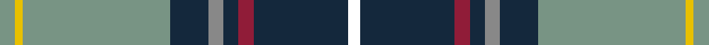

This page is one **sett** — a single exact thread-count. It belongs to the [tartan](/tartans/lg4y2lg39dn10n4dn4dr4dn25w3/)
(the same proportion at any scale), whose colour order is pattern [GYGBRBRBW](/stripes/gygbrbrbw/).

Sourced from register-of-tartans.  It is a [9 stripe tartan](/stripes/stripes9/).

Original link https://www.tartanregister.gov.uk/tartanDetails.aspx?ref=302

2 attestations — the source records this cloth was collapsed from (oldest owns this page)

<ul>
<li>01/01/2004 — Blue Blas Alba (register-of-tartans, <a href="https://www.tartanregister.gov.uk/tartanDetails.aspx?ref=302">record</a>)</li>
<li>2004 — Blue Blas Alba (Fashion) (tartans-authority, <a href="http://www.tartansauthority.com/tartan-ferret/display/6892/">record</a>)</li>
</ul>

## Register references

External register numbers recorded for this tartan.

- Scottish Register of Tartans: [302](https://www.tartanregister.gov.uk/tartanDetails.aspx?ref=302)
- Scottish Tartans Authority (ITI): 6892

## Thread count
LG/8 Y4 LG78 DN20 N8 DN8 DR8 DN50 W/6

## Palette
Each colour and the base-6 reference it is a variant of.

| Colour | Shade | Base |
|---|---|---|
| DN | <code style="background-color:#14283C;">#14283C</code> `oklch(27.1% 0.046 249.9)` <small>#14283C</small> | B <code style="background-color:#2A418A;">#2A418A</code> |
| DR | <code style="background-color:#901C38;">#901C38</code> `oklch(43.2% 0.150 13.1)` <small>#901C38</small> | R <code style="background-color:#CC0000;">#CC0000</code> |
| LG | <code style="background-color:#789484;">#789484</code> `oklch(64.0% 0.040 160.0)` <small>#789484</small> | G <code style="background-color:#006100;">#006100</code> |
| N | <code style="background-color:#888888;">#888888</code> `oklch(62.7% 0.000 89.9)` <small>#888888</small> | R <code style="background-color:#CC0000;">#CC0000</code> |
| W | <code style="background-color:#FFFFFF;">#FFFFFF</code> `oklch(100.0% 0.000 89.9)` <small>#FFFFFF</small> | W <code style="background-color:#F7F7F7;">#F7F7F7</code> |
| Y | <code style="background-color:#E8C000;">#E8C000</code> `oklch(81.9% 0.168 93.7)` <small>#E8C000</small> | Y <code style="background-color:#F2BF00;">#F2BF00</code> |

## Nearest tartans

The nearest existing variants by ΔTartan distance, with this tartan at the top so the swatches line up against it.

ΔTartan

Tartan

Sett

—

<a href="/ttd/edit/#slug=y4ly2y39dt10o4dt4r4dt25w3~x2">Blue Blas Alba</a> <a class="nn-out" href="/setts/s9/y4ly2y39dt10o4dt4r4dt25w3~x2/" title="open its dictionary page">↗</a>

0.67

<a href="/ttd/edit/#slug=r3w6r2g32db36k2db4ly2~x2">Canadian Centennial</a> <a class="nn-out" href="/setts/s8/r3w6r2g32db36k2db4ly2~x2/" title="open its dictionary page">↗</a>

0.83

<a href="/ttd/edit/#slug=w1db16ly1r3ly1g6g2g6w1~x2">Kleto, Susan (Personal)</a> <a class="nn-out" href="/setts/s9/w1db16ly1r3ly1g6g2g6w1~x2/" title="open its dictionary page">↗</a>

0.88

<a href="/ttd/edit/#slug=w2db20dg2g2dg2g4dg8ly2r1~x2">Nova Scotia</a> <a class="nn-out" href="/setts/s9/w2db20dg2g2dg2g4dg8ly2r1~x2/" title="open its dictionary page">↗</a>

0.88

<a href="/ttd/edit/#slug=w2db20g2g2g2g4g8ly2r1~x2">Nova Scotia (Province)</a> <a class="nn-out" href="/setts/s9/w2db20g2g2g2g4g8ly2r1~x2/" title="open its dictionary page">↗</a>

1.02

<a href="/ttd/edit/#slug=b24w2b6g9r6b3r6g35k2ly2~x2">O'Donohue Personal)</a> <a class="nn-out" href="/setts/s10/b24w2b6g9r6b3r6g35k2ly2~x2/" title="open its dictionary page">↗</a>

1.05

<a href="/ttd/edit/#slug=y16k2y6k2r2k2db15g1db1w2~x2">Otago</a> <a class="nn-out" href="/setts/s10/y16k2y6k2r2k2db15g1db1w2~x2/" title="open its dictionary page">↗</a>

1.07

<a href="/ttd/edit/#slug=r8ly2o7ly2n24k2g1~x2">(4) Traill</a> <a class="nn-out" href="/setts/s7/r8ly2o7ly2n24k2g1~x2/" title="open its dictionary page">↗</a>

1.10

<a href="/ttd/edit/#slug=w4db58g28o4w18db14r3db8ly4">Scotia</a> <a class="nn-out" href="/setts/s9/w4db58g28o4w18db14r3db8ly4/" title="open its dictionary page">↗</a>

1.11

<a href="/ttd/edit/#slug=r4g14k3lp3g12db36w4~x2">Vipont</a> <a class="nn-out" href="/setts/s7/r4g14k3lp3g12db36w4~x2/" title="open its dictionary page">↗</a>

1.14

<a href="/ttd/edit/#slug=ly3db1k2g26db28w1db1r2~x2">Johnston, Diana Hunting (Personal)</a> <a class="nn-out" href="/setts/s8/ly3db1k2g26db28w1db1r2~x2/" title="open its dictionary page">↗</a>

## Neighbour map

Every grey dot is one of 14299 variants placed by the first two principal components of the ΔTartan feature space (44% of its variance). Red is this tartan; blue dots are its nearest — click one to open its page.

<svg viewBox="0 0 640 380" role="img" style="max-width:100%;height:auto;border:1px solid #e0e0e0;border-radius:4px;display:block" xmlns="http://www.w3.org/2000/svg"><image href="/nn/cloud.v1.png" width="640" height="380"/><a href="/setts/s8/r3w6r2g32db36k2db4ly2~x2/"><circle cx="243.3" cy="120.5" r="4" fill="#3465a4"><title>Canadian Centennial</title></circle></a><a href="/setts/s9/w1db16ly1r3ly1g6g2g6w1~x2/"><circle cx="198.7" cy="120.9" r="4" fill="#3465a4"><title>Kleto, Susan (Personal)</title></circle></a><a href="/setts/s9/w2db20dg2g2dg2g4dg8ly2r1~x2/"><circle cx="231.7" cy="115.2" r="4" fill="#3465a4"><title>Nova Scotia</title></circle></a><a href="/setts/s9/w2db20g2g2g2g4g8ly2r1~x2/"><circle cx="230.9" cy="114.0" r="4" fill="#3465a4"><title>Nova Scotia (Province)</title></circle></a><a href="/setts/s10/b24w2b6g9r6b3r6g35k2ly2~x2/"><circle cx="241.6" cy="122.9" r="4" fill="#3465a4"><title>O'Donohue Personal)</title></circle></a><a href="/setts/s10/y16k2y6k2r2k2db15g1db1w2~x2/"><circle cx="206.3" cy="110.9" r="4" fill="#3465a4"><title>Otago</title></circle></a><a href="/setts/s7/r8ly2o7ly2n24k2g1~x2/"><circle cx="276.4" cy="118.6" r="4" fill="#3465a4"><title>(4) Traill</title></circle></a><a href="/setts/s9/w4db58g28o4w18db14r3db8ly4/"><circle cx="274.1" cy="116.9" r="4" fill="#3465a4"><title>Scotia</title></circle></a><a href="/setts/s7/r4g14k3lp3g12db36w4~x2/"><circle cx="221.1" cy="154.1" r="4" fill="#3465a4"><title>Vipont</title></circle></a><a href="/setts/s8/ly3db1k2g26db28w1db1r2~x2/"><circle cx="293.5" cy="106.9" r="4" fill="#3465a4"><title>Johnston, Diana Hunting (Personal)</title></circle></a><circle cx="246.5" cy="114.9" r="5" fill="#c00000"/></svg>

ID: /setts/s9/y4ly2y39dt10o4dt4r4dt25w3~x2/
