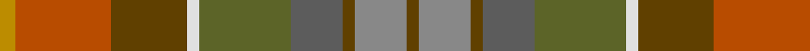

In pattern [GRGBGWGRY](/patterns/grgbgwgry/).

This was sourced from register-of-tartans.  It is a [9 stripes tartan](/stripes/stripes9/).

Original link https://www.tartanregister.gov.uk/tartanDetails.aspx?ref=4084

## Attestations

This cloth appears in 2 source records; the oldest owns this page.

- undated — Teallach (Personal) (register-of-tartans, [record](https://www.tartanregister.gov.uk/tartanDetails.aspx?ref=4084))
- Unknown — Teallach (Personal) (tartans-authority, [record](http://www.tartansauthority.com/tartan-ferret/display/832/))

## Thread count
DY/8 DO48 T38 LN6 G46 N26 T6 Na26 T/6

## Palette
Each colour and its ΔE from the base-6 reference it is a variant of.

| Colour | Shade | Base | ΔE (OKLab) |
|---|---|---|---|
| DO | <code style="background-color:#B84C00;">#B84C00</code> `#B84C00` | R <code style="background-color:#CC0000;">#CC0000</code> | 0.08 |
| DY | <code style="background-color:#BC8C00;">#BC8C00</code> `#BC8C00` | Y <code style="background-color:#F2BF00;">#F2BF00</code> | 0.16 |
| G | <code style="background-color:#5C6428;">#5C6428</code> `#5C6428` | G <code style="background-color:#006100;">#006100</code> | 0.10 |
| LN | <code style="background-color:#E0E0E0;">#E0E0E0</code> `#E0E0E0` | W <code style="background-color:#F7F7F7;">#F7F7F7</code> | 0.07 |
| N | <code style="background-color:#5C5C5C;">#5C5C5C</code> `#5C5C5C` | B <code style="background-color:#2A418A;">#2A418A</code> | 0.15 |
| Na | <code style="background-color:#888888;">#888888</code> `#888888` | R <code style="background-color:#CC0000;">#CC0000</code> | 0.24 |
| T | <code style="background-color:#604000;">#604000</code> `#604000` | G <code style="background-color:#006100;">#006100</code> | 0.14 |

## Nearest tartans

The nearest existing variants by ΔTartan distance.

1. [Teallach](/setts/s9/y4r24g19w3ga23gb13g3b13g3~b505050-g604000-ga607030-gb808080-rc00000-we0e0e0-yf0c000~x2/) — ΔT 1.40
1. [Teallach Family Tartan Tartan Number: 832. Earliest known date: pre 2003 The tartan of the present chairman of the Scottish Tartans Society, Dr Gordon Teall of Teallach. See products available Copyright © Blair Urquhart, Comrie, 2015](/setts/s9/y4r24g19w3ga23ra13g3b13g3~b5c5c5c-g604000-ga5c6428-rc80000-ra888888-we0e0e0-ye8c000~x2/) — ΔT 1.42
1. [Auld Scotland](/setts/s10/b2y12b3y3b12g12ba12ga12g1ya2~b60082c-ba5c5c5c-g5c6428-ga747c60-ya08858-yad8c888~x2/) — ΔT 1.57
1. [Meath Irish County Tartan Tartan Number: 2269. Earliest known date: 1996 One of a series of Irish District tartans designed by Polly Wittering of the House of Edgar, with colours reminiscent of the Country with soft warm colours dominating. See products available Copyright © Blair Urquhart, Comrie, 2015](/setts/s12/y5b2r14g9ga8b3r3b3r3b3ga19ya3~b606884-g5c483c-ga385c59-rb45430-yc48800-yac4c4a4~x2/) — ΔT 1.76
1. [Isle of Rona (District)](/setts/s6/r4b19g10ra10ga15y2~b505874-g307840-ga744c00-rc80000-ra888888-yb49830~x2/) — ΔT 1.78
1. [Auld Scotland Weavers Tartan Tartan Number: 7303. Earliest known date: September 2007 A new design from Lochcarron for the 2008 season. See products available Copyright © Blair Urquhart, Comrie, 2015](/setts/s10/k2y12b3y3b12g12ba12ga12g1ya2~b60082c-ba5c5c5c-g5c6428-ga747c60-k000000-ya08858-yad8c888~x2/) — ΔT 1.93
1. [Allen - 2012 (Personal)](/setts/s14/b16r2b3r4b2ba12g18w2g18ba12b12y2r2y2~b441800-ba5c5c5c-g604000-r880000-w98c8e8-ybc8c00~x2/) — ΔT 2.00
1. [Hash House Harriers Hunting (Corp)](/setts/s13/g7ga1w1ga1y1ga7b7ga1b7ga7g7ga1r1~b48587c-g006818-ga604000-rc80000-wd4d0b4-ybc8c00~x4/) — ΔT 2.28
1. [Roscommon Irish County Tartan Tartan Number: 2246. Earliest known date: 1996 One of a series of Irish District tartans designed by Polly Wittering of the House of Edgar, with colours reminiscent of the Country with soft warm colours dominating. See products available Copyright © Blair Urquhart, Comrie, 2015](/setts/s10/r5y3r19b6y5b6g12ba5g12ba3~b4c3428-ba3c588c-g385c5c-rc05838-yc48800~x2/) — ΔT 2.32
1. [MacVicar, McVicar, McVicker](/setts/s13/b12g2y2g2b2g10ga12g3ga12g10b11r2y2~b574b6f-g594312-ga667123-rd45647-yfcc254~x2/) — ΔT 2.39

## Neighbour map

Every grey dot is one of 15726 variants placed by the first two principal components of the ΔTartan feature space (44% of its variance). Red is this tartan; blue dots are its nearest — click one to open its page.

<svg viewBox="0 0 640 380" role="img" style="max-width:100%;height:auto;border:1px solid #e0e0e0;border-radius:4px;display:block" xmlns="http://www.w3.org/2000/svg"><image href="/nn/cloud.v1.png" width="640" height="380"/><a href="/setts/s9/y4r24g19w3ga23gb13g3b13g3~b505050-g604000-ga607030-gb808080-rc00000-we0e0e0-yf0c000~x2/"><circle cx="92.5" cy="171.1" r="4" fill="#3465a4"><title>Teallach</title></circle></a><a href="/setts/s9/y4r24g19w3ga23ra13g3b13g3~b5c5c5c-g604000-ga5c6428-rc80000-ra888888-we0e0e0-ye8c000~x2/"><circle cx="92.5" cy="170.4" r="4" fill="#3465a4"><title>Teallach Family Tartan Tartan Number: 832. Earliest known date: pre 2003 The tartan of the present chairman of the Scottish Tartans Society, Dr Gordon Teall of Teallach. See products available Copyright © Blair Urquhart, Comrie, 2015</title></circle></a><a href="/setts/s10/b2y12b3y3b12g12ba12ga12g1ya2~b60082c-ba5c5c5c-g5c6428-ga747c60-ya08858-yad8c888~x2/"><circle cx="128.1" cy="176.9" r="4" fill="#3465a4"><title>Auld Scotland</title></circle></a><a href="/setts/s12/y5b2r14g9ga8b3r3b3r3b3ga19ya3~b606884-g5c483c-ga385c59-rb45430-yc48800-yac4c4a4~x2/"><circle cx="210.2" cy="179.6" r="4" fill="#3465a4"><title>Meath Irish County Tartan Tartan Number: 2269. Earliest known date: 1996 One of a series of Irish District tartans designed by Polly Wittering of the House of Edgar, with colours reminiscent of the Country with soft warm colours dominating. See products available Copyright © Blair Urquhart, Comrie, 2015</title></circle></a><a href="/setts/s6/r4b19g10ra10ga15y2~b505874-g307840-ga744c00-rc80000-ra888888-yb49830~x2/"><circle cx="190.3" cy="237.3" r="4" fill="#3465a4"><title>Isle of Rona (District)</title></circle></a><a href="/setts/s10/k2y12b3y3b12g12ba12ga12g1ya2~b60082c-ba5c5c5c-g5c6428-ga747c60-k000000-ya08858-yad8c888~x2/"><circle cx="77.6" cy="153.1" r="4" fill="#3465a4"><title>Auld Scotland Weavers Tartan Tartan Number: 7303. Earliest known date: September 2007 A new design from Lochcarron for the 2008 season. See products available Copyright © Blair Urquhart, Comrie, 2015</title></circle></a><a href="/setts/s14/b16r2b3r4b2ba12g18w2g18ba12b12y2r2y2~b441800-ba5c5c5c-g604000-r880000-w98c8e8-ybc8c00~x2/"><circle cx="215.7" cy="179.9" r="4" fill="#3465a4"><title>Allen - 2012 (Personal)</title></circle></a><a href="/setts/s13/g7ga1w1ga1y1ga7b7ga1b7ga7g7ga1r1~b48587c-g006818-ga604000-rc80000-wd4d0b4-ybc8c00~x4/"><circle cx="216.2" cy="199.1" r="4" fill="#3465a4"><title>Hash House Harriers Hunting (Corp)</title></circle></a><a href="/setts/s10/r5y3r19b6y5b6g12ba5g12ba3~b4c3428-ba3c588c-g385c5c-rc05838-yc48800~x2/"><circle cx="165.7" cy="223.4" r="4" fill="#3465a4"><title>Roscommon Irish County Tartan Tartan Number: 2246. Earliest known date: 1996 One of a series of Irish District tartans designed by Polly Wittering of the House of Edgar, with colours reminiscent of the Country with soft warm colours dominating. See products available Copyright © Blair Urquhart, Comrie, 2015</title></circle></a><a href="/setts/s13/b12g2y2g2b2g10ga12g3ga12g10b11r2y2~b574b6f-g594312-ga667123-rd45647-yfcc254~x2/"><circle cx="199.5" cy="218.9" r="4" fill="#3465a4"><title>MacVicar, McVicar, McVicker</title></circle></a><circle cx="125.4" cy="187.4" r="5" fill="#c00000"/></svg>

ID: /setts/s9/y4r24g19w3ga23b13g3ra13g3~b5c5c5c-g604000-ga5c6428-rb84c00-ra888888-we0e0e0-ybc8c00~x2/
