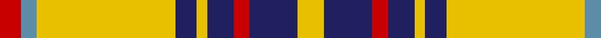

In pattern [RBYBYBRBY](/patterns/rbybybrby/).

This was sourced from register-of-tartans.  It is a [9 stripes tartan](/stripes/stripes9/).

Original link https://www.tartanregister.gov.uk/tartanDetails.aspx?ref=330

## Attestations

This cloth appears in 2 source records; the oldest owns this page.

- 01/01/1951 — Bracken (register-of-tartans, [record](https://www.tartanregister.gov.uk/tartanDetails.aspx?ref=330))
- 1951 — Bracken (Fashion) (tartans-authority, [record](http://www.tartansauthority.com/tartan-ferret/display/1449/))

## Thread count
R/8 B6 Y52 DBa8 Y4 DBa10 R6 DBa18 Y/10

## Palette
Each colour and its ΔE from the base-6 reference it is a variant of.

| Colour | Shade | Base | ΔE (OKLab) |
|---|---|---|---|
| B | <code style="background-color:#5C8CA8;">#5C8CA8</code> `#5C8CA8` | B <code style="background-color:#2A418A;">#2A418A</code> | 0.23 |
| DB | <code style="background-color:#2C2C80;">#2C2C80</code> `#2C2C80` | B <code style="background-color:#2A418A;">#2A418A</code> | 0.06 |
| DBa | <code style="background-color:#202060;">#202060</code> `#202060` | B <code style="background-color:#2A418A;">#2A418A</code> | 0.11 |
| R | <code style="background-color:#C80000;">#C80000</code> `#C80000` | R <code style="background-color:#CC0000;">#CC0000</code> | 0.01 |
| Y | <code style="background-color:#E8C000;">#E8C000</code> `#E8C000` | Y <code style="background-color:#F2BF00;">#F2BF00</code> | 0.02 |

## Nearest tartans

The nearest existing variants by ΔTartan distance.

1. [Braken Tartan Tartan Number: 1449. Earliest known date: pre 1992 Originally spelt 'Braken'. See products available Copyright © Blair Urquhart, Comrie, 2015](/setts/s9/y20b27r6b15y8b11y78ba10r12~b202060-ba2c2c80-rc80000-ye8c000/) — ΔT 0.28
1. [Bracken](/setts/s9/y20b27r6b15y8b11y78ba10r12~b000050-ba304080-rc00000-yf0c000/) — ΔT 0.49
1. [Burns Battalion (Fashion)](/setts/s10/g22b2g3y4g3b2g12b4w19g3~b1474b4-g604000-wf8f4d0-ye8c000~x2/) — ΔT 0.78
1. [Unidentified (ex Tony Murray)](/setts/s7/r2w10k15y36w2k2w2~k101010-rc80000-we8ccb8-ya08858~x2/) — ΔT 1.08
1. [Hughes (USA) (Name)](/setts/s10/b4k12ba3b4ba3k3y36ba3b2y3~b2474e8-ba2c2c80-k101010-yfccc00~x2/) — ΔT 1.20
1. [Hannay Dress (Dance)](/setts/s10/k9y4k2y4k2y29k9y4ya14yb2~k101010-ye08070-ya48a4c0-ybe8c000~x2/) — ΔT 1.23
1. [Wilbers #2 (Personal)](/setts/s8/y5k9y2k7r10ra4r35k4~k101010-rbe7832-radc0000-yfadc00~x2/) — ΔT 1.25
1. [Braemar or Blair Atholl Trade Tartan Tartan Number: 1741. Earliest known date: 1984 Nothing See products available Copyright © Blair Urquhart, Comrie, 2015](/setts/s10/g1w2k5g3k1y5k1y11k1y1~g604000-k101010-we0e0e0-ya08858~x4/) — ΔT 1.26
1. [Dunbarton](/setts/s11/y30r2y2k5y3ra2y3ra22y3k2y3~k000000-rc00000-ra806050-yf0c000~x2/) — ΔT 1.29
1. [Loch Sween](/setts/s12/w3y3r2y13k3y4k22y4k3y16b2w3~b9058d8-k101010-rc80000-wfcfcfc-yfccc00~x2/) — ΔT 1.29

## Neighbour map

Every grey dot is one of 15726 variants placed by the first two principal components of the ΔTartan feature space (44% of its variance). Red is this tartan; blue dots are its nearest — click one to open its page.

<svg viewBox="0 0 640 380" role="img" style="max-width:100%;height:auto;border:1px solid #e0e0e0;border-radius:4px;display:block" xmlns="http://www.w3.org/2000/svg"><image href="/nn/cloud.v1.png" width="640" height="380"/><a href="/setts/s9/y20b27r6b15y8b11y78ba10r12~b202060-ba2c2c80-rc80000-ye8c000/"><circle cx="280.6" cy="147.3" r="4" fill="#3465a4"><title>Braken Tartan Tartan Number: 1449. Earliest known date: pre 1992 Originally spelt 'Braken'. See products available Copyright © Blair Urquhart, Comrie, 2015</title></circle></a><a href="/setts/s9/y20b27r6b15y8b11y78ba10r12~b000050-ba304080-rc00000-yf0c000/"><circle cx="273.5" cy="146.4" r="4" fill="#3465a4"><title>Bracken</title></circle></a><a href="/setts/s10/g22b2g3y4g3b2g12b4w19g3~b1474b4-g604000-wf8f4d0-ye8c000~x2/"><circle cx="280.6" cy="159.1" r="4" fill="#3465a4"><title>Burns Battalion (Fashion)</title></circle></a><a href="/setts/s7/r2w10k15y36w2k2w2~k101010-rc80000-we8ccb8-ya08858~x2/"><circle cx="290.7" cy="141.8" r="4" fill="#3465a4"><title>Unidentified (ex Tony Murray)</title></circle></a><a href="/setts/s10/b4k12ba3b4ba3k3y36ba3b2y3~b2474e8-ba2c2c80-k101010-yfccc00~x2/"><circle cx="268.4" cy="107.9" r="4" fill="#3465a4"><title>Hughes (USA) (Name)</title></circle></a><a href="/setts/s10/k9y4k2y4k2y29k9y4ya14yb2~k101010-ye08070-ya48a4c0-ybe8c000~x2/"><circle cx="266.6" cy="143.2" r="4" fill="#3465a4"><title>Hannay Dress (Dance)</title></circle></a><a href="/setts/s8/y5k9y2k7r10ra4r35k4~k101010-rbe7832-radc0000-yfadc00~x2/"><circle cx="330.4" cy="147.1" r="4" fill="#3465a4"><title>Wilbers #2 (Personal)</title></circle></a><a href="/setts/s10/g1w2k5g3k1y5k1y11k1y1~g604000-k101010-we0e0e0-ya08858~x4/"><circle cx="274.9" cy="164.8" r="4" fill="#3465a4"><title>Braemar or Blair Atholl Trade Tartan Tartan Number: 1741. Earliest known date: 1984 Nothing See products available Copyright © Blair Urquhart, Comrie, 2015</title></circle></a><a href="/setts/s11/y30r2y2k5y3ra2y3ra22y3k2y3~k000000-rc00000-ra806050-yf0c000~x2/"><circle cx="313.1" cy="116.4" r="4" fill="#3465a4"><title>Dunbarton</title></circle></a><a href="/setts/s12/w3y3r2y13k3y4k22y4k3y16b2w3~b9058d8-k101010-rc80000-wfcfcfc-yfccc00~x2/"><circle cx="214.3" cy="123.4" r="4" fill="#3465a4"><title>Loch Sween</title></circle></a><circle cx="268.8" cy="145.0" r="5" fill="#c00000"/></svg>

ID: /setts/s9/y5b9r3b5y2b4y26ba3r4~b202060-ba5c8ca8-rc80000-ye8c000~x2/
