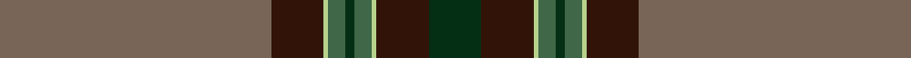

In pattern [GBYGGGYBG](/stripes/gbygggybg/).

This was sourced from register-of-tartans.  It is a [9 stripe tartan](/stripes/stripes9/).

Original link https://www.tartanregister.gov.uk/tartanDetails.aspx?ref=11256

## Register references

External register numbers recorded for this tartan.

- Scottish Register of Tartans: [11256](https://www.tartanregister.gov.uk/tartanDetails.aspx?ref=11256)

## Thread count
N/124 K24 LG2 Na8 DG4 Na8 LG2 K24 DG/24

## Palette
Each colour and the base-6 reference it is a variant of.

| Colour | Shade | Base |
|---|---|---|
| DG | <code style="background-color:#052F14;">#052F14</code> `oklch(26.9% 0.067 150.8)` <small>#052F14</small> | G <code style="background-color:#006100;">#006100</code> |
| K | <code style="background-color:#321308;">#321308</code> `oklch(23.2% 0.054 39.9)` <small>#321308</small> | B <code style="background-color:#2A418A;">#2A418A</code> |
| LG | <code style="background-color:#B7D38B;">#B7D38B</code> `oklch(82.9% 0.100 125.8)` <small>#B7D38B</small> | Y <code style="background-color:#F2BF00;">#F2BF00</code> |
| N | <code style="background-color:#786557;">#786557</code> `oklch(52.1% 0.032 58.3)` <small>#786557</small> | G <code style="background-color:#006100;">#006100</code> |
| Na | <code style="background-color:#3F6748;">#3F6748</code> `oklch(47.5% 0.067 150.3)` <small>#3F6748</small> | G <code style="background-color:#006100;">#006100</code> |

## Nearest tartans

The nearest existing variants by ΔTartan distance.

1. [Afghanistan Memorial](/setts/s13/dt8dy3y1dy1y39dy3o3y2dt11dy8y2dy3w2~x2/) — ΔT 1.22
1. [Hickory](/setts/s10/db4y30do2y2do14w2do2w1do6y3~x2/) — ΔT 1.26
1. [Klappert Original (Personal)](/setts/s9/r1k1n30k6n1k6dy8k1r1~x2/) — ΔT 1.27
1. [Donohoe Grey, Peter](/setts/s11/dy9db2r1db2dy3k9g3dy1n35k3n2~x2/) — ΔT 1.37
1. [MacDonald of Glenaladale #2](/setts/s13/r6r1db2r2dg40r6db13t1r48dg2r4r1dg4~x2/) — ΔT 1.37
1. [MacDonald of Glencoe #2](/setts/s13/r5ly1db2r2dg30r5db10t1r42dg2r4ly1dg4~x2/) — ΔT 1.40
1. [Roast Den, The](/setts/s9/lo62dr12g1g4dg2g4g1dr12dg12~x2/) — ΔT 1.43
1. [Glen and Son, William (Corporate)](/setts/s11/r6k3do4k10do5o3k2do31w1do2w2~x2/) — ΔT 1.43
1. [Saunders (Personal)](/setts/s13/k1ly1k1ly1k1ly1k1ly1y46lr17y4lr16dr1~x2/) — ΔT 1.43
1. [Donohoe Grey, Peter (Commemorative)](/setts/s11/do9lb2r1lb2do3k9dg3do1n35k3n2~x2/) — ΔT 1.44

## Neighbour map

Every grey dot is one of 14299 variants placed by the first two principal components of the ΔTartan feature space (44% of its variance). Red is this tartan; blue dots are its nearest — click one to open its page.

<svg viewBox="0 0 640 380" role="img" style="max-width:100%;height:auto;border:1px solid #e0e0e0;border-radius:4px;display:block" xmlns="http://www.w3.org/2000/svg"><image href="/nn/cloud.v1.png" width="640" height="380"/><a href="/setts/s13/dt8dy3y1dy1y39dy3o3y2dt11dy8y2dy3w2~x2/"><circle cx="381.0" cy="107.6" r="4" fill="#3465a4"><title>Afghanistan Memorial</title></circle></a><a href="/setts/s10/db4y30do2y2do14w2do2w1do6y3~x2/"><circle cx="365.3" cy="133.8" r="4" fill="#3465a4"><title>Hickory</title></circle></a><a href="/setts/s9/r1k1n30k6n1k6dy8k1r1~x2/"><circle cx="426.3" cy="149.9" r="4" fill="#3465a4"><title>Klappert Original (Personal)</title></circle></a><a href="/setts/s11/dy9db2r1db2dy3k9g3dy1n35k3n2~x2/"><circle cx="342.2" cy="91.2" r="4" fill="#3465a4"><title>Donohoe Grey, Peter</title></circle></a><a href="/setts/s13/r6r1db2r2dg40r6db13t1r48dg2r4r1dg4~x2/"><circle cx="407.1" cy="93.8" r="4" fill="#3465a4"><title>MacDonald of Glenaladale #2</title></circle></a><a href="/setts/s13/r5ly1db2r2dg30r5db10t1r42dg2r4ly1dg4~x2/"><circle cx="400.6" cy="93.3" r="4" fill="#3465a4"><title>MacDonald of Glencoe #2</title></circle></a><a href="/setts/s9/lo62dr12g1g4dg2g4g1dr12dg12~x2/"><circle cx="383.4" cy="87.2" r="4" fill="#3465a4"><title>Roast Den, The</title></circle></a><a href="/setts/s11/r6k3do4k10do5o3k2do31w1do2w2~x2/"><circle cx="402.4" cy="124.1" r="4" fill="#3465a4"><title>Glen and Son, William (Corporate)</title></circle></a><a href="/setts/s13/k1ly1k1ly1k1ly1k1ly1y46lr17y4lr16dr1~x2/"><circle cx="410.4" cy="75.2" r="4" fill="#3465a4"><title>Saunders (Personal)</title></circle></a><a href="/setts/s11/do9lb2r1lb2do3k9dg3do1n35k3n2~x2/"><circle cx="336.9" cy="88.7" r="4" fill="#3465a4"><title>Donohoe Grey, Peter (Commemorative)</title></circle></a><circle cx="414.8" cy="108.5" r="5" fill="#c00000"/></svg>

ID: /setts/s9/y62do12lg1y4dg2y4lg1do12dg12~x2/
