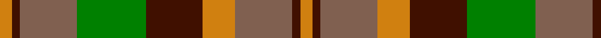

In pattern [YBRGBYRBY](/patterns/ybrgbyrby/).

This was sourced from weddslist.  It is a [9 stripes tartan](/stripes/stripes9/).

Original link http://www.weddslist.com/cgi-bin/tartans/pg.pl?source=sts

## Thread count
O/6 DR4 LT28 G34 DR28 O16 LT28 DR4 O/6

## Palette
Each colour and its ΔE from the base-6 reference it is a variant of.

| Colour | Shade | Base | ΔE (OKLab) |
|---|---|---|---|
| DR | <code style="background-color:#401000;">#401000</code> `#401000` | B <code style="background-color:#2A418A;">#2A418A</code> | 0.24 |
| G | <code style="background-color:#008000;">#008000</code> `#008000` | G <code style="background-color:#006100;">#006100</code> | 0.10 |
| LT | <code style="background-color:#806050;">#806050</code> `#806050` | R <code style="background-color:#CC0000;">#CC0000</code> | 0.17 |
| O | <code style="background-color:#D08010;">#D08010</code> `#D08010` | Y <code style="background-color:#F2BF00;">#F2BF00</code> | 0.17 |

## Nearest tartans

The nearest existing variants by ΔTartan distance.

1. [Londonderry, County (District)](/setts/s7/r24k8g48y32r20k8g12-g006434-k101010-rb84c00-ybc8c00/) — ΔT 0.92
1. [Monaghan, County (District)](/setts/s9/y6b4r28y16b28g32r26b4y6-b4c3428-g003820-ra03400-ybc8c00/) — ΔT 0.96
1. [Monaghan Irish County Tartan Tartan Number: 2267. Earliest known date: 1996 One of a series of Irish District tartans designed by Polly Wittering of the House of Edgar, with colours reminiscent of the Country with soft warm colours dominating. See products available Copyright © Blair Urquhart, Comrie, 2015](/setts/s9/y6g4r28ga34g28y16r28g4y6-g28200c-ga004830-r782030-ycc9410/) — ΔT 0.99
1. [MacAart Family Tartan Tartan Number: 1477. Earliest known date: pre 2003 Restricted See products available Copyright © Blair Urquhart, Comrie, 2015](/setts/s10/g18k4g4r4ga12k2y2k2ga12r6-g604000-ga006818-k101010-rc80000-ye8c000/) — ΔT 1.17
1. [Alister Grant 'Mohr', the Laird's Champion](/setts/s7/g60k8y20k8r10y10r30-g777733-k101010-rb13e0f-ybdbd65/) — ΔT 1.19
1. [Scott Htg (Clan)](/setts/s8/r6g32ga20r6ga6w4ga6r6-g604000-ga006818-rc80000-wc0c0c0/) — ΔT 1.20
1. [Londonderry, County](/setts/s7/r24k8g48y32r20k8g12-g003820-k101010-rb84c00-ybc8c00/) — ΔT 1.26
1. [Glenmorangie (Corporate)](/setts/s11/g12r4g4r8g26k24y26r8y4r4y12-g805400-k101010-ra8608c-yc09458/) — ΔT 1.26
1. [Glenmorangie #2](/setts/s11/g12r4g4r8g26ga24ra26r8ra4r4ra12-g503c14-ga2a2303-r781c38-rabe7832/) — ΔT 1.26
1. [Unidentified #57](/setts/s8/g40r16y4r16g10ya16g4ya16-g004c00-r8c0000-yb0b0b0-yac89800/) — ΔT 1.32

## Neighbour map

Every grey dot is one of 15726 variants placed by the first two principal components of the ΔTartan feature space (44% of its variance). Red is this tartan; blue dots are its nearest — click one to open its page.

<svg viewBox="0 0 640 380" role="img" style="max-width:100%;height:auto;border:1px solid #e0e0e0;border-radius:4px;display:block" xmlns="http://www.w3.org/2000/svg"><image href="/nn/cloud.v1.png" width="640" height="380"/><a href="/setts/s7/r24k8g48y32r20k8g12-g006434-k101010-rb84c00-ybc8c00/"><circle cx="183.8" cy="245.9" r="4" fill="#3465a4"><title>Londonderry, County (District)</title></circle></a><a href="/setts/s9/y6b4r28y16b28g32r26b4y6-b4c3428-g003820-ra03400-ybc8c00/"><circle cx="200.2" cy="227.1" r="4" fill="#3465a4"><title>Monaghan, County (District)</title></circle></a><a href="/setts/s9/y6g4r28ga34g28y16r28g4y6-g28200c-ga004830-r782030-ycc9410/"><circle cx="184.7" cy="218.1" r="4" fill="#3465a4"><title>Monaghan Irish County Tartan Tartan Number: 2267. Earliest known date: 1996 One of a series of Irish District tartans designed by Polly Wittering of the House of Edgar, with colours reminiscent of the Country with soft warm colours dominating. See products available Copyright © Blair Urquhart, Comrie, 2015</title></circle></a><a href="/setts/s10/g18k4g4r4ga12k2y2k2ga12r6-g604000-ga006818-k101010-rc80000-ye8c000/"><circle cx="187.1" cy="194.1" r="4" fill="#3465a4"><title>MacAart Family Tartan Tartan Number: 1477. Earliest known date: pre 2003 Restricted See products available Copyright © Blair Urquhart, Comrie, 2015</title></circle></a><a href="/setts/s7/g60k8y20k8r10y10r30-g777733-k101010-rb13e0f-ybdbd65/"><circle cx="212.8" cy="208.8" r="4" fill="#3465a4"><title>Alister Grant 'Mohr', the Laird's Champion</title></circle></a><a href="/setts/s8/r6g32ga20r6ga6w4ga6r6-g604000-ga006818-rc80000-wc0c0c0/"><circle cx="245.8" cy="221.7" r="4" fill="#3465a4"><title>Scott Htg (Clan)</title></circle></a><a href="/setts/s7/r24k8g48y32r20k8g12-g003820-k101010-rb84c00-ybc8c00/"><circle cx="169.2" cy="239.5" r="4" fill="#3465a4"><title>Londonderry, County</title></circle></a><a href="/setts/s11/g12r4g4r8g26k24y26r8y4r4y12-g805400-k101010-ra8608c-yc09458/"><circle cx="141.0" cy="201.5" r="4" fill="#3465a4"><title>Glenmorangie (Corporate)</title></circle></a><a href="/setts/s11/g12r4g4r8g26ga24ra26r8ra4r4ra12-g503c14-ga2a2303-r781c38-rabe7832/"><circle cx="179.7" cy="220.9" r="4" fill="#3465a4"><title>Glenmorangie #2</title></circle></a><a href="/setts/s8/g40r16y4r16g10ya16g4ya16-g004c00-r8c0000-yb0b0b0-yac89800/"><circle cx="222.7" cy="209.2" r="4" fill="#3465a4"><title>Unidentified #57</title></circle></a><circle cx="183.5" cy="217.4" r="5" fill="#c00000"/></svg>

ID: /setts/s9/y6b4r28g34b28y16r28b4y6-b401000-g008000-r806050-yd08010/
