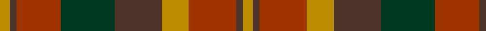

In pattern [YBRGBYRBY](/patterns/ybrgbyrby/).

This was sourced from tartans-authority.  It is a [9 stripes tartan](/stripes/stripes9/).

Original link http://www.tartansauthority.com/tartan-ferret/display/2267/

## Thread count
DY/6 T4 R26 DG32 T28 DY16 R28 T4 DY/6

## Palette
Each colour and its ΔE from the base-6 reference it is a variant of.

| Colour | Shade | Base | ΔE (OKLab) |
|---|---|---|---|
| DG | <code style="background-color:#003820;">#003820</code> `#003820` | G <code style="background-color:#006400;">#006400</code> | 0.16 |
| DY | <code style="background-color:#BC8C00;">#BC8C00</code> `#BC8C00` | Y <code style="background-color:#E8C000;">#E8C000</code> | 0.16 |
| R | <code style="background-color:#A03400;">#A03400</code> `#A03400` | R <code style="background-color:#C80000;">#C80000</code> | 0.08 |
| T | <code style="background-color:#4C3428;">#4C3428</code> `#4C3428` | B <code style="background-color:#2C4084;">#2C4084</code> | 0.16 |

## Nearest tartans

The nearest existing variants by ΔTartan distance.

1. [Glenmorangie #2](/setts/s11/g12r4g4r8g26b24ra26r8ra4r4ra12-b2a2303-g503c14-r781c38-rabe7832/) — ΔT 0.67
1. [Monaghan Irish County Tartan Tartan Number: 2267. Earliest known date: 1996 One of a series of Irish District tartans designed by Polly Wittering of the House of Edgar, with colours reminiscent of the Country with soft warm colours dominating. See products available Copyright © Blair Urquhart, Comrie, 2015](/setts/s9/y6b4r28g34b28y16r28b4y6-b28200c-g004830-r782030-ycc9410/) — ΔT 0.94
1. [Monaghan](/setts/s9/y6b4r28g34b28y16r28b4y6-b401000-g008000-r806050-yd08010/) — ΔT 0.96
1. [Monaghan, County](/setts/s16/y6b4r26g32b28y16r28b4y6b4r28y16b28g32r26b4-b4c3428-g003820-ra03400-ybc8c00/) — ΔT 1.22
1. [Scott Htg (Clan)](/setts/s8/r6g32ga20r6ga6w4ga6r6-g604000-ga006818-rc80000-wc0c0c0/) — ΔT 1.22
1. [Dewar](/setts/s10/g4ga4g28ga16r28ga4r28ga16g28ga4-g006818-ga604000-rc80000/) — ΔT 1.25
1. [Unidentified Printing #3](/setts/s7/g8y4g24r16ra24k4ra8-g004c00-k000000-r8c0000-raa02828-yc89800/) — ΔT 1.27
1. [Orban-Prentice (Personal)](/setts/s7/g50b8r48b42ga50b8g6-b2c2c80-g285800-ga604000-rc80000/) — ΔT 1.31
1. [Hueg (Munich) Hunting (Personal)](/setts/s11/r20b20r8g4r4b4r8g24ba24g6ba8-b311f11-ba433a5a-g23321b-rca2625/) — ΔT 1.34
1. [Orban-Prentice (Personal)](/setts/s12/g50b8r48b42ga50b8g6b8ga50b42r48b8-b2c2c80-g285800-ga604000-rc80000/) — ΔT 1.37

## Neighbour map

Every grey dot is one of 15726 variants placed by the first two principal components of the ΔTartan feature space (44% of its variance). Red is this tartan; blue dots are its nearest — click one to open its page.

<svg viewBox="0 0 640 380" role="img" style="max-width:100%;height:auto;border:1px solid #e0e0e0;border-radius:4px;display:block" xmlns="http://www.w3.org/2000/svg"><image href="/nn/cloud.v1.png" width="640" height="380"/><a href="/setts/s11/g12r4g4r8g26b24ra26r8ra4r4ra12-b2a2303-g503c14-r781c38-rabe7832/"><circle cx="179.7" cy="220.9" r="4" fill="#3465a4"><title>Glenmorangie #2</title></circle></a><a href="/setts/s9/y6b4r28g34b28y16r28b4y6-b28200c-g004830-r782030-ycc9410/"><circle cx="184.7" cy="218.1" r="4" fill="#3465a4"><title>Monaghan Irish County Tartan Tartan Number: 2267. Earliest known date: 1996 One of a series of Irish District tartans designed by Polly Wittering of the House of Edgar, with colours reminiscent of the Country with soft warm colours dominating. See products available Copyright © Blair Urquhart, Comrie, 2015</title></circle></a><a href="/setts/s9/y6b4r28g34b28y16r28b4y6-b401000-g008000-r806050-yd08010/"><circle cx="183.5" cy="217.4" r="4" fill="#3465a4"><title>Monaghan</title></circle></a><a href="/setts/s16/y6b4r26g32b28y16r28b4y6b4r28y16b28g32r26b4-b4c3428-g003820-ra03400-ybc8c00/"><circle cx="196.6" cy="211.5" r="4" fill="#3465a4"><title>Monaghan, County</title></circle></a><a href="/setts/s8/r6g32ga20r6ga6w4ga6r6-g604000-ga006818-rc80000-wc0c0c0/"><circle cx="245.8" cy="221.7" r="4" fill="#3465a4"><title>Scott Htg (Clan)</title></circle></a><a href="/setts/s10/g4ga4g28ga16r28ga4r28ga16g28ga4-g006818-ga604000-rc80000/"><circle cx="252.0" cy="249.8" r="4" fill="#3465a4"><title>Dewar</title></circle></a><a href="/setts/s7/g8y4g24r16ra24k4ra8-g004c00-k000000-r8c0000-raa02828-yc89800/"><circle cx="178.9" cy="232.2" r="4" fill="#3465a4"><title>Unidentified Printing #3</title></circle></a><a href="/setts/s7/g50b8r48b42ga50b8g6-b2c2c80-g285800-ga604000-rc80000/"><circle cx="167.7" cy="239.2" r="4" fill="#3465a4"><title>Orban-Prentice (Personal)</title></circle></a><a href="/setts/s11/r20b20r8g4r4b4r8g24ba24g6ba8-b311f11-ba433a5a-g23321b-rca2625/"><circle cx="172.5" cy="233.7" r="4" fill="#3465a4"><title>Hueg (Munich) Hunting (Personal)</title></circle></a><a href="/setts/s12/g50b8r48b42ga50b8g6b8ga50b42r48b8-b2c2c80-g285800-ga604000-rc80000/"><circle cx="171.5" cy="215.8" r="4" fill="#3465a4"><title>Orban-Prentice (Personal)</title></circle></a><circle cx="200.2" cy="227.1" r="5" fill="#c00000"/></svg>

ID: /setts/s9/y6b4r28y16b28g32r26b4y6-b4c3428-g003820-ra03400-ybc8c00/
