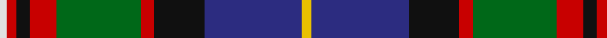

In pattern [WRKRGRKBY](/patterns/wrkrgrkby/).

This was sourced from house-of-tartan.  It is a [9 stripes tartan](/stripes/stripes9/).

Original link http://www.house-of-tartan.scotland.net/house/TartanViewjs.asp?colr=Def&tnam=1853

## Thread count
LN/4 R6 K8 R16 G50 R8 K30 DB58 Y/6

## Palette
Each colour and its ΔE from the base-6 reference it is a variant of.

| Colour | Shade | Base | ΔE (OKLab) |
|---|---|---|---|
| DB | <code style="background-color:#2C2C80;">#2C2C80</code> `#2C2C80` | B <code style="background-color:#2C4084;">#2C4084</code> | 0.05 |
| G | <code style="background-color:#006818;">#006818</code> `#006818` | G <code style="background-color:#006400;">#006400</code> | 0.02 |
| K | <code style="background-color:#101010;">#101010</code> `#101010` | K <code style="background-color:#000000;">#000000</code> | 0.17 |
| LN | <code style="background-color:#E0E0E0;">#E0E0E0</code> `#E0E0E0` | W <code style="background-color:#F4F4F0;">#F4F4F0</code> | 0.06 |
| R | <code style="background-color:#C80000;">#C80000</code> `#C80000` | R <code style="background-color:#C80000;">#C80000</code> | 0.00 |
| Y | <code style="background-color:#E8C000;">#E8C000</code> `#E8C000` | Y <code style="background-color:#E8C000;">#E8C000</code> | 0.00 |

## Nearest tartans

The nearest existing variants by ΔTartan distance.

1. [Loch Awe](/setts/s9/w6k4r6g40k48b40r6k4y6-b2c2c80-g006818-k101010-rc80000-wc0c0c0-yfccc00/) — ΔT 0.64
1. [Whitson Family Tartan Tartan Number: 1422. Earliest known date: 1984 UK Design No 514358 See products available Copyright © Blair Urquhart, Comrie, 2015](/setts/s9/w8k2g38y2k38b26r4b8r4-b2c2c80-g006818-k101010-rc80000-we0e0e0-ye8c000/) — ΔT 0.71
1. [George Brown](/setts/s9/y6b58k30r8g50r16k8r6w4-b304080-g008000-k000000-rc00000-we0e0e0-yf0c000/) — ΔT 0.83
1. [Sey (Name)](/setts/s8/r4k16y2k16g26b26ya2r4-b2c2c80-g006818-k101010-rc80000-ye8c000-yad87c00/) — ΔT 0.85
1. [Stirling and Bannockburn District Tartan Tartan Number: 1536. Earliest known date: 1847 The Stirling and Bannockburn Caledonian Society tartan produced by Wilson's of Bannockburn around 1847, has been recognised in more recent times as the District tartan for the Stirling and Bannockburn area of central Scotland. See products available Copyright © Blair Urquhart, Comrie, 2015](/setts/s10/r6g36r8b6r8k26r6ba36g4y6-b5c8ca8-ba2c2c80-g006818-k101010-rc80000-ye8c000/) — ΔT 0.88
1. [Scottish National - 1934 (Fashion)](/setts/s9/w8r12b24b32g48k4r16b8w8-b2c2c80-g006818-k101010-rc80000-we0e0e0/) — ΔT 0.93
1. [Dunedin](/setts/s9/k6r6g42ra16r6ra8k6b52w6-b304080-g008000-k000000-rc00000-ra900030-we0e0e0/) — ΔT 0.93
1. [Leung (Personal)](/setts/s9/r8k14r4b50k38w4g26k4y6-b2c2c80-g006818-k101010-rb468ac-wfcfcfc-ye8c000/) — ΔT 0.94
1. [Harvey of Cornwall (Personal)](/setts/s7/w10k52b52g24y10g5r5-b2c4084-g003c14-k101010-rdc0000-we0e0e0-ye8c000/) — ΔT 0.98
1. [MacLean](/setts/s11/b16k16y4k6w6k6g48r32b6r8k4-b2c4084-g005020-k101010-rdc0000-we0e0e0-ye8c000/) — ΔT 0.98

## Neighbour map

Every grey dot is one of 15726 variants placed by the first two principal components of the ΔTartan feature space (44% of its variance). Red is this tartan; blue dots are its nearest — click one to open its page.

<svg viewBox="0 0 640 380" role="img" style="max-width:100%;height:auto;border:1px solid #e0e0e0;border-radius:4px;display:block" xmlns="http://www.w3.org/2000/svg"><image href="/nn/cloud.v1.png" width="640" height="380"/><a href="/setts/s9/w6k4r6g40k48b40r6k4y6-b2c2c80-g006818-k101010-rc80000-wc0c0c0-yfccc00/"><circle cx="139.6" cy="141.6" r="4" fill="#3465a4"><title>Loch Awe</title></circle></a><a href="/setts/s9/w8k2g38y2k38b26r4b8r4-b2c2c80-g006818-k101010-rc80000-we0e0e0-ye8c000/"><circle cx="138.3" cy="124.8" r="4" fill="#3465a4"><title>Whitson Family Tartan Tartan Number: 1422. Earliest known date: 1984 UK Design No 514358 See products available Copyright © Blair Urquhart, Comrie, 2015</title></circle></a><a href="/setts/s9/y6b58k30r8g50r16k8r6w4-b304080-g008000-k000000-rc00000-we0e0e0-yf0c000/"><circle cx="105.0" cy="128.0" r="4" fill="#3465a4"><title>George Brown</title></circle></a><a href="/setts/s8/r4k16y2k16g26b26ya2r4-b2c2c80-g006818-k101010-rc80000-ye8c000-yad87c00/"><circle cx="142.9" cy="165.5" r="4" fill="#3465a4"><title>Sey (Name)</title></circle></a><a href="/setts/s10/r6g36r8b6r8k26r6ba36g4y6-b5c8ca8-ba2c2c80-g006818-k101010-rc80000-ye8c000/"><circle cx="87.9" cy="152.3" r="4" fill="#3465a4"><title>Stirling and Bannockburn District Tartan Tartan Number: 1536. Earliest known date: 1847 The Stirling and Bannockburn Caledonian Society tartan produced by Wilson's of Bannockburn around 1847, has been recognised in more recent times as the District tartan for the Stirling and Bannockburn area of central Scotland. See products available Copyright © Blair Urquhart, Comrie, 2015</title></circle></a><a href="/setts/s9/w8r12b24b32g48k4r16b8w8-b2c2c80-g006818-k101010-rc80000-we0e0e0/"><circle cx="88.6" cy="152.1" r="4" fill="#3465a4"><title>Scottish National - 1934 (Fashion)</title></circle></a><a href="/setts/s9/k6r6g42ra16r6ra8k6b52w6-b304080-g008000-k000000-rc00000-ra900030-we0e0e0/"><circle cx="123.8" cy="145.1" r="4" fill="#3465a4"><title>Dunedin</title></circle></a><a href="/setts/s9/r8k14r4b50k38w4g26k4y6-b2c2c80-g006818-k101010-rb468ac-wfcfcfc-ye8c000/"><circle cx="146.8" cy="145.1" r="4" fill="#3465a4"><title>Leung (Personal)</title></circle></a><a href="/setts/s7/w10k52b52g24y10g5r5-b2c4084-g003c14-k101010-rdc0000-we0e0e0-ye8c000/"><circle cx="118.4" cy="165.2" r="4" fill="#3465a4"><title>Harvey of Cornwall (Personal)</title></circle></a><a href="/setts/s11/b16k16y4k6w6k6g48r32b6r8k4-b2c4084-g005020-k101010-rdc0000-we0e0e0-ye8c000/"><circle cx="115.9" cy="125.1" r="4" fill="#3465a4"><title>MacLean</title></circle></a><circle cx="127.1" cy="136.2" r="5" fill="#c00000"/></svg>

ID: /setts/s9/y6b58k30r8g50r16k8r6w4-b2c2c80-g006818-k101010-rc80000-we0e0e0-ye8c000/
