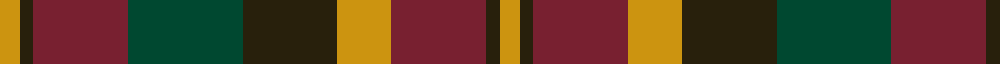

In pattern [YGRGGYRGY](/patterns/ygrggyrgy/).

This was sourced from house-of-tartan.  It is a [9 stripes tartan](/stripes/stripes9/).

Original link http://www.house-of-tartan.scotland.net/house/TartanViewjs.asp?colr=Def&tnam=2267

## Thread count
DY/6 K4 DR28 DG34 K28 DY16 DR28 K4 DY/6

## Palette
Each colour and its ΔE from the base-6 reference it is a variant of.

| Colour | Shade | Base | ΔE (OKLab) |
|---|---|---|---|
| DG | <code style="background-color:#004830;">#004830</code> `#004830` | G <code style="background-color:#006100;">#006100</code> | 0.11 |
| DR | <code style="background-color:#782030;">#782030</code> `#782030` | R <code style="background-color:#CC0000;">#CC0000</code> | 0.18 |
| DY | <code style="background-color:#CC9410;">#CC9410</code> `#CC9410` | Y <code style="background-color:#F2BF00;">#F2BF00</code> | 0.13 |
| K | <code style="background-color:#28200C;">#28200C</code> `#28200C` | G <code style="background-color:#006100;">#006100</code> | 0.22 |

## Nearest tartans

The nearest existing variants by ΔTartan distance.

1. [Monaghan, County (District)](/setts/s9/y6b4r28y16b28g32r26b4y6-b4c3428-g003820-ra03400-ybc8c00/) — ΔT 0.94
1. [Monaghan](/setts/s9/y6b4r28g34b28y16r28b4y6-b401000-g008000-r806050-yd08010/) — ΔT 0.99
1. [Clare Irish County Tartan Tartan Number: 2248. Earliest known date: 1995 One of a series of Irish District tartans designed by Polly Wittering of the House of Edgar, with colours reminiscent of the Country with soft warm colours dominating. See products available Copyright © Blair Urquhart, Comrie, 2015](/setts/s11/r6b28g28b4r28b4r28b4g28b4y6-b101448-g3c6838-r8c0020-yd09000/) — ΔT 1.02
1. [Delanghe, Ruben (Personal)](/setts/s10/g14k5b2r21g18k4b18r9k2r12-b2c2c80-g006818-k101010-rc80000/) — ΔT 1.05
1. [Carnegie #3](/setts/s8/r33g17b50g17r11g17r9k7-b2c4084-g005020-k101010-rdc0000/) — ΔT 1.07
1. [Glenmorangie #2](/setts/s11/g12r4g4r8g26ga24ra26r8ra4r4ra12-g503c14-ga2a2303-r781c38-rabe7832/) — ΔT 1.09
1. [Hueg (Personal)](/setts/s11/r20k20r8g4r4k4r8g24b24g6b8-b003c64-g006818-k101010-rc80000/) — ΔT 1.09
1. [Orban-Prentice (Personal)](/setts/s12/g50b8r48b42ga50b8g6b8ga50b42r48b8-b2c2c80-g285800-ga604000-rc80000/) — ΔT 1.13
1. [Roscommon, County](/setts/s10/r10y6r38b12y10b12g24ba10g24ba6-b441800-ba303070-g003820-rb03000-yd8b000/) — ΔT 1.17
1. [Fulton (1999) (Name)](/setts/s9/b12k20r8g8r12g48r24k4r12-b2c2c80-g006818-k101010-rc80000/) — ΔT 1.17

## Neighbour map

Every grey dot is one of 15726 variants placed by the first two principal components of the ΔTartan feature space (44% of its variance). Red is this tartan; blue dots are its nearest — click one to open its page.

<svg viewBox="0 0 640 380" role="img" style="max-width:100%;height:auto;border:1px solid #e0e0e0;border-radius:4px;display:block" xmlns="http://www.w3.org/2000/svg"><image href="/nn/cloud.v1.png" width="640" height="380"/><a href="/setts/s9/y6b4r28y16b28g32r26b4y6-b4c3428-g003820-ra03400-ybc8c00/"><circle cx="200.2" cy="227.1" r="4" fill="#3465a4"><title>Monaghan, County (District)</title></circle></a><a href="/setts/s9/y6b4r28g34b28y16r28b4y6-b401000-g008000-r806050-yd08010/"><circle cx="183.5" cy="217.4" r="4" fill="#3465a4"><title>Monaghan</title></circle></a><a href="/setts/s11/r6b28g28b4r28b4r28b4g28b4y6-b101448-g3c6838-r8c0020-yd09000/"><circle cx="204.3" cy="212.8" r="4" fill="#3465a4"><title>Clare Irish County Tartan Tartan Number: 2248. Earliest known date: 1995 One of a series of Irish District tartans designed by Polly Wittering of the House of Edgar, with colours reminiscent of the Country with soft warm colours dominating. See products available Copyright © Blair Urquhart, Comrie, 2015</title></circle></a><a href="/setts/s10/g14k5b2r21g18k4b18r9k2r12-b2c2c80-g006818-k101010-rc80000/"><circle cx="191.6" cy="199.7" r="4" fill="#3465a4"><title>Delanghe, Ruben (Personal)</title></circle></a><a href="/setts/s8/r33g17b50g17r11g17r9k7-b2c4084-g005020-k101010-rdc0000/"><circle cx="169.8" cy="224.2" r="4" fill="#3465a4"><title>Carnegie #3</title></circle></a><a href="/setts/s11/g12r4g4r8g26ga24ra26r8ra4r4ra12-g503c14-ga2a2303-r781c38-rabe7832/"><circle cx="179.7" cy="220.9" r="4" fill="#3465a4"><title>Glenmorangie #2</title></circle></a><a href="/setts/s11/r20k20r8g4r4k4r8g24b24g6b8-b003c64-g006818-k101010-rc80000/"><circle cx="127.1" cy="217.7" r="4" fill="#3465a4"><title>Hueg (Personal)</title></circle></a><a href="/setts/s12/g50b8r48b42ga50b8g6b8ga50b42r48b8-b2c2c80-g285800-ga604000-rc80000/"><circle cx="171.5" cy="215.8" r="4" fill="#3465a4"><title>Orban-Prentice (Personal)</title></circle></a><a href="/setts/s10/r10y6r38b12y10b12g24ba10g24ba6-b441800-ba303070-g003820-rb03000-yd8b000/"><circle cx="114.3" cy="206.0" r="4" fill="#3465a4"><title>Roscommon, County</title></circle></a><a href="/setts/s9/b12k20r8g8r12g48r24k4r12-b2c2c80-g006818-k101010-rc80000/"><circle cx="207.9" cy="189.2" r="4" fill="#3465a4"><title>Fulton (1999) (Name)</title></circle></a><circle cx="184.7" cy="218.1" r="5" fill="#c00000"/></svg>

ID: /setts/s9/y6g4r28ga34g28y16r28g4y6-g28200c-ga004830-r782030-ycc9410/
