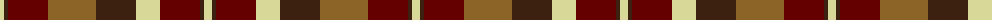

In pattern [YBRRBYRBY](/patterns/ybrrbyrby/).

This was sourced from register-of-tartans.  It is a [9 stripes tartan](/stripes/stripes9/).

Original link https://www.tartanregister.gov.uk/tartanDetails.aspx?ref=1724

## Thread count
LY/8 K4 DR40 LT48 K40 LY24 DR40 K4 LY/8

## Palette
Each colour and its ΔE from the base-6 reference it is a variant of.

| Colour | Shade | Base | ΔE (OKLab) |
|---|---|---|---|
| DR | <code style="background-color:#640000;">#640000</code> `#640000` | R <code style="background-color:#C80000;">#C80000</code> | 0.22 |
| K | <code style="background-color:#3C2010;">#3C2010</code> `#3C2010` | B <code style="background-color:#2C4084;">#2C4084</code> | 0.20 |
| LT | <code style="background-color:#8C6428;">#8C6428</code> `#8C6428` | R <code style="background-color:#C80000;">#C80000</code> | 0.16 |
| LY | <code style="background-color:#D8D898;">#D8D898</code> `#D8D898` | Y <code style="background-color:#E8C000;">#E8C000</code> | 0.10 |

ID: /setts/s9/y8b4r40ra48b40y24r40b4y8-b3c2010-r640000-ra8c6428-yd8d898/
