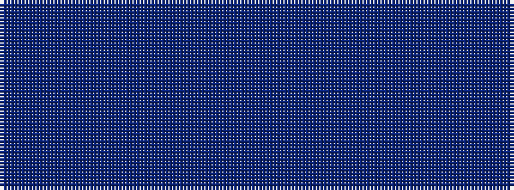

BBB

It is a 3 stripe tartan.

<figure class="pat-woven">

<figcaption>idealised sample</figcaption>
</figure>

## Colour Sequence



## Tartans with this colour sequence

| Tartans |
|---------------|
| [Outlander #4](/setts/s3/do27n3do17~x4/)|
||
| [Outlander #5](/setts/s3/n13do15n2~x4/)|
||
