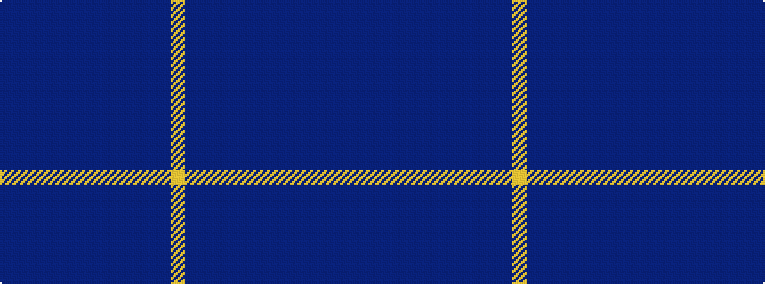

BBBBBBBBBBBBY

It is a 13 stripe tartan.

<figure class="pat-woven">

<figcaption>idealised sample</figcaption>
</figure>

## Colour Sequence



## Tartans with this colour sequence

| Tartans |
|---------------|
| [Hawick Common Riding](/variants/s13/db4dbi23db8dbi1db3dbi2db2dbi2db2dbi3db1dbi4ly4~x2/)|
||
| [Hawick Common Riding (Commemorative)](/variants/s13/dt4db23dt8db1dt3db2dt2db2dt2db3dt1db4ly4~x2/)|
||
