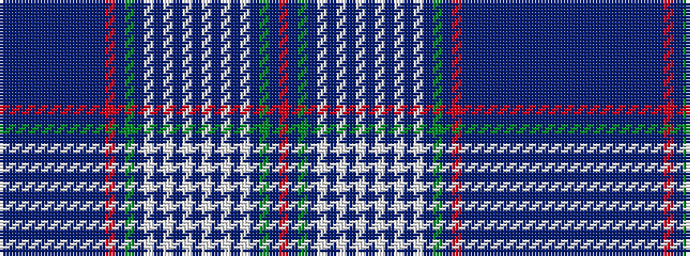

BBBBBBBBBBBRBGBWBWBWBWBWBWBGBR

It is a 30 stripe tartan.

<figure class="pat-woven">

<figcaption>idealised sample</figcaption>
</figure>

## Colour Sequence



## Tartans with this colour sequence

| Tartans |
|---------------|
| [Edinburgh, '86 Border](/setts/s30/db1b2db2b2db2b39db2b2db2b2db1r1db1y1db10w3db2w1db1w1db3w1db1w1db2w3db10y1db1r1~x2/)|
||
