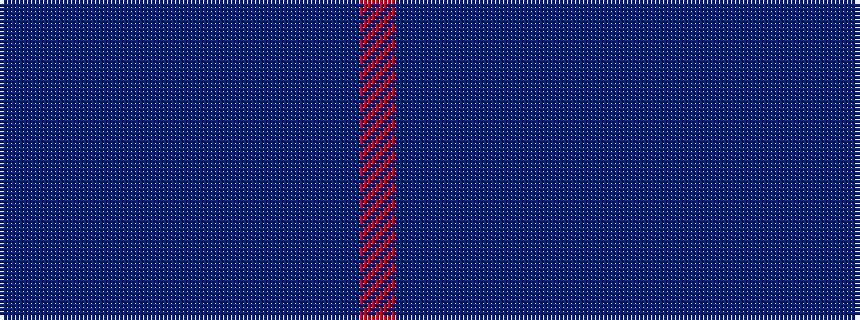

BBBBBBBBBBR

It is a 11 stripe tartan.

<figure class="pat-woven">

<figcaption>idealised sample</figcaption>
</figure>

## Colour Sequence



## Tartans with this colour sequence

| Tartans |
|---------------|
| [Royal Delight](/variants/s11/dpi3dp12dpi12dp3db18dpi3dp2dpi3db18dp2r3~x2/)|
||
