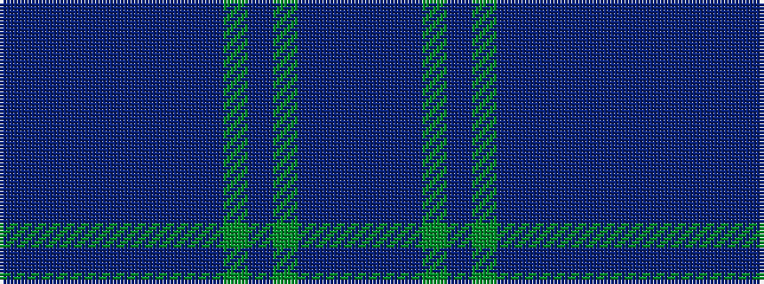

BBBBBBBBBGBGBBB

It is a 15 stripe tartan.

<figure class="pat-woven">

<figcaption>idealised sample</figcaption>
</figure>

## Colour Sequence



## Tartans with this colour sequence

| Tartans |
|---------------|
| [Grant - 1819 (Clan)](/variants/s15/db15dp1db2dp2db78t1db2dp21db3g2db3g79db2dp2db10/)|
||
