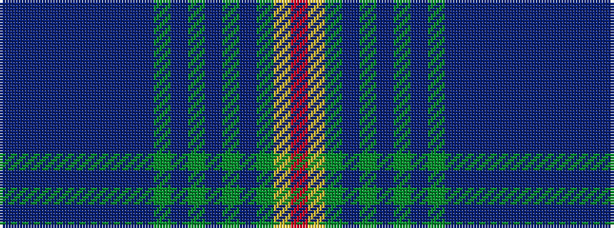

BBBBBBBBBGBGBGBGYR

It is a 18 stripe tartan.

<figure class="pat-woven">

<figcaption>idealised sample</figcaption>
</figure>

## Colour Sequence



## Tartans with this colour sequence

| Tartans |
|---------------|
| [Glaz (Fashion)](/variants/s18/n2dt9db1dt4db2dt2db4n1db15g1db3g3db2g4db1g7ly1r2~x2/)|
||
