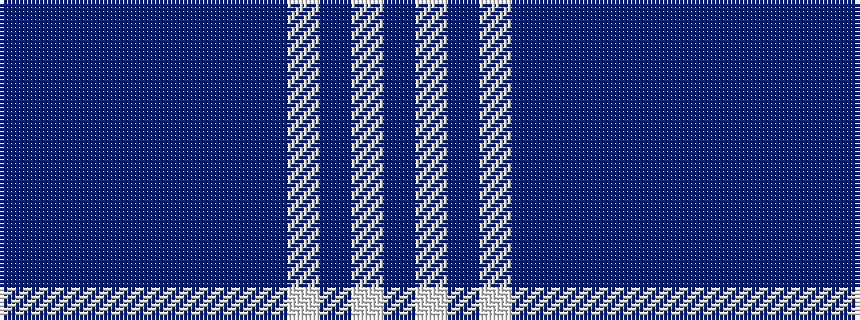

BBBBBBBBBWBWB

It is a 13 stripe tartan.

<figure class="pat-woven">

<figcaption>idealised sample</figcaption>
</figure>

## Colour Sequence



## Tartans with this colour sequence

| Tartans |
|---------------|
| [Highland Sky (Fashion)](/setts/s13/n43dti2n2dti1n1dt11n2dti2n1lb1n20lbi4n7~x2/)|
||
