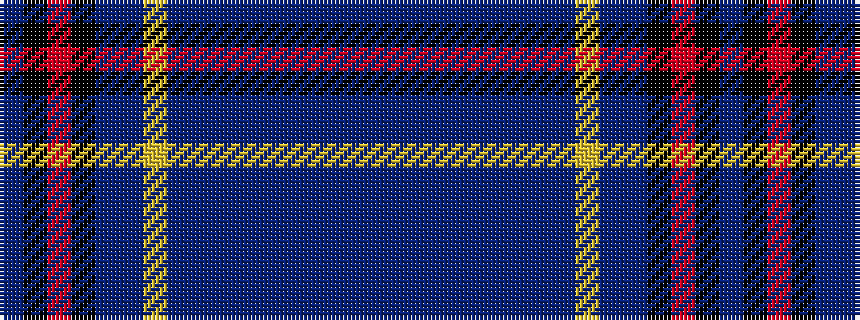

BBBBBBBBBYBBKRKB

It is a 16 stripe tartan.

<figure class="pat-woven">

<figcaption>idealised sample</figcaption>
</figure>

## Colour Sequence



## Tartans with this colour sequence

| Tartans |
|---------------|
| [Frogaletto (Personal)](/variants/s16/n26dt2n2dt2n3dt9n5t2n2ly2n10dt14k3r2k4dt8~x2/)|
||
