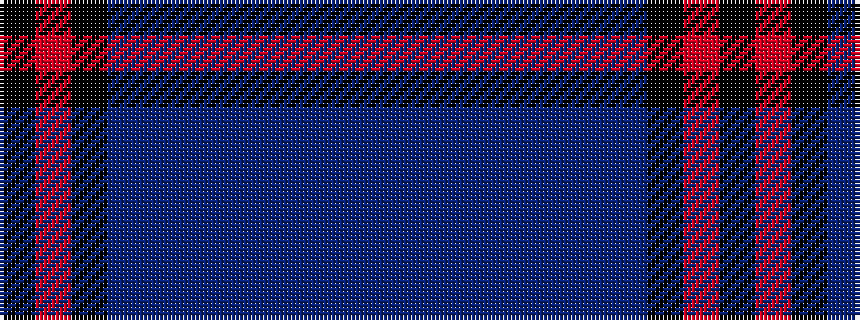

BBBBBBBBKRK

It is a 11 stripe tartan.

<figure class="pat-woven">

<figcaption>idealised sample</figcaption>
</figure>

## Colour Sequence



## Tartans with this colour sequence

| Tartans |
|---------------|
| [Lunar](/setts/s11/k10r1k3do7n1do1n1do1n1do1n7~x4/)|
||
